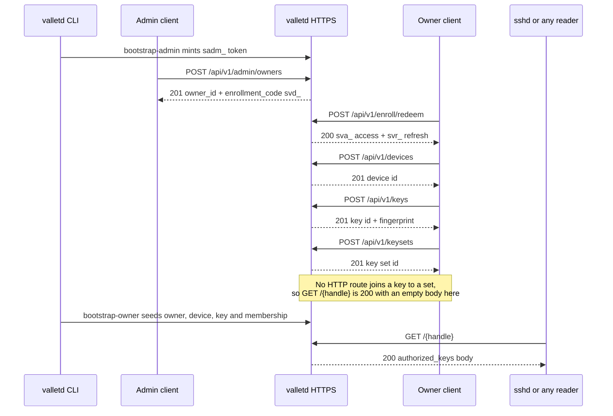

# Quickstart

This page takes you from an empty directory to a published `authorized_keys` body in one sitting. Every request and response below was captured against a live `valletd` on `https://localhost:8443` with a self-signed certificate, so what you see is what the server actually sends — including the one place where the golden path does not yet work over HTTP alone. Read the honesty note in [Publish the key](#publish-the-key-and-the-one-gap-you-must-know-about) before you plan a client around it.

## Contents

- [Prerequisites](#prerequisites)
- [The server is HTTPS-only](#the-server-is-https-only)
- [Path A: docker compose](#path-a-docker-compose)
- [Path B: build from source](#path-b-build-from-source)
- [Mint an administrator token](#mint-an-administrator-token)
- [The golden path](#the-golden-path)
  - [1. Provision an owner](#1-provision-an-owner)
  - [2. Redeem the enrollment code](#2-redeem-the-enrollment-code)
  - [3. Register a device](#3-register-a-device)
  - [4. Add a public key](#4-add-a-public-key)
  - [5. Create a key set](#5-create-a-key-set)
- [Publish the key, and the one gap you must know about](#publish-the-key-and-the-one-gap-you-must-know-about)
- [What you just built](#what-you-just-built)
- [See also](#see-also)

## Prerequisites

- **Go 1.26** (the module's `go` directive is 1.26; the release image builds with `golang:1.26.5-bookworm`) — only needed for Path B.
- **Docker** with Compose v2 — only needed for Path A.
- `curl` and `jq` for following along.
- An SSH public key to publish. If you do not have one: `ssh-keygen -t ed25519 -C alice@laptop -f ./id_ed25519 -N ''`.

Conventions used across this guide:

| Placeholder | Meaning |
| --- | --- |
| `https://vallet.example.com` | your production deployment |
| `https://localhost:8443` | the local dev server (self-signed cert, hence `curl -k`) |
| `$ADMIN_TOKEN` | an administrator token, prefix `sadm_` |
| `$ACCESS_TOKEN` | an owner access token, prefix `sva_` |
| `$REFRESH_TOKEN` | an owner refresh token, prefix `svr_` |

## The server is HTTPS-only

There is no plaintext port. The server refuses to start without a usable TLS mode, and `docker-compose.yml` states it plainly: *"No plaintext port exists by design."* Two narrow exceptions exist and neither is a general HTTP entrypoint — an optional health listener, and the `upstream` TLS mode's socket, which validation fences to a loopback or private address and which requires at least one trusted proxy.

For local development the certificate is self-signed, so every `curl` below carries `-k`. Never carry `-k` into production; point your client at a real hostname and let it verify.

## Path A: docker compose

The default `valletd` service boots with **zero secrets**: self-signed TLS, SQLite on a named volume, JSON logs. It is not behind a profile, so:

```bash
docker compose up
```

That service sets exactly these variables:

```
VALLET_SERVER_ENVIRONMENT=development
VALLET_SERVER_LISTEN_ADDR=":8443"
VALLET_TLS_MODE=self_signed
VALLET_DATABASE_DRIVER=sqlite
VALLET_DATABASE_SQLITE_PATH=/data/vallet.db
VALLET_TELEMETRY_LOG_FORMAT=json
VALLET_TELEMETRY_LOG_LEVEL=info
```

Port `8443` is published. The container runs as a non-root distroless user (UID 65532) with `no-new-privileges` and all capabilities dropped, and its healthcheck hits `https://127.0.0.1:8443/healthz`.

Note that these dev defaults alone will **not** let you mint an administrator token — that needs a signing key reference, which the dev block deliberately does not set. See [Mint an administrator token](#mint-an-administrator-token). (The compose file also carries a commented production block and an opt-in `postgres` profile.)

## Path B: build from source

```bash
go build ./cmd/valletd
```

Then give it the environment. This is the exact block used to capture every response in this guide:

```bash
export VALLET_SERVER_ENVIRONMENT=development
export VALLET_SERVER_LISTEN_ADDR=127.0.0.1:8443
export VALLET_TLS_MODE=self_signed
export VALLET_DATABASE_DRIVER=sqlite
export VALLET_DATABASE_SQLITE_PATH=/path/to/vallet.db
export VALLET_AUTH_ADMIN_TOKEN_SIGNING_KEY_REF=file:/path/to/admin_signing.key
export VALLET_AUTH_TOKEN_SIGNING_KEY_REF=file:/path/to/token_signing.key
export VALLET_AUTH_ACCESS_KEY_PEPPER_REF=file:/path/to/pepper.key

./valletd
```

The three `*_ref` values are **references**, not secrets — `file:/path` reads the value from a file, `env:VAR` from the environment. Create the key files first, readable only by the server user:

```bash
umask 077
openssl rand -base64 48 > /path/to/admin_signing.key
openssl rand -base64 48 > /path/to/token_signing.key
openssl rand -base64 48 > /path/to/pepper.key
```

Confirm it is up:

```bash
curl -k https://localhost:8443/healthz
```

```json
{"status":"ok","version":"0.0.0-dev"}
```

```bash
curl -k https://localhost:8443/readyz
```

```json
{"status":"ready","version":"0.0.0-dev"}
```

## Mint an administrator token

Owner provisioning is an administrator action, so the very first thing you need is an admin token. It is minted by a CLI subcommand, not by an HTTP route.

If `auth.admin_token_signing_key_ref` is not configured, the subcommand **refuses to run** rather than minting an unverifiable token:

```
valletd: bootstrap-admin: auth.admin_token_signing_key_ref must be set to mint an administrator token
```

With the reference set:

```bash
./valletd bootstrap-admin -label docs-admin
```

```
administrator_id=5SI4C3467CZBGMOHGKWW3WT5U2
label=docs-admin
admin_token=sadm_eyJ2IjoxLCJqdGkiOiJlQlFGSEdiQ3dEM05EMEJTdmxhelRBIiwiYWRtIjoiNVNJNEMzNDY3Q1pCR01PSEdLV1czV1Q1VTIiLCJpYXQiOjE3ODQ5MDkwOTQsImV4cCI6MTc4NzUwMTA5NH0.lHWi7djZhtjBC_aixB0ZFaQBMoaY6IDIMpFydQMep7M
```

Flags: `-config` (config file path), `-label` (**required**, names the administrator), `-ttl` (default `720h`, i.e. 30 days). The subcommand runs database migrations first and is idempotent for a given label. There is no per-token revocation endpoint — to cut off a leaked token you disable the administrator row.

```bash
export ADMIN_TOKEN=sadm_...
```

## The golden path



### 1. Provision an owner

```bash
curl -k -X POST https://localhost:8443/api/v1/admin/owners \
  -H "Authorization: Bearer $ADMIN_TOKEN" \
  -H 'Content-Type: application/json' \
  -d '{"handle":"alice"}'
```

`201 Created`:

```json
{
  "owner_id": "OUP7CNH2TR2IOQKEKF4RTF6Z47",
  "handle": "alice",
  "set_name": "default",
  "enrollment_code": "svd_xSRuLXWoFj9xKhR6c0jAlQ.2UDzHozLNanK6tnxaXd6LqoteW46b8Fo9nLi4vosVVg",
  "expires_at": "2026-07-24T17:15:13.866593461+01:00",
  "pairing_id": "xSRuLXWoFj9xKhR6c0jAlQ"
}
```

Provisioning creates the owner **and** a default key set named `default` whose visibility is `public`. The `enrollment_code` is the device code you redeem in the next step — the same string, under a different name. It expires; redeem it promptly.

A blocklisted handle is refused:

```bash
curl -k -X POST https://localhost:8443/api/v1/admin/owners \
  -H "Authorization: Bearer $ADMIN_TOKEN" \
  -H 'Content-Type: application/json' \
  -d '{"handle":"postmaster"}'
```

`400 Bad Request`, body `{"status":"error"}`. Management errors never explain themselves; see [07-errors-security-and-limits.md](07-errors-security-and-limits.md).

### 2. Redeem the enrollment code

This call is **unauthenticated** — the code is the credential.

```bash
curl -k -X POST https://localhost:8443/api/v1/enroll/redeem \
  -H 'Content-Type: application/json' \
  -d '{"device_code":"svd_xSRuLXWoFj9xKhR6c0jAlQ.2UDzHozLNanK6tnxaXd6LqoteW46b8Fo9nLi4vosVVg"}'
```

`200 OK`:

```json
{
  "refresh_token": "svr_1Fy07sEjiFiIbZe-0-Dd-g.QPCOk6h_DwLJcORFkap3dzmoxil7Gsnb98v4HfF75uw",
  "refresh_expires_at": "2026-10-22T17:05:28.026740069+01:00",
  "access_token": "sva_...",
  "access_expires_at": "2026-07-24T17:20:28.026740069+01:00",
  "owner_id": "OUP7CNH2TR2IOQKEKF4RTF6Z47",
  "scopes": [{"kind": "full-owner"}]
}
```

The access token lives about 15 minutes; the refresh token about 90 days. The scope kind is **hyphenated** — `full-owner`. The underscore form `full_owner` is rejected with `400`. The other kinds the server defines are `read-only`, `single-set`, and `single-device`, the last two requiring a `resource_id` (from the code; only `full-owner` was exercised live). The OpenAPI document's scope description lists `full_owner`, `key_set`, and `device` — all three names are wrong.

```bash
export ACCESS_TOKEN=sva_...
export REFRESH_TOKEN=svr_...
```

### 3. Register a device

The body field is `name`. There is no `label` field; sending one is a `400` (strict decoding rejects unknown fields).

```bash
curl -k -X POST https://localhost:8443/api/v1/devices \
  -H "Authorization: Bearer $ACCESS_TOKEN" \
  -H 'Content-Type: application/json' \
  -d '{"name":"work laptop"}'
```

`201 Created`:

```json
{
  "id": "SOE3NPUCSIRKLLQXSPNNUQQETR",
  "name": "work laptop",
  "status": "active",
  "created_at": "2026-07-24T17:05:41.111+01:00",
  "updated_at": "2026-07-24T17:05:41.111+01:00"
}
```

### 4. Add a public key

```bash
curl -k -X POST https://localhost:8443/api/v1/keys \
  -H "Authorization: Bearer $ACCESS_TOKEN" \
  -H 'Content-Type: application/json' \
  -d '{"device_id":"SOE3NPUCSIRKLLQXSPNNUQQETR","public_key":"ssh-ed25519 AAAAC3NzaC1lZDI1NTE5AAAAIFEDekQ7K0Z2UMpuepS0mnASJ7EJH8x6WUSEtgFZixT6 alice@laptop"}'
```

`201 Created`:

```json
{
  "id": "4CWDFHTBRB2A7UGJWR5YBFHT64",
  "device_id": "SOE3NPUCSIRKLLQXSPNNUQQETR",
  "algorithm": "ssh-ed25519",
  "comment": "alice@laptop",
  "fingerprint": "SHA256:4LA2LcP4zPzowu7BJB47GKbwwOM9/+nniaEqpBq8TMU",
  "bit_len": 256,
  "status": "active"
}
```

You send only `device_id` and `public_key`. The server parses the key and derives `algorithm`, `comment`, `fingerprint`, and `bit_len` itself — never send those.

### 5. Create a key set

Listing right after provisioning shows the set the admin call created for you:

```bash
curl -k https://localhost:8443/api/v1/keysets -H "Authorization: Bearer $ACCESS_TOKEN"
```

```json
{"key_sets":[{"id":"DEORY7CPZIXRDC7PIBBJ7UKGKW","name":"default","visibility":"public","is_default":true}]}
```

Creating your own:

```bash
curl -k -X POST https://localhost:8443/api/v1/keysets \
  -H "Authorization: Bearer $ACCESS_TOKEN" \
  -H 'Content-Type: application/json' \
  -d '{"name":"servers"}'
```

`201 Created`:

```json
{"id":"IZMTEKANV4GDI7UGUB6FOBO5VB","name":"servers","visibility":"protected","is_default":false}
```

Two defaults worth internalising: a **newly created** set is `protected`, while the set provisioning made for you is `public`. And renaming a set with `PATCH` returns a **new id** — the old one 404s afterwards. Do not cache key set ids across a rename.

A `protected` set is served only to a caller presenting an access key — and there is currently **no way to mint an access key**, neither an HTTP route nor a CLI subcommand. Protected sets are therefore unreadable in practice today. Keep the set you intend to publish `public`.

Reusing a name gives the one management error that carries a reason:

```json
{"status":"error","reason":"name_taken"}
```

with status `409`. See [07-errors-security-and-limits.md](07-errors-security-and-limits.md#the-uniform-management-error-body).

## Publish the key, and the one gap you must know about

The publish endpoint is unauthenticated and returns a plain `authorized_keys` body:

```bash
curl -k -i https://localhost:8443/alice
```

```
HTTP/2 200
cache-control: public, max-age=60
content-type: text/plain; charset=utf-8
etag: "e3b0c44298fc1c149afbf4c8996fb92427ae41e4649b934ca495991b7852b855"
content-length: 0
```

**The body is empty.** That ETag is the SHA-256 of the empty string, and it is not a mistake in your request.

Here is the gap, stated plainly: **there is currently no HTTP route that adds a key to a key set.** You can create keys, and you can create key sets, but nothing in the API joins the two. A key added over the API is therefore a member of no set, and `GET /{handle}` correctly reports the owner's default set as containing nothing — `200` with a zero-length body, not a `404`. Plan your client accordingly; do not build a UI that promises "your key is now live" after `POST /api/v1/keys`.

The only way to publish a key today is the `valletd bootstrap-owner` CLI subcommand, which creates owner, device, key, and set membership in one shot:

```bash
./valletd bootstrap-owner -handle bob -key-file ./id_ed25519.pub -device "bob-laptop"
```

```
owner_id=QI4IBYFNLCCKVESZ57LPZTCQSA
handle=bob
set=default
key_fingerprint=SHA256:4LA2LcP4zPzowu7BJB47GKbwwOM9/+nniaEqpBq8TMU
```

Flags: `-config`, `-handle` (**required**), `-key-file` (a path, or `-` to read stdin), `-device` (default `bootstrap`), `-set`.

Now the publish endpoint has something to serve:

```bash
curl -k -i https://localhost:8443/bob
```

```
HTTP/2 200
cache-control: public, max-age=60
content-type: text/plain; charset=utf-8
etag: "18ada6ff3dcbc0c7f3a2eaf3e2316b0a6c4c2c8f8a7d3b6fd92abe06d3d47cae"
content-length: 94

ssh-ed25519 AAAAC3NzaC1lZDI1NTE5AAAAIFEDekQ7K0Z2UMpuepS0mnASJ7EJH8x6WUSEtgFZixT6 alice@laptop
```

`HEAD /bob` returns the identical headers with no body. An unknown handle is a plain-text `404`:

```bash
curl -k -i https://localhost:8443/nope
```

```
HTTP/2 404
cache-control: no-store
content-type: text/plain; charset=utf-8
content-length: 10

not found
```

That `404` is deliberately the same answer you get for an unknown set, another owner's set, an inactive set, or a refused access key — it is an anti-enumeration measure, not an oversight. Details in [07-errors-security-and-limits.md](07-errors-security-and-limits.md).

## What you just built

- A **server** on HTTPS only, with a self-signed certificate and a SQLite database.
- An **administrator**, minted by `valletd bootstrap-admin`, holding a `sadm_` token — the only credential that may provision owners.
- An **owner** `alice` with a public default key set, plus the `svd_` enrollment code that bootstrapped her first client.
- An owner **session**: a short-lived `sva_` access token and a 90-day `svr_` refresh token, scoped `full-owner`.
- A **device**, a **public key** whose fingerprint the server derived, and a second **key set**.
- A **published** `authorized_keys` body at `GET /bob`, cacheable for 60 seconds and validated by a strong content-hash ETag — created via `bootstrap-owner`, because the API cannot yet attach a key to a set.

Next: [02-configuration.md](02-configuration.md) to run this somewhere real, or [06-api-reference.md](06-api-reference.md) for every route.

## See also

- [README.md](README.md) — guide index
- [02-configuration.md](02-configuration.md) — configuration reference
- [03-users-and-onboarding.md](03-users-and-onboarding.md) — owners, enrollment, tokens
- [04-devices-and-keys.md](04-devices-and-keys.md) — devices and public keys
- [05-key-sets-and-publishing.md](05-key-sets-and-publishing.md) — key sets and the publish endpoint
- [06-api-reference.md](06-api-reference.md) — full endpoint reference
- [07-errors-security-and-limits.md](07-errors-security-and-limits.md) — errors, security headers, rate limits
