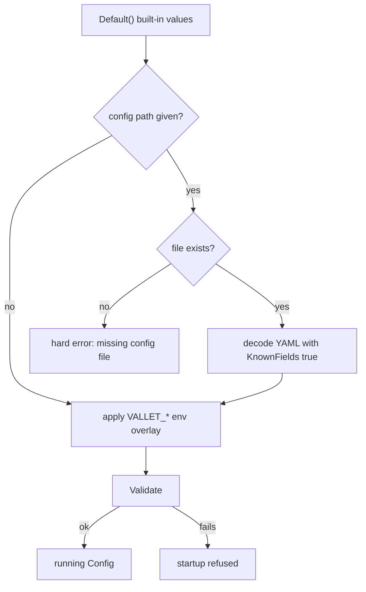

# Configuration

`valletd` is configured by three layers — built-in defaults, an optional YAML file, and `VALLET_*` environment variables — resolved in that order with environment winning. Nothing here is guessed: the precedence below is what `internal/config/load.go` implements, the variable table is the loader's own binding table, and the defaults are the ones `Default()` returns. Secrets are never part of any of it; configuration carries *references* to secrets, and this page explains why.

## Contents

- [The three layers and their precedence](#the-three-layers-and-their-precedence)
- [The YAML shape](#the-yaml-shape)
- [Environment variables](#environment-variables)
  - [server](#server)
  - [tls](#tls)
  - [database](#database)
  - [auth](#auth)
  - [rate_limit](#rate_limit)
  - [telemetry](#telemetry)
  - [onboarding, blocklist, retention, install, docs](#onboarding-blocklist-retention-install-docs)
- [Secret references](#secret-references)
- [TLS modes](#tls-modes)
- [Rate limit tiers](#rate-limit-tiers)
- [Database drivers](#database-drivers)
- [Telemetry](#telemetry-1)
- [Containers and the dev profile](#containers-and-the-dev-profile)
- [See also](#see-also)

## The three layers and their precedence

`Load` builds a `Config` with precedence **env > file > built-in defaults**:

1. Start from `Default()`.
2. If a config path was given and the file exists, decode the YAML **over** the defaults with `KnownFields(true)` — an unknown YAML key is a hard error, not a warning.
3. Overlay `VALLET_*` environment variables through the binding table.

Two details that surprise people:

- A **non-empty path pointing at a missing file is an error.** The loader does not silently fall back. Passing an empty path (`valletd` with no `-config`) means "defaults plus environment only".
- Only the path you give is consulted. There is no search of `/etc`, `$HOME`, or the working directory.
- An empty or comments-only YAML file is fine — it simply contributes no overrides.



Validation runs after resolution, so a value supplied by any layer is held to the same rules.

## The YAML shape

This is the loader's own worked example (`internal/config/testdata/full.yaml`). Every section is optional; anything you omit keeps its default.

```yaml
server:
  environment: development
  listen_addr: :9443
  public_base_url: https://vallet.dev.example.com
  trusted_proxies:
    - 10.0.0.1
    - 10.0.0.2
tls:
  mode: acme
  min_version: "1.3"
  acme:
    directory_url: https://acme-staging-v02.api.letsencrypt.org/directory
    solver: dns_01
    account_key_file: /var/lib/vallet/acme/account.key
    cache_dir: /var/lib/vallet/acme
    contact_email: ops@example.com
    accept_tos: true
    dns:
      mode: api
      provider: cloudflare
      credentials_ref: env:VALLET_DNS_CREDS
  domain: vallet.dev.example.com
  sans:
    - www.vallet.dev.example.com
database:
  driver: postgres
  postgres:
    dsn_ref: file:/run/secrets/pg-dsn
auth:
  access_token_ttl: 10m
  refresh_token_max_age: 30d
  token_signing_key_ref: env:VALLET_SIGNING_KEY
  providers:
    api_token:
      enabled: true
    passkey:
      enabled: true
    oidc:
      enabled: false
rate_limit:
  enabled: true
  store: shared
  shared:
    address: redis.internal:6379
    password_ref: env:VALLET_REDIS_PASSWORD
  tiers:
    auth:
      requests: 10
      window: 1m
    publish:
      requests: 100
      window: 1m
    management:
      requests: 200
      window: 1m
    admin:
      requests: 50
      window: 1m
telemetry:
  log:
    level: debug
    format: text
  metrics:
    prometheus:
      enabled: true
      listen_addr: :9100
      path: /metrics
    otlp:
      enabled: true
      endpoint: https://otel.internal:4317
      headers_ref: env:VALLET_OTLP_HEADERS
  traces:
    enabled: true
    endpoint: https://otel.internal:4317
onboarding:
  mode: open
blocklist:
  seed_file: ./blocklist.txt
  extra_entries:
    - admin
    - root
  allow_entries:
    - support
retention:
  handle_quarantine: 45d
  audit_retention: 730d
  max_sets_per_owner: 250
```

Durations accept Go duration syntax plus a `d` suffix meaning 24 hours, so `30d`, `720h`, and `1m` are all valid. Note that OTLP and trace endpoints must be absolute `http`/`https` URLs with no userinfo — validation rejects a bare `host:port`.

## Environment variables

Every variable is prefixed `VALLET_`. There are **83 flat bindings**, listed in full below, plus one YAML-only knob (`tls.acme.dns.credentials_refs`, the named-credentials map) which has no flat binding because its keys are operator-chosen.

Type conventions: **bool** is parsed by `strconv.ParseBool` (`true`/`false`/`1`/`0`); **list** is comma-separated with surrounding whitespace trimmed and empty items dropped; **duration** accepts Go syntax plus the `d` suffix; **ref** must be `scheme:opaque` (see [Secret references](#secret-references)). Setting a variable to the empty string sets the field to empty — it is an override, not an absence.

### server

| Variable | YAML path | Type | Default | Meaning |
| --- | --- | --- | --- | --- |
| `VALLET_SERVER_ENVIRONMENT` | `server.environment` | string | `production` | `production` or `development`. Production tightens several rules below. |
| `VALLET_SERVER_LISTEN_ADDR` | `server.listen_addr` | string | `:8443` | HTTPS listener address. There is no plaintext counterpart. |
| `VALLET_SERVER_PUBLIC_BASE_URL` | `server.public_base_url` | string | `""` | Externally reachable base URL. Required in production and must start `https://`. |
| `VALLET_SERVER_TRUSTED_PROXIES` | `server.trusted_proxies` | list | none | Peer addresses whose `X-Forwarded-For` / `X-Forwarded-Proto` are believed. Empty means no header is trusted. |
| `VALLET_SERVER_HEALTH_LISTEN_ADDR` | `server.health_listen_addr` | string | `""` | Optional separate health listener. Empty means health is served on the main listener only. |

### tls

| Variable | YAML path | Type | Default | Meaning |
| --- | --- | --- | --- | --- |
| `VALLET_TLS_MODE` | `tls.mode` | string | `""` | One of `acme`, `cloudflare_origin`, `manual`, `csr`, `upstream`, `self_signed`. No default — the operator must choose. |
| `VALLET_TLS_MIN_VERSION` | `tls.min_version` | string | `1.2` | `1.2` or `1.3` only. |
| `VALLET_TLS_DOMAIN` | `tls.domain` | string | `""` | Primary certificate name. Required by `acme`, `csr`, and `cloudflare_origin`; must be an FQDN in production. |
| `VALLET_TLS_SANS` | `tls.sans` | list | none | Additional subject alternative names. |
| `VALLET_TLS_ALLOW_SELF_SIGNED_IN_PRODUCTION` | `tls.allow_self_signed_in_production` | bool | `false` | The only way `self_signed` is tolerated when `environment=production`. |
| `VALLET_TLS_ACME_DIRECTORY_URL` | `tls.acme.directory_url` | string | `https://acme-v02.api.letsencrypt.org/directory` | ACME directory endpoint. |
| `VALLET_TLS_ACME_SOLVER` | `tls.acme.solver` | string | `""` | `tls_alpn_01` or `dns_01`. |
| `VALLET_TLS_ACME_ACCOUNT_KEY_FILE` | `tls.acme.account_key_file` | string | `""` | Path to the ACME account key. Required in `acme` mode. |
| `VALLET_TLS_ACME_CACHE_DIR` | `tls.acme.cache_dir` | string | `""` | Where issued certificates are cached. Required in `acme` mode. |
| `VALLET_TLS_ACME_CONTACT_EMAIL` | `tls.acme.contact_email` | string | `""` | Contact registered with the CA. |
| `VALLET_TLS_ACME_ACCEPT_TOS` | `tls.acme.accept_tos` | bool | `false` | Must be `true` in `acme` mode; the CA's terms are not accepted implicitly. |
| `VALLET_TLS_ACME_DNS_MODE` | `tls.acme.dns.mode` | string | `""` | `manual` or `api`. Required when the solver is `dns_01`. |
| `VALLET_TLS_ACME_DNS_PROVIDER` | `tls.acme.dns.provider` | string | `""` | DNS provider identifier; required when `dns.mode=api`. |
| `VALLET_TLS_ACME_DNS_CREDENTIALS_REF` | `tls.acme.dns.credentials_ref` | ref | `""` | Single credential reference for the provider. Exactly one of this or the YAML-only `credentials_refs` map. |
| `VALLET_TLS_ACME_DNS_SERVER` | `tls.acme.dns.server` | string | `""` | RFC 2136 update server. Required for the `rfc2136` provider. |
| `VALLET_TLS_ACME_DNS_TSIG_KEY_NAME` | `tls.acme.dns.tsig_key_name` | string | `""` | RFC 2136 TSIG key name. |
| `VALLET_TLS_ACME_DNS_TSIG_ALGORITHM` | `tls.acme.dns.tsig_algorithm` | string | `""` | One of `hmac-sha224`, `hmac-sha256`, `hmac-sha384`, `hmac-sha512`. |
| `VALLET_TLS_CLOUDFLARE_ORIGIN_API_TOKEN_REF` | `tls.cloudflare_origin.api_token_ref` | ref | `""` | Cloudflare API token reference. Required in `cloudflare_origin` mode. |
| `VALLET_TLS_CLOUDFLARE_ORIGIN_CACHE_DIR` | `tls.cloudflare_origin.cache_dir` | string | `""` | Certificate cache directory. Required in `cloudflare_origin` mode. |
| `VALLET_TLS_CLOUDFLARE_ORIGIN_VALIDITY_DAYS` | `tls.cloudflare_origin.validity_days` | int | `365` | Must be one of 7, 30, 90, 365, 730, 1095, 5475 — the values Cloudflare accepts. |
| `VALLET_TLS_MANUAL_CERT_FILE` | `tls.manual.cert_file` | string | `""` | PEM certificate chain. Required in `manual` mode. |
| `VALLET_TLS_MANUAL_KEY_FILE` | `tls.manual.key_file` | string | `""` | PEM private key. Required in `manual` mode. |
| `VALLET_TLS_CSR_KEY_FILE` | `tls.csr.key_file` | string | `""` | Private key for the CSR workflow. |
| `VALLET_TLS_CSR_CSR_FILE` | `tls.csr.csr_file` | string | `""` | Where the generated CSR is written. |
| `VALLET_TLS_CSR_CERT_FILE` | `tls.csr.cert_file` | string | `""` | Where the signed certificate is expected. |
| `VALLET_TLS_UPSTREAM_REQUIRE_FORWARDED_PROTO` | `tls.upstream.require_forwarded_proto` | bool | `true` | In `upstream` mode, require `X-Forwarded-Proto: https` from the trusted peer. |
| `VALLET_TLS_UPSTREAM_LISTEN_ADDR` | `tls.upstream.listen_addr` | string | `""` | The plaintext socket used behind a terminating proxy. Must be loopback or private, and must be empty in every other mode. |

### database

| Variable | YAML path | Type | Default | Meaning |
| --- | --- | --- | --- | --- |
| `VALLET_DATABASE_DRIVER` | `database.driver` | string | `sqlite` | `sqlite` or `postgres`. |
| `VALLET_DATABASE_SQLITE_PATH` | `database.sqlite.path` | string | `./data/vallet.db` | SQLite file path. Required when the driver is `sqlite`. |
| `VALLET_DATABASE_POSTGRES_DSN_REF` | `database.postgres.dsn_ref` | ref | `""` | Reference to the PostgreSQL DSN. Required when the driver is `postgres` — the DSN carries a password and is never inlined. |

### auth

| Variable | YAML path | Type | Default | Meaning |
| --- | --- | --- | --- | --- |
| `VALLET_AUTH_ACCESS_TOKEN_TTL` | `auth.access_token_ttl` | duration | `15m` | Access token lifetime. Must be greater than zero and at most 24h. |
| `VALLET_AUTH_REFRESH_TOKEN_MAX_AGE` | `auth.refresh_token_max_age` | duration | `90d` | Refresh token lifetime. Must exceed the access TTL. |
| `VALLET_AUTH_TOKEN_SIGNING_KEY_REF` | `auth.token_signing_key_ref` | ref | `""` | Signing key for owner tokens. Required in production. |
| `VALLET_AUTH_ADMIN_TOKEN_SIGNING_KEY_REF` | `auth.admin_token_signing_key_ref` | ref | `""` | Signing key for administrator tokens. Required in production, and required by `valletd bootstrap-admin` in any environment. |
| `VALLET_AUTH_ACCESS_KEY_PEPPER_REF` | `auth.access_key_pepper_ref` | ref | `""` | Pepper mixed into access-key hashing. Required in production. |
| `VALLET_AUTH_ACCESS_KEY_GRACE_WINDOW` | `auth.access_key_grace_window` | duration | `24h` | How long a rotated access key keeps working. Greater than zero, at most 720h. |
| `VALLET_AUTH_PROVIDERS_API_TOKEN_ENABLED` | `auth.providers.api_token.enabled` | bool | `true` | Enable API-token authentication. |
| `VALLET_AUTH_PROVIDERS_PASSKEY_ENABLED` | `auth.providers.passkey.enabled` | bool | `false` | Enable passkey authentication. |
| `VALLET_AUTH_PROVIDERS_OIDC_ENABLED` | `auth.providers.oidc.enabled` | bool | `false` | Enable OIDC authentication. |

At least one provider must be enabled; a config that disables all three is refused.

### rate_limit

| Variable | YAML path | Type | Default | Meaning |
| --- | --- | --- | --- | --- |
| `VALLET_RATE_LIMIT_ENABLED` | `rate_limit.enabled` | bool | `true` | Master switch for the publish, management, and admin tiers. |
| `VALLET_RATE_LIMIT_STORE` | `rate_limit.store` | string | `memory` | `memory` (per-process) or `shared` (Redis-compatible, correct across replicas). |
| `VALLET_RATE_LIMIT_SHARED_ADDRESS` | `rate_limit.shared.address` | string | `""` | Address of the shared counter store. Required when `store=shared`. |
| `VALLET_RATE_LIMIT_SHARED_PASSWORD_REF` | `rate_limit.shared.password_ref` | ref | `""` | Password reference for the shared store. An embedded password in the address URL is refused. |
| `VALLET_RATE_LIMIT_TIERS_AUTH_REQUESTS` | `rate_limit.tiers.auth.requests` | int | `5` | AUTH tier budget. Must be greater than zero. |
| `VALLET_RATE_LIMIT_TIERS_AUTH_WINDOW` | `rate_limit.tiers.auth.window` | duration | `1m` | AUTH tier window. |
| `VALLET_RATE_LIMIT_TIERS_PUBLISH_REQUESTS` | `rate_limit.tiers.publish.requests` | int | `60` | PUBLISH tier budget. |
| `VALLET_RATE_LIMIT_TIERS_PUBLISH_WINDOW` | `rate_limit.tiers.publish.window` | duration | `1m` | PUBLISH tier window. |
| `VALLET_RATE_LIMIT_TIERS_MANAGEMENT_REQUESTS` | `rate_limit.tiers.management.requests` | int | `120` | MANAGEMENT tier budget. |
| `VALLET_RATE_LIMIT_TIERS_MANAGEMENT_WINDOW` | `rate_limit.tiers.management.window` | duration | `1m` | MANAGEMENT tier window. |
| `VALLET_RATE_LIMIT_TIERS_ADMIN_REQUESTS` | `rate_limit.tiers.admin.requests` | int | `60` | ADMIN tier budget. |
| `VALLET_RATE_LIMIT_TIERS_ADMIN_WINDOW` | `rate_limit.tiers.admin.window` | duration | `1m` | ADMIN tier window. |

### telemetry

| Variable | YAML path | Type | Default | Meaning |
| --- | --- | --- | --- | --- |
| `VALLET_TELEMETRY_LOG_LEVEL` | `telemetry.log.level` | string | `info` | Log level. |
| `VALLET_TELEMETRY_LOG_FORMAT` | `telemetry.log.format` | string | `json` | `json` or `text`. |
| `VALLET_TELEMETRY_METRICS_PROMETHEUS_ENABLED` | `telemetry.metrics.prometheus.enabled` | bool | `true` | Enable the Prometheus registry. |
| `VALLET_TELEMETRY_METRICS_PROMETHEUS_LISTEN_ADDR` | `telemetry.metrics.prometheus.listen_addr` | string | `""` | Address of the **separate** scrape listener. Empty means metrics are collected but not served. Must not equal `server.listen_addr`. |
| `VALLET_TELEMETRY_METRICS_PROMETHEUS_PATH` | `telemetry.metrics.prometheus.path` | string | `/metrics` | Scrape path on that separate listener. Must be absolute. |
| `VALLET_TELEMETRY_METRICS_OTLP_ENABLED` | `telemetry.metrics.otlp.enabled` | bool | `false` | Push metrics over OTLP. |
| `VALLET_TELEMETRY_METRICS_OTLP_ENDPOINT` | `telemetry.metrics.otlp.endpoint` | string | `""` | Absolute `http`/`https` URL, no userinfo. |
| `VALLET_TELEMETRY_METRICS_OTLP_HEADERS_REF` | `telemetry.metrics.otlp.headers_ref` | ref | `""` | Reference to OTLP headers — they usually carry an API key. |
| `VALLET_TELEMETRY_TRACES_ENABLED` | `telemetry.traces.enabled` | bool | `false` | Enable tracing. |
| `VALLET_TELEMETRY_TRACES_ENDPOINT` | `telemetry.traces.endpoint` | string | `""` | Absolute `http`/`https` URL, no userinfo. |
| `VALLET_TELEMETRY_TRACES_SAMPLE_RATIO` | `telemetry.traces.sample_ratio` | float | `1` | Head sampling ratio, between 0 and 1 inclusive. |

### onboarding, blocklist, retention, install, docs

| Variable | YAML path | Type | Default | Meaning |
| --- | --- | --- | --- | --- |
| `VALLET_ONBOARDING_MODE` | `onboarding.mode` | string | `invite` | How new owners appear. `invite` is the closed default; `open` is the permissive setting used in the loader example. |
| `VALLET_BLOCKLIST_SEED_FILE` | `blocklist.seed_file` | string | `""` | File of reserved handles loaded at startup. |
| `VALLET_BLOCKLIST_EXTRA_ENTRIES` | `blocklist.extra_entries` | list | none | Additional reserved handles. |
| `VALLET_BLOCKLIST_ALLOW_ENTRIES` | `blocklist.allow_entries` | list | none | Handles exempted from the blocklist. |
| `VALLET_RETENTION_HANDLE_QUARANTINE` | `retention.handle_quarantine` | duration | `30d` | How long a released handle stays unavailable for re-registration. |
| `VALLET_RETENTION_AUDIT_RETENTION` | `retention.audit_retention` | duration | `365d` | How long audit records are kept. |
| `VALLET_RETENTION_AUDIT_PURGE_INTERVAL` | `retention.audit_purge_interval` | duration | `24h` | How often the audit purge runs. |
| `VALLET_RETENTION_AUDIT_PURGE_BATCH` | `retention.audit_purge_batch` | int | `500` | Rows deleted per statement. |
| `VALLET_RETENTION_AUDIT_PURGE_MAX_PER_RUN` | `retention.audit_purge_max_per_run` | int | `100000` | Ceiling on rows deleted in one pass. |
| `VALLET_RETENTION_HANDLE_QUARANTINE_SWEEP_INTERVAL` | `retention.handle_quarantine_sweep_interval` | duration | `1h` | How often quarantined handles are released. |
| `VALLET_RETENTION_HANDLE_QUARANTINE_SWEEP_BATCH` | `retention.handle_quarantine_sweep_batch` | int | `200` | Rows per quarantine sweep statement. |
| `VALLET_RETENTION_ACCESS_KEY_GRACE_SWEEP_INTERVAL` | `retention.access_key_grace_sweep_interval` | duration | `0` | Zero disables the grace sweep. |
| `VALLET_RETENTION_ACCESS_KEY_GRACE_SWEEP_BATCH` | `retention.access_key_grace_sweep_batch` | int | `200` | Rows per grace sweep statement. |
| `VALLET_RETENTION_MAX_SETS_PER_OWNER` | `retention.max_sets_per_owner` | int | `100` | Cap on key sets one owner may hold. |
| `VALLET_INSTALL_ENABLED` | `install.enabled` | bool | `true` | Serve `/install/vallet-helper.sh` and its `.sha256`. |
| `VALLET_DOCS_ENABLED` | `docs.enabled` | bool | `true` | Serve `/docs/` and the OpenAPI documents. |

## Secret references

Every field whose name ends `_ref` holds a **reference**, in the form `scheme:opaque`:

| Form | Meaning |
| --- | --- |
| `file:/run/secrets/pg-dsn` | read the value from that file |
| `env:VALLET_SIGNING_KEY` | read the value from that environment variable |

A malformed reference fails validation with a message that names the shape and never the value:

```
malformed secret reference: want scheme:opaque (for example env:VAR or file:/path)
```

**Why values are never inlined.** A configuration file is copied into image layers, checked into version control, printed by support tooling, and shipped to log aggregators. A reference is safe in all of those places; a signing key is not. Keeping the indirection also means the secret can be rotated by the platform (a Kubernetes Secret remount, a systemd credential) without editing configuration, and it means an error message about configuration can always be printed in full — there is nothing sensitive in it to redact.

The file resolver checks permissions. A secret file readable by group or other is refused outright, or logged as:

```
secret file has group/other-readable permissions
```

with the hard-failure form reading `secrets: file for reference %q has insecure permissions %#o (group/other access); want 0600 or stricter`. Create secret files with `umask 077`.

Which references become mandatory depends on the rest of the configuration:

| Condition | Required reference |
| --- | --- |
| `database.driver=postgres` | `database.postgres.dsn_ref` |
| `tls.mode=cloudflare_origin` | `tls.cloudflare_origin.api_token_ref` |
| `tls.mode=acme` with `solver=dns_01`, `dns.mode=api` | `tls.acme.dns.credentials_ref` **or** the YAML-only `credentials_refs` map (exactly one) |
| `server.environment=production` | `auth.token_signing_key_ref`, `auth.admin_token_signing_key_ref`, `auth.access_key_pepper_ref` |
| `rate_limit.store=shared` with a password | `rate_limit.shared.password_ref` |
| `telemetry.metrics.otlp.enabled` with headers | `telemetry.metrics.otlp.headers_ref` |

DNS-01 providers each expect their own credential payload. The supported set is AWS Route 53, Cloudflare, Google Cloud DNS, DigitalOcean, DNSimple, Gandi, GoDaddy, ArvanCloud, Namecheap, OVH, Azure DNS, and RFC 2136; the exact field names and minimum IAM scopes for each are in [../dns01-provider-credentials.md](../dns01-provider-credentials.md).

## TLS modes

There is no default mode — the operator must choose one, and validation enforces the mode's own prerequisites.

| Mode | Requires | Production notes |
| --- | --- | --- |
| `self_signed` | nothing | **Refused in production** unless `tls.allow_self_signed_in_production=true`. This is the dev mode; clients need `curl -k`. |
| `manual` | `tls.manual.cert_file` and `tls.manual.key_file` | You supply and renew the certificate. |
| `csr` | `tls.domain`, plus `csr.key_file`, `csr.csr_file`, `csr.cert_file` | For an internal CA that signs a CSR you generate. |
| `acme` | `tls.domain`, `acme.solver`, `acme.directory_url`, `acme.account_key_file`, `acme.cache_dir`, `acme.accept_tos=true` | `dns_01` additionally requires `dns.mode`; `api` mode requires a provider and exactly one credential reference. |
| `cloudflare_origin` | `api_token_ref`, `cache_dir`, `validity_days` from the allowed set, `tls.domain` (FQDN in production), **at least one trusted proxy** | Origin certificates are only trusted by Cloudflare, so the trusted-proxy requirement is what keeps the deployment honest. |
| `upstream` | **at least one trusted proxy**, and `tls.upstream.listen_addr` bound to a loopback or private address | TLS is terminated by a proxy in front. `tls.upstream.listen_addr` must be empty in every other mode. |

`tls.min_version` accepts only `1.2` or `1.3`.

## Rate limit tiers

Four tiers, each with its own budget and window. See [07-errors-security-and-limits.md](07-errors-security-and-limits.md) for what each keys on and how 429 behaves.

| Tier | Default | Applies to |
| --- | --- | --- |
| `auth` | 5 per minute | unauthenticated credential exchange |
| `publish` | 60 per minute | `GET /{handle}` and `GET /{handle}/{set}` |
| `management` | 120 per minute | the authenticated `/api/v1/...` surface |
| `admin` | 60 per minute | administrator actions |

`store=memory` counts per process, which is fine for a single instance and wrong for a fleet — two replicas each grant the full budget. `store=shared` points at a Redis-compatible server so the budget is global; supply the password via `rate_limit.shared.password_ref` rather than embedding it in the address, which validation refuses.

## Database drivers

`sqlite` (the default) uses a pure-Go driver, so the release image needs no libc and builds with `CGO_ENABLED=0`. Point `database.sqlite.path` at a persistent volume — the container declares `VOLUME ["/data"]` and defaults the path to `/data/vallet.db`.

`postgres` requires `database.postgres.dsn_ref`. The repository's `docker-compose.yml` ships an opt-in `postgres` profile (image `postgres:17`, password taken from `.env`) for local experimentation; its own comments note that the server-side wiring for the driver is still landing, so treat `sqlite` as the supported path today.

## Telemetry

Metrics are **never** a path on the main mux. The router says so explicitly, and `telemetry.metrics.prometheus.listen_addr` is a separate listener whose address validation forbids from colliding with `server.listen_addr`. Leave it empty and the registry still collects; nothing is exposed. The consequence for a frontend: there is no `/metrics` on your API host, and no amount of authentication will produce one.

OTLP metrics and traces push outward instead. Both endpoints must be absolute `http`/`https` URLs without userinfo, so credentials travel in headers referenced by `telemetry.metrics.otlp.headers_ref`, not in the URL. Tracing uses head sampling: `telemetry.traces.sample_ratio` between 0 and 1, defaulting to 1 (sample everything).

Logs are structured (`json` by default, `text` available). The access log records method, matched route pattern, sanitized path, status, byte count, duration, and request id — never the query string, headers, cookies, or body.

## Containers and the dev profile

The image is built from `golang:1.26.5-bookworm` with `CGO_ENABLED=0`, `GOTOOLCHAIN=local`, and `-trimpath -buildvcs=false`, and ships on `gcr.io/distroless/static-debian12:nonroot` running as UID 65532. It exposes `8443`, declares `/data` as a volume, sets `VALLET_DATABASE_SQLITE_PATH=/data/vallet.db`, and embeds a tiny static healthcheck binary driven by `VALLET_HEALTHCHECK_URL` (default `https://127.0.0.1:8443/healthz`).

`.env.example` intentionally contains only `VALLET_VERSION` and `POSTGRES_PASSWORD`; it states that real secret **values** belong in mounted files referenced by `*_ref`, not in the environment file.

Useful `make` targets: `build`, `test` (race + coverage), `lint`, `vet`, `cover`, `tidy`, `vuln` (govulncheck), `dist`, `repro`, `sbom` (CycloneDX), `clean`.

## See also

- [README.md](README.md) — guide index
- [01-quickstart.md](01-quickstart.md) — from zero to a published key
- [03-users-and-onboarding.md](03-users-and-onboarding.md) — owners, enrollment, tokens
- [04-devices-and-keys.md](04-devices-and-keys.md) — devices and public keys
- [05-key-sets-and-publishing.md](05-key-sets-and-publishing.md) — key sets and the publish endpoint
- [06-api-reference.md](06-api-reference.md) — full endpoint reference
- [07-errors-security-and-limits.md](07-errors-security-and-limits.md) — errors, security headers, rate limits
