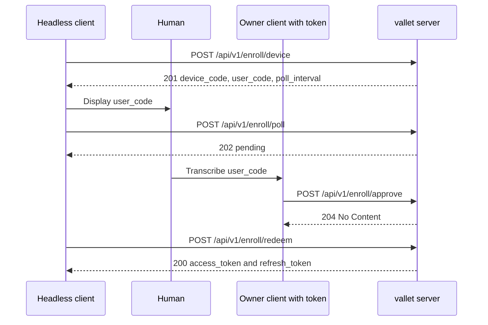
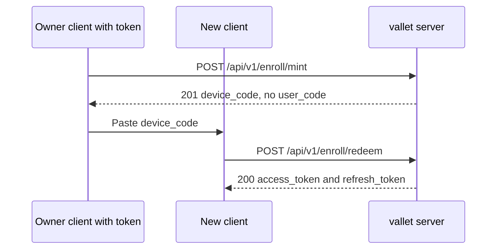
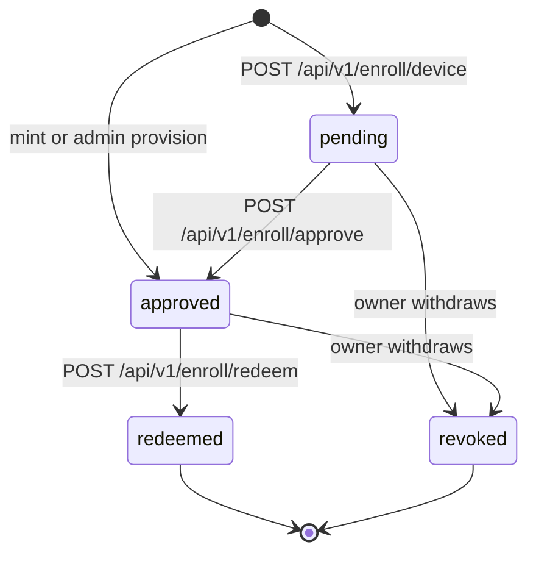

# Users and Onboarding

Nothing in the vallet management API is reachable without a bearer token, so this is the
page to read first. It explains the identity model (administrator, owner, handle, device,
key set), how the very first administrator is created with the `valletd bootstrap-admin`
CLI, how an administrator provisions an owner — which is what "creating a user" means here
— and the three enrollment paths by which a client turns a one-time code into an
access/refresh token pair. Every request and response below was captured from a running
server unless it is explicitly marked otherwise.

## Contents

- [Identity model](#identity-model)
- [Credential prefixes at a glance](#credential-prefixes-at-a-glance)
- [Step 1 — bootstrap the first administrator](#step-1--bootstrap-the-first-administrator)
- [Step 2 — provision an owner](#step-2--provision-an-owner)
- [Onboarding modes](#onboarding-modes)
- [Step 3 — redeem the enrollment code](#step-3--redeem-the-enrollment-code)
- [Enrolling additional clients — the three modes](#enrolling-additional-clients--the-three-modes)
  - [Mode 1 — device-authorization grant](#mode-1--device-authorization-grant)
  - [Mode 2 — mint, the authenticated manual-paste flow](#mode-2--mint-the-authenticated-manual-paste-flow)
  - [Mode 3 — in-client interactive / OIDC](#mode-3--in-client-interactive--oidc)
- [Pairing lifecycle](#pairing-lifecycle)
- [Scopes](#scopes)
- [Token lifecycle and refresh rotation](#token-lifecycle-and-refresh-rotation)
- [Token storage notes for frontend clients](#token-storage-notes-for-frontend-clients)
- [See also](#see-also)

Base URL in every sample: `https://vallet.example.com` for production, or
`https://localhost:8443` with `curl -k` for a local dev server using a self-signed
certificate. Shell variables used: `$ADMIN_TOKEN`, `$ACCESS_TOKEN`, `$REFRESH_TOKEN`.

## Identity model

| Concept | What it is | Created by |
| --- | --- | --- |
| **Administrator** | A privileged operator of the *instance*. Has `id`, `label`, and a status of `active` or `disabled`. Administrators are on a **separate signing key** from owners, so an owner token can never carry admin authority. | `valletd bootstrap-admin` (CLI) |
| **Owner** | The root account entity. It deliberately carries **no name and no email** — only `id`, `status` (`active`, `suspended`, `deleted`) and timestamps. This is what a frontend calls "the user". | `POST /api/v1/admin/owners` |
| **Handle** | The owner's globally unique **public name** — the thing that appears in the publish URL `GET /{handle}`. One handle per owner. Unique on a normalized, look-alike-folded form, and checked against the reserved-identifier blocklist. | Created with the owner |
| **Device** | A machine registered by an owner. Has `id`, `name`, and a status of `active` or `revoked`. Public keys hang off devices. | `POST /api/v1/devices` |
| **Public key** | One SSH public key attached to one device. The server derives everything about it from the submitted line. | `POST /api/v1/keys` |
| **Key set** | A named, resolvable collection of an owner's public keys, with a `visibility` of `public` or `protected`, and at most one `is_default: true` per owner. Served at `GET /{handle}/{set}`. | `POST /api/v1/keysets`, plus a `default` set created with the owner |
| **Pairing** | One enrollment attempt. Holds only *hashes* of the device code and user code, plus the scopes the redemption will carry. Redeemable exactly once. | `POST /api/v1/enroll/device`, `POST /api/v1/enroll/mint`, `POST /api/v1/admin/owners` |
| **Access key** | A bearer credential that resolves **one specific protected key set** on the publish path. See the honesty note in [05-key-sets-and-publishing.md](05-key-sets-and-publishing.md) — there is currently no way to mint one. | Nothing exposed today |

Two independent authority axes exist and they never mix: the **owner** axis (access tokens
for `/api/v1/devices`, `/api/v1/keys`, `/api/v1/keysets`, `/api/v1/enroll/mint`,
`/api/v1/enroll/approve`) and the **administrator** axis (`/api/v1/admin/*`). Presenting an
owner token to an admin route answers `403`; presenting no token at all to an admin route
also answers `403`.

## Credential prefixes at a glance

Every credential the server issues is self-describing by prefix. Use these when writing a
client-side guard so a caller cannot accidentally send the wrong secret to the wrong header.

| Prefix | Credential | Typical lifetime |
| --- | --- | --- |
| `sadm_` | Administrator token | 30 days (`-ttl`, default `720h`) |
| `sva_` | Owner **access** token | ~15 minutes (observed) |
| `svr_` | Owner **refresh** token | ~90 days (observed) |
| `svd_` | Device code / enrollment code | ~10 minutes (observed) |
| `vak_` | Access key for a protected key set | n/a — cannot currently be minted |

## Step 1 — bootstrap the first administrator

There is no HTTP route that creates an administrator. The first one — and every subsequent
one — comes from a CLI subcommand run on the server host. `valletd` has exactly two
subcommands: `bootstrap-admin` and `bootstrap-owner`.

```
$ valletd bootstrap-admin -label "docs-admin"
administrator_id=5SI4C3467CZBGMOHGKWW3WT5U2
label=docs-admin
admin_token=sadm_eyJ2IjoxLCJqdGkiOiJlQlFGSEdiQ3dEM05EMEJTdmxhelRBIiwiYWRtIjoiNVNJNEMzNDY3Q1pCR01PSEdLV1czV1Q1VTIiLCJpYXQiOjE3ODQ5MDkwOTQsImV4cCI6MTc4NzUwMTA5NH0.lHWi7djZhtjBC_aixB0ZFaQBMoaY6IDIMpFydQMep7M
```

| Flag | Meaning |
| --- | --- |
| `-config` | Path to the configuration file |
| `-label` | **Required.** Human-readable label for the administrator row |
| `-ttl` | Token lifetime; default `720h` (30 days) |

Notes that matter operationally:

- The subcommand **runs migrations first** and is idempotent on an already-migrated
  database.
- `auth.admin_token_signing_key_ref` must be configured, or the command refuses with the
  exact message:
  `valletd: bootstrap-admin: auth.admin_token_signing_key_ref must be set to mint an administrator token`
- **There is no per-token revocation.** An administrator token is valid until it expires.
  To cut off a leaked token you disable the administrator *row* — a validly signed token
  for a disabled administrator is refused, because the service re-checks `status == active`
  on every admin request rather than trusting the signature alone.
- The token is printed once. Capture it into `$ADMIN_TOKEN`.

## Step 2 — provision an owner

This is "create a user". It is an administrator action.

```
$ curl -sk -i -X POST https://localhost:8443/api/v1/admin/owners \
    -H "Authorization: Bearer $ADMIN_TOKEN" \
    -H 'Content-Type: application/json' \
    -d '{"handle":"alice"}'
HTTP/2 201
cache-control: no-store
content-type: application/json; charset=utf-8
x-request-id: X4UWYVXQG5BXRNHGUL5UJI2HNL

{"owner_id":"OUP7CNH2TR2IOQKEKF4RTF6Z47","handle":"alice","set_name":"default","enrollment_code":"svd_xSRuLXWoFj9xKhR6c0jAlQ.2UDzHozLNanK6tnxaXd6LqoteW46b8Fo9nLi4vosVVg","expires_at":"2026-07-24T17:15:13.866593461+01:00","pairing_id":"xSRuLXWoFj9xKhR6c0jAlQ"}
```

What happened in that one transaction: an active owner, its handle name-claim, and a
**public** key set named `default` were created; an `owner.created` audit record was
written; and a pre-approved pairing was minted whose device code is returned as
`enrollment_code`. All of it commits or rolls back together, so you can never end up with a
claimed handle and no way to enroll.

| Response field | Use it for |
| --- | --- |
| `owner_id` | The stable identifier for the user |
| `handle` | The public name; publish URL is `/{handle}` |
| `set_name` | Always `default` for a freshly provisioned owner |
| `enrollment_code` | **One-time secret.** Hand it to the owner out of band; it is the `device_code` for `POST /api/v1/enroll/redeem` |
| `expires_at` | ~10 minutes after issue — the code is short-lived by design |
| `pairing_id` | Lookup handle for the pairing; **not** a secret on its own |

A handle that the reserved-identifier blocklist refuses is a `400`:

```
$ curl -sk -X POST https://localhost:8443/api/v1/admin/owners \
    -H "Authorization: Bearer $ADMIN_TOKEN" \
    -H 'Content-Type: application/json' \
    -d '{"handle":"postmaster"}'
[400] {"status":"error"}
```

> **There is no route to re-issue an enrollment code for an owner who already exists.**
> That is deliberate: such a route would let an administrator mint a full-owner credential
> for any account by handle, which is exactly the admin→owner escalation the two-axis design
> forbids. If an owner loses the code before redeeming it, the practical recovery is to
> re-provision under a fresh handle, or to seed the account with `valletd bootstrap-owner`
> on the host.

## Onboarding modes

Configuration carries one knob, `onboarding.mode` (environment variable
`VALLET_ONBOARDING_MODE`, YAML `onboarding.mode`). Validation accepts exactly two values:

| Value | Meaning |
| --- | --- |
| `invite` | **Default.** Owners exist only because an administrator provisioned them. This is the safe posture for self-hosted and team deployments. |
| `open` | Reserved for open self-signup (the SaaS posture). |

Honest status: **open self-signup is not built.** There is no unauthenticated
owner-creation route in the router — building one pulls in identity verification, abuse
handling, and unauthenticated rate limiting, and that work is deferred. So today both
values behave the same on the wire, and `POST /api/v1/admin/owners` is the only way an
owner comes into existence over HTTP. A client should not branch on the mode; treat
administrator provisioning as the only onboarding path.

## Step 3 — redeem the enrollment code

Redemption is **unauthenticated** — the code *is* the credential. Send it as `device_code`.

```
$ curl -sk -i -X POST https://localhost:8443/api/v1/enroll/redeem \
    -H 'Content-Type: application/json' \
    -d '{"device_code":"svd_xSRuLXWoFj9xKhR6c0jAlQ.2UDz…"}'
HTTP/2 200

{"refresh_token":"svr_1Fy07sEjiFiIbZe-0-Dd-g.QPCOk6h_DwLJcORFkap3dzmoxil7Gsnb98v4HfF75uw","refresh_expires_at":"2026-10-22T17:05:28.026740069+01:00","access_token":"sva_eyJ2IjoxLCJqdGkiOiI3dzBmajBjVUpsYXV6U1RnTlFxVVRRIiwib3duIjoiT1VQN0NOSDJUUjJJT1FLRUtGNFJURjZaNDciLCJyZWYiOiIxRnkwN3NFamlGaUliWmUtMC1EZC1nIiwic2NwIjpbeyJrIjoiZnVsbC1vd25lciJ9XSwiaWF0IjoxNzg0OTA5MTI4LCJleHAiOjE3ODQ5MTAwMjh9.ujnpHCi2-r9KYkxOaXPTaBEGhJ7TamfJOkcmxVJClgM","access_expires_at":"2026-07-24T17:20:28.026740069+01:00","owner_id":"OUP7CNH2TR2IOQKEKF4RTF6Z47","scopes":[{"kind":"full-owner"}]}
```

That is the same response shape every redemption returns, whichever mode produced the
pairing. Store both tokens (see [Token storage notes](#token-storage-notes-for-frontend-clients)),
then use `$ACCESS_TOKEN` for everything in
[04-devices-and-keys.md](04-devices-and-keys.md) and
[05-key-sets-and-publishing.md](05-key-sets-and-publishing.md).

Redemption failures are a **uniform `401`** with body `{"status":"error"}` — an unknown
code, an expired code, a pairing nobody approved, and a code that was already redeemed are
one indistinguishable answer. Do not try to tell them apart; re-run enrollment.

## Enrolling additional clients — the three modes

Once an owner holds a token, additional clients (a second laptop, a CI runner, a TV box)
enroll through the pairing surface. Three modes were designed; two are implemented.

### Mode 1 — device-authorization grant

For a client that cannot show a login form — a headless box, a TV, a CLI on a machine with
no browser. The client starts the grant **unauthenticated**, displays a short `user_code`
for a human to transcribe, and polls until the owner approves it from an already-signed-in
client.

**1. Start the grant.** `scopes` is required.

```
$ curl -sk -X POST https://localhost:8443/api/v1/enroll/device \
    -H 'Content-Type: application/json' \
    -d '{"client_label":"tv-box","scopes":[{"kind":"full-owner"}]}'
HTTP/2 201
{"pairing_id":"EPh6xavJgwlFQI5vo-hF3A","device_code":"svd_EPh6xavJgwlFQI5vo-hF3A.aDK8zpdpVm1Gsy9rf7x4blCyDSJTEzMgYtxBmHaY0uI","user_code":"7MAL-ESTP","expires_at":"2026-07-24T17:17:53.593316127+01:00","poll_interval_seconds":5}
```

Keep `device_code` secret and show `user_code` to the human. Respect
`poll_interval_seconds`: the server advances a per-pairing "earliest next poll" deadline on
every poll, so a client that polls faster is slowed down, not served.

**2. Poll while waiting.**

```
$ curl -sk -X POST https://localhost:8443/api/v1/enroll/poll \
    -H 'Content-Type: application/json' \
    -d '{"device_code":"svd_EPh6…"}'
{"status":"pending"}
```

Three answers, verified live:

| Status | Body | Meaning |
| --- | --- | --- |
| `202 Accepted` | `{"status":"pending"}` | Nobody has approved yet. Wait `poll_interval_seconds`, then poll again. |
| `200 OK` | `{"status":"approved"}` | Approved. Redeem now. |
| `401 Unauthorized` | `{"status":"error"}` | Refused — see the warning below. |

> **A `401` most often means you polled too soon, not that the pairing is dead.** The
> server collapses *unknown code*, *expired*, *revoked*, and **polled before the interval
> elapsed** into one indistinguishable `401`. The minimum gap between two polls of the same
> device code is **5 seconds** (`poll_interval_seconds` in the grant response), and a
> too-soon poll pushes the next permitted time out a further 5 seconds **from now** — so a
> client that polls in a tight loop starves itself and never sees `approved`. Sleep for at
> least `poll_interval_seconds` between polls.

**3. The owner approves, out of band**, from a client that already holds an access token.
The owner transcribes the short code:

```
$ curl -sk -i -X POST https://localhost:8443/api/v1/enroll/approve \
    -H "Authorization: Bearer $ACCESS_TOKEN" \
    -H 'Content-Type: application/json' \
    -d '{"user_code":"7MAL-ESTP"}'
HTTP/2 204
vary: Authorization
```

`204 No Content`, no body. A user code the owner does not own, or one that has expired,
answers `403` — the same answer for both, so an owner cannot probe other people's pairings.
This route additionally carries a per-owner failure-counting rate limit, because a
transcribed short code is the one guessable secret in the system.

**4. Redeem.**

```
$ curl -sk -X POST https://localhost:8443/api/v1/enroll/redeem \
    -H 'Content-Type: application/json' \
    -d '{"device_code":"svd_EPh6…"}'
[200] {"refresh_token":"svr_N598WIMaMa3pXuQkqIQRmQ.…","access_token":"sva_…","owner_id":"OUP7CNH2TR2IOQKEKF4RTF6Z47","scopes":[{"kind":"full-owner"}]}
```

> **Redeem is single-use and it is what follows approval.** Once a poll returns
> `{"status":"approved"}`, stop polling and redeem. A second redeem of the same device code
> answers `401`, exactly like an unknown or expired code. If a poll returns `401` when you
> expected `approved`, the overwhelmingly likely cause is polling inside the 5-second
> interval — back off one full interval and poll once more before abandoning the grant.



### Mode 2 — mint, the authenticated manual-paste flow

For a client the owner can paste a code into. The owner, already authenticated, mints a
pairing that is **pre-approved** — the act of minting *is* the approval, so there is no
`user_code` and no approval step.

```
$ curl -sk -X POST https://localhost:8443/api/v1/enroll/mint \
    -H "Authorization: Bearer $ACCESS_TOKEN" \
    -H 'Content-Type: application/json' \
    -d '{"client_label":"backup host","scopes":[{"kind":"full-owner"}]}'
HTTP/2 201
{"pairing_id":"wYB0LRtw6jY4DAsMfWE6rg","device_code":"svd_wYB0LRtw6jY4DAsMfWE6rg.epQn-_9UhcfDk9He2QDjKmtbRLilKOesEV6pwMowtDo","expires_at":"2026-07-24T17:17:53.568191682+01:00","poll_interval_seconds":5}
```

Note the absence of `user_code` in the response — that is the wire-visible difference
between the two modes. The owner copies `device_code` to the new client, which redeems it
exactly as in step 3 above. `poll_interval_seconds` is still returned but a mint-path client
has nothing to wait for; go straight to redeem.

This is also the mechanism behind `POST /api/v1/admin/owners`: the `enrollment_code` in that
response is a mint device code for the brand-new owner.



### Mode 3 — in-client interactive / OIDC

**Deferred. Not implemented.** The design names a third mode in which the client runs an
identity-provider flow directly (OIDC discovery, provider-agnostic claim mapping), but it
needs an IdP integration and a redirect surface that do not exist. No route serves it, and
there is nothing for a client to call. Do not design a UI around it yet.

## Pairing lifecycle

A pairing is a single-use, short-lived record. Only *hashes* of the device code and user
code are stored, so neither can ever be recovered from the database or re-shown to the
owner. Transitions are one-way.



`redeemed` and `revoked` are terminal — a device code that reached either will never
authenticate again. A pairing also simply expires (~10 minutes), after which redemption
answers the same uniform `401`.

## Scopes

`scopes` is **required** on both grant endpoints, `POST /api/v1/enroll/device` and
`POST /api/v1/enroll/mint`. The scopes are fixed when the pairing is created, so the
authority a client receives is decided up front by whoever created the pairing, never
negotiated by the client at redemption. Each entry is an object:

```json
{"kind": "full-owner"}
```

| `kind` | Grants | Requires `resource_id` |
| --- | --- | --- |
| `full-owner` | Everything on the owner axis | No |
| `read-only` | Non-mutating routes only | No |
| `single-set` | One key set, named by `resource_id` | Yes |
| `single-device` | One device, named by `resource_id` | Yes |

Only `full-owner` was exercised live. `read-only`, `single-set`, and `single-device` are
**(from the code; not exercised live)**. A resource-bound entry looks like
`{"kind":"single-set","resource_id":"HPDG66LHVCCN43WPGSFCCMEIUU"}`; the resource id must be
present for exactly those two kinds and absent for the other two, or the request is a `400`.

> **The wire value is hyphenated: `full-owner`.** The OpenAPI `Scope` schema describes the
> kinds as `full_owner`, `key_set`, and `device`. That text is **stale**. The server rejects
> `{"kind":"full_owner"}` with `400` and both accepts and returns `full-owner`. Verified in
> both directions.

Scope enforcement happens at the route level, before any handler runs: account-wide routes
(register a device, list devices, add or list keys, create or list key sets, mint, approve,
set a default set) refuse a resource-bound token outright, and a read-only token cannot
reach any mutating method.

## Token lifecycle and refresh rotation

Exchange a refresh token for a fresh pair at `POST /api/v1/token`. The endpoint is
unauthenticated in the header sense — the refresh token in the body *is* the credential.

```
$ curl -sk -X POST https://localhost:8443/api/v1/token \
    -H 'Content-Type: application/json' \
    -d '{"refresh_token":"svr_N598WIMaMa3pXuQkqIQRmQ.…"}'
[200] {"refresh_token":"svr_2XUzIBL5tyoIVNfXy-__fg.fLV3aH_oQK5AOCXKd2eihb1jxOpcQfK5sRZgCPZ1nCw","refresh_expires_at":"2026-10-22T16:08:05.62322684Z","access_token":"sva_…","access_expires_at":"2026-07-24T17:23:21.199348146+01:00","owner_id":"OUP7CNH2TR2IOQKEKF4RTF6Z47","scopes":[{"kind":"full-owner"}]}
```

**Refresh tokens are single-use and rotate.** The response carries a *new* `refresh_token`;
the one you sent is spent. Replaying the same refresh token is treated as theft — reuse
detection revokes the whole lineage, which logs out the client that legitimately holds the
rotated token as well. The observed replay of the exact request above:

```
[401] {"status":"error"}
```

So the sequence is: `200` on the first exchange, `401` on the replay, and the lineage is
dead — the client must enroll again from scratch.

## Token storage notes for frontend clients

- **Access token (`sva_`): ~15 minutes.** Short enough that you must plan for silent
  refresh. Keep it in memory where you can.
- **Refresh token (`svr_`): ~90 days.** This is the long-lived secret; persist it in the
  most protected store your platform offers (OS keychain, secure storage, an HTTP-only
  cookie set by your own backend — never `localStorage` if you can avoid it).
- **Persist the rotated refresh token before you use the new access token.** This is the
  single most common way to brick a client: you exchange, the process crashes or the write
  fails, you retry with the *old* refresh token, reuse detection fires, and the lineage is
  revoked. Write the new refresh token durably first, then proceed.
- **Serialize refresh exchanges.** Two tabs or two worker threads exchanging the same
  refresh token concurrently will produce exactly the reuse pattern that revokes the
  lineage. Use a lock, a leader tab, or a single refresh coordinator.
- **On `401` from a management route**, exchange the refresh token once and retry. On `401`
  from the exchange itself, the lineage is gone — surface a re-enrollment prompt rather
  than retrying.
- `scopes` and `owner_id` come back on every issuance; cache them alongside the tokens so
  the UI can hide actions a resource-bound or read-only token cannot perform.

## See also

- [README.md](README.md) — guide index
- [01-quickstart.md](01-quickstart.md) — end-to-end first run
- [02-configuration.md](02-configuration.md) — server configuration and secrets
- [04-devices-and-keys.md](04-devices-and-keys.md) — registering devices and enrolling public keys
- [05-key-sets-and-publishing.md](05-key-sets-and-publishing.md) — key sets, visibility, and the publish read path
- [06-api-reference.md](06-api-reference.md) — every route, request, and response
- [07-errors-security-and-limits.md](07-errors-security-and-limits.md) — error bodies, enumeration policy, rate limits
