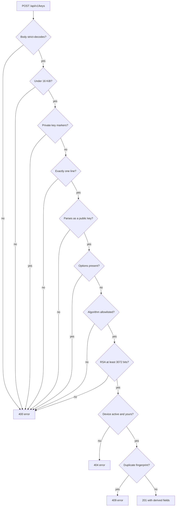
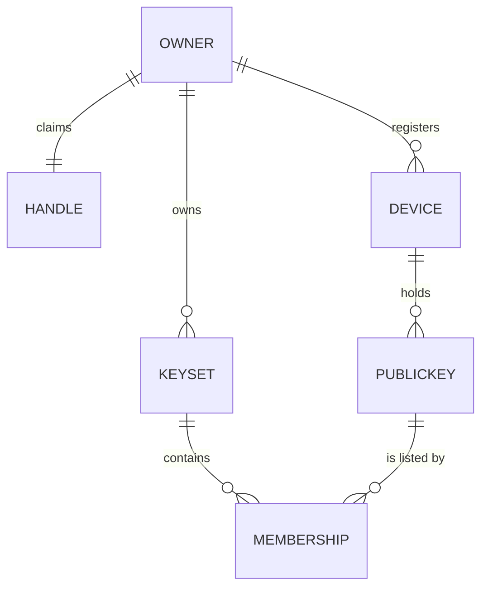

# Devices and Keys

A vallet owner does not hold a flat bag of SSH keys: every public key belongs to a
**device**, and the device is the unit an owner revokes when a laptop is lost. This page
covers registering, listing and revoking devices, enrolling public keys onto them, and —
in detail, because it is where most client bugs live — exactly what the key-ingest layer
refuses and with which status code. Every request and response below was captured from a
running server unless marked otherwise.

## Contents

- [Why keys hang off devices](#why-keys-hang-off-devices)
- [Register a device](#register-a-device)
- [List devices](#list-devices)
- [Revoke a device](#revoke-a-device)
- [Enroll a public key](#enroll-a-public-key)
- [What the key ingest refuses](#what-the-key-ingest-refuses)
- [Accepted algorithms](#accepted-algorithms)
- [List keys](#list-keys)
- [Revoke a key](#revoke-a-key)
- [Revocation is not deletion](#revocation-is-not-deletion)
- [Data model](#data-model)
- [See also](#see-also)

Base URL: `https://vallet.example.com` in production, or `https://localhost:8443` with
`curl -k` against a local dev server. Every route on this page needs
`Authorization: Bearer $ACCESS_TOKEN` — see
[03-users-and-onboarding.md](03-users-and-onboarding.md) for how to get one. Management
responses carry `cache-control: no-store` and, when authenticated, `vary: Authorization`.

## Why keys hang off devices

The owner is the account; the device is the *thing that holds a private key*. Modelling it
this way means "my laptop was stolen" is one call — revoke the device — rather than an
audit of which key fingerprints lived on which machine. A device has:

| Field | Notes |
| --- | --- |
| `id` | Opaque, non-guessable identifier |
| `name` | Operator-visible label you supply |
| `status` | `active` or `revoked` |
| `created_at`, `updated_at` | RFC 3339 timestamps |

A key can never be created without naming an existing, active device of yours.

## Register a device

```
$ curl -sk -X POST https://localhost:8443/api/v1/devices \
    -H "Authorization: Bearer $ACCESS_TOKEN" \
    -H 'Content-Type: application/json' \
    -d '{"name":"work laptop"}'
{"id":"SOE3NPUCSIRKLLQXSPNNUQQETR","name":"work laptop","status":"active","created_at":"2026-07-24T16:05:52.734103101Z","updated_at":"2026-07-24T16:05:52.734103101Z"}
```

Status: **`201 Created`**.

> **The field is `name`, not `label`.** Sending `{"label":"work laptop"}` answers `400`
> with `{"status":"error"}`. Every management endpoint decodes **strictly**: unknown
> fields are refused rather than ignored, a second JSON value in the same body is refused,
> and the body is size-bounded (4 KiB for device requests, 64 KiB for key requests). That
> strictness is a security property, not pedantry — it is what makes a request such as
> `{"name":"x","owner_id":"victim"}` fail loudly instead of quietly dropping the field a
> client tried to assert.

There is no `owner_id` field on any request body: the owner always comes from the bearer
token and can never be named by the caller.

## List devices

```
$ curl -sk https://localhost:8443/api/v1/devices \
    -H "Authorization: Bearer $ACCESS_TOKEN"
{"devices":[]}
```

Status `200`. The response is always an object with a `devices` array, empty before any
device is registered. Only the token owner's devices appear; there is no cross-owner
visibility of any kind.

This route is account-wide, so a resource-bound token (`single-set`, `single-device`)
cannot reach it.

## Revoke a device

```
$ curl -sk -i -X DELETE \
    https://localhost:8443/api/v1/devices/SOE3NPUCSIRKLLQXSPNNUQQETR \
    -H "Authorization: Bearer $ACCESS_TOKEN"
HTTP/2 204
```

`204 No Content`, no body. A device id that is unknown, belongs to another owner, or has
already been revoked all answer the same `404` with `{"status":"error"}` — the three cases
are deliberately indistinguishable, so a caller cannot use the endpoint to discover whether
an identifier exists.

## Enroll a public key

Submit one `authorized_keys`-style line and the device it belongs to:

```
$ curl -sk -X POST https://localhost:8443/api/v1/keys \
    -H "Authorization: Bearer $ACCESS_TOKEN" \
    -H 'Content-Type: application/json' \
    -d '{"device_id":"SOE3NPUCSIRKLLQXSPNNUQQETR","public_key":"ssh-ed25519 AAAAC3NzaC1lZDI1NTE5AAAAIFEDekQ7K0Z2UMpuepS0mnASJ7EJH8x6WUSEtgFZixT6 alice@laptop"}'
{"id":"4CWDFHTBRB2A7UGJWR5YBFHT64","device_id":"SOE3NPUCSIRKLLQXSPNNUQQETR","algorithm":"ssh-ed25519","comment":"alice@laptop","fingerprint":"SHA256:4LA2LcP4zPzowu7BJB47GKbwwOM9/+nniaEqpBq8TMU","bit_len":256,"status":"active","created_at":"2026-07-24T16:06:00.437902348Z","updated_at":"2026-07-24T16:06:00.437902348Z"}
```

Status: **`201 Created`**. The request body has exactly two fields, `device_id` and
`public_key`.

> **The server derives `algorithm`, `comment`, `fingerprint` and `bit_len`.** A client
> cannot assert any of them — sending them is an unknown-field `400`. The key is parsed
> once, re-serialized into its canonical wire form, and stored that way; a client-asserted
> fingerprint would be a client-asserted *identity* for the key, which is precisely what
> must not be possible.

> **Creating a key does not publish it.** `POST /api/v1/keys` attaches the key to a device.
> It does **not** add the key to any key set, and there is no HTTP route that does. Until
> that gap is closed, a key enrolled over the API is never served by `GET /{handle}`. See
> the callout in [05-key-sets-and-publishing.md](05-key-sets-and-publishing.md).

Failure statuses:

| Status | Cause |
| --- | --- |
| `400` | Anything the ingest layer refuses (see the next section), an unknown field, a malformed or oversized body |
| `401` | Missing or invalid access token |
| `403` | The token's scope does not permit this account-wide mutation |
| `404` | `device_id` is unknown, belongs to another owner, or names a revoked device — one indistinguishable answer for all three |
| `409` | You already hold this exact key |
| `500` | Server fault |

The `409` is safe to distinguish because it can only ever report on a key the caller
*already owns*; every cross-owner case collapses into the uniform `404` long before it.

## What the key ingest refuses

All of these are `400` with the uniform `{"status":"error"}` body. The server never echoes
the rejected bytes and never explains which rule fired, so your client must validate
locally if you want to give the user a useful message.

| Refused | Why |
| --- | --- |
| **Private key material** | Detected by marker scan (`private key`, `putty-user-key-file`, case-insensitive) **before any parsing**. The submission is never parsed, never stored, and never echoed back. This is the single most important thing to catch client-side: tell the user to submit the `.pub` file. |
| **`authorized_keys` options of any kind** | `command=`, `from=`, `no-pty`, restrict, environment — anything in the options field. Keys are stored canonically and options are never accepted, so an option can never ride along into a host's `authorized_keys`. |
| **An algorithm outside the allowlist** | Including `ssh-dss` and every certificate type. |
| **RSA below 3072 bits** | Hard floor; there is no configuration that lowers it. |
| **More than one key in one submission** | Exactly one key line. A trailing newline is tolerated; a second line, an embedded `\r`, or trailing content after the key is refused. |
| **An empty or comment-only line** | A line beginning with `#` after leading whitespace is refused rather than skipped. |
| **An oversized submission** | The ingest ceiling is **16 KiB** per key line; the HTTP body ceiling for this endpoint is **64 KiB**. |
| **An invalid trailing comment** | The comment must pass the domain comment validator. |



## Accepted algorithms

| `algorithm` value | Reported `bit_len` |
| --- | --- |
| `ssh-ed25519` | 256 |
| `ecdsa-sha2-nistp256` | 256 |
| `ecdsa-sha2-nistp384` | 384 |
| `ecdsa-sha2-nistp521` | 521 |
| `ssh-rsa` | Actual modulus size; **minimum 3072** |
| `sk-ssh-ed25519@openssh.com` | 256 |
| `sk-ecdsa-sha2-nistp256@openssh.com` | 256 |

DSA (`ssh-dss`) is intentionally absent and always refused. The two `sk-` entries are
FIDO/U2F hardware-backed keys.

## List keys

```
$ curl -sk https://localhost:8443/api/v1/keys \
    -H "Authorization: Bearer $ACCESS_TOKEN"
{"keys":[{ …same shape as the create response… }]}
```

Status `200`, always an object with a `keys` array. **Revoked keys are included**, carrying
`"status":"revoked"` and a revocation timestamp. That is intentional: this is the owner's
own inventory, and hiding revoked keys would make "I revoked this" indistinguishable from
"this was never enrolled" for the one party entitled to know the difference.

## Revoke a key

```
$ curl -sk -i -X DELETE \
    https://localhost:8443/api/v1/keys/4CWDFHTBRB2A7UGJWR5YBFHT64 \
    -H "Authorization: Bearer $ACCESS_TOKEN"
HTTP/2 204
```

Repeating the same call:

```
$ curl -sk -i -X DELETE \
    https://localhost:8443/api/v1/keys/4CWDFHTBRB2A7UGJWR5YBFHT64 \
    -H "Authorization: Bearer $ACCESS_TOKEN"
HTTP/2 404

{"status":"error"}
```

An unknown id, another owner's id, and an already-revoked key are **one answer**. Repeating
a revoke is therefore safe — the second call changes nothing — but it will not answer `204`
a second time, which is a deliberate departure from the usual REST convention: answering
the repeat with success would expose a key's lifecycle state as a third, distinguishable
outcome. Write your client so that `404` on a revoke means "it is not active", never "it
never existed".

## Revocation is not deletion

For **public keys** this is exact: revoking marks the row `revoked`, stamps `revoked_at`,
stops it being served by the publish path, and leaves it visible in the owner's own
`GET /api/v1/keys` listing. Nothing is erased. Every revoke also writes an append-only
audit record carrying the fingerprint and algorithm — never the key blob.

For **devices**, revoke likewise transitions the status rather than deleting the row.

For **key sets**, `DELETE /api/v1/keysets/{id}` is different: it removes the set and its
membership rows, though the underlying public keys survive (a key may belong to several
sets, and always belongs to its device). See
[05-key-sets-and-publishing.md](05-key-sets-and-publishing.md).

## Data model



A `MEMBERSHIP` row is what makes a key appear in a published set. **No HTTP route creates
one** — see [05-key-sets-and-publishing.md](05-key-sets-and-publishing.md).

## See also

- [README.md](README.md) — guide index
- [01-quickstart.md](01-quickstart.md) — end-to-end first run
- [02-configuration.md](02-configuration.md) — server configuration and secrets
- [03-users-and-onboarding.md](03-users-and-onboarding.md) — identity model, enrollment, and tokens
- [05-key-sets-and-publishing.md](05-key-sets-and-publishing.md) — key sets, visibility, and the publish read path
- [06-api-reference.md](06-api-reference.md) — every route, request, and response
- [07-errors-security-and-limits.md](07-errors-security-and-limits.md) — error bodies, enumeration policy, rate limits
