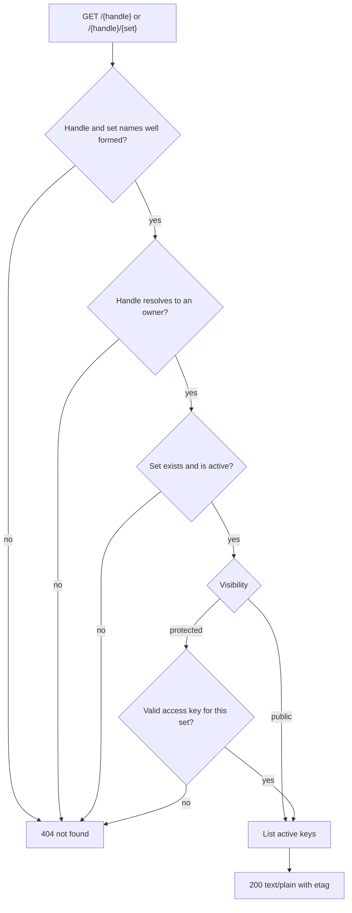
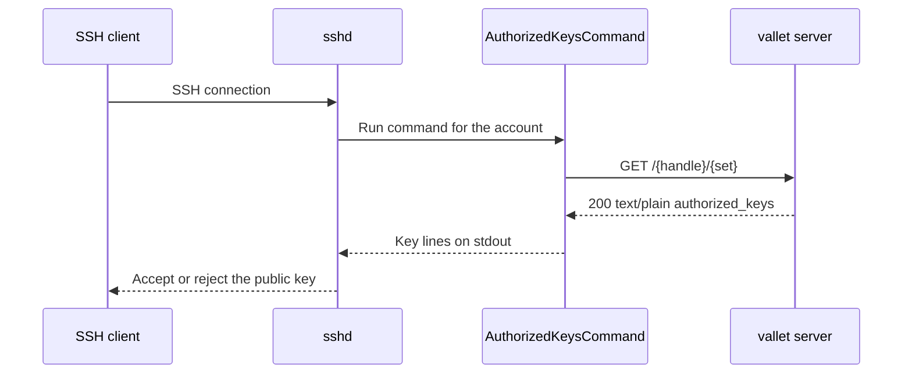

# Key Sets and Publishing

A **key set** is a named, resolvable collection of an owner's public keys, and it is what
the world actually fetches: `GET /{handle}` serves the owner's default set as a native
`authorized_keys` file, and `GET /{handle}/{set}` serves a named one. This page covers
managing sets over the API, the two behaviours most likely to break a client (a rename
changes the set's id, and there is no route to put a key *into* a set), the delete
confirmation protocol, and the unauthenticated read path a server consumes with
`AuthorizedKeysCommand`.

## Contents

- [The key set model](#the-key-set-model)
- [FINDING 5 — there is no route to add a key to a key set](#finding-5--there-is-no-route-to-add-a-key-to-a-key-set)
- [FINDING 6 — renaming changes the set id](#finding-6--renaming-changes-the-set-id)
- [Create a key set](#create-a-key-set)
- [List key sets](#list-key-sets)
- [Rename a key set](#rename-a-key-set)
- [Set the default set](#set-the-default-set)
- [Set visibility](#set-visibility)
- [Delete a key set](#delete-a-key-set)
- [Name quarantine on rename and delete](#name-quarantine-on-rename-and-delete)
- [The publish read path](#the-publish-read-path)
- [Protected sets and access keys](#protected-sets-and-access-keys)
- [Publish resolution](#publish-resolution)
- [Consuming keys from a server](#consuming-keys-from-a-server)
- [See also](#see-also)

Base URL: `https://vallet.example.com` in production, or `https://localhost:8443` with
`curl -k` locally. Management routes need `Authorization: Bearer $ACCESS_TOKEN`; the
publish routes need no credential at all for a public set.

## The key set model

| Field | Notes |
| --- | --- |
| `id` | Opaque identifier. **Not stable across a rename** — see FINDING 6 |
| `name` | The path segment in `GET /{handle}/{set}` |
| `visibility` | `public` or `protected` |
| `is_default` | At most one per owner; it is what bare `GET /{handle}` resolves to |
| `created_at`, `updated_at` | RFC 3339 timestamps |

Per-owner cap: **100 sets by default** (`retention.max_sets_per_owner`,
`VALLET_RETENTION_MAX_SETS_PER_OWNER`). Exceeding it is a `409` with reason
`limit_reached`.

> **Key-set `409` bodies are the one exception to the uniform error body.** Every other
> management error is exactly `{"status":"error"}`. A key-set conflict adds a fixed
> `reason`: `{"status":"error","reason":"name_taken"}`. The four reasons are `name_taken`,
> `limit_reached`, `default_set`, and `confirmation_required`. They are safe to report
> because each can only ever describe the caller's *own* account — a stranger's set id
> produces a reasonless `404` long before any of them.

## FINDING 5 — there is no route to add a key to a key set

> **This is the largest functional gap in the current API, and a client built without
> knowing about it will look broken.**
>
> `POST /api/v1/keys` creates a public key and attaches it to a device. It does **not**
> create a membership row in any key set, and **no HTTP route creates one**. The
> repository operation exists (`AddMember`) but its only caller is the bootstrap service
> behind the `valletd bootstrap-owner` CLI.
>
> The consequence: a key enrolled over the API is never published. The publish endpoint
> answers `200` with an **empty body**.

Enrolled over the API, then fetched — note `content-length: 0`:

```
$ curl -sk -i https://localhost:8443/alice
HTTP/2 200
cache-control: public, max-age=60
content-type: text/plain; charset=utf-8
etag: "e3b0c44298fc1c149afbf4c8996fb92427ae41e4649b934ca495991b7852b855"
content-length: 0
```

That etag is the SHA-256 of the empty string — a useful sentinel to assert against in a
client health check.

Seeded with the CLI instead, the same fetch serves the key:

```
$ valletd bootstrap-owner -handle bob -key-file ./id_ed25519.pub -device "bob-laptop"
owner_id=QI4IBYFNLCCKVESZ57LPZTCQSA
handle=bob
set=default
key_fingerprint=SHA256:4LA2LcP4zPzowu7BJB47GKbwwOM9/+nniaEqpBq8TMU

$ curl -sk -i https://localhost:8443/bob
HTTP/2 200
cache-control: public, max-age=60
content-type: text/plain; charset=utf-8
etag: "18ada6ff3dcbc0c7f3a2eaf3e2316b0a6c4c2c8f8a7d3b6fd92abe06d3d47cae"
content-length: 94

ssh-ed25519 AAAAC3NzaC1lZDI1NTE5AAAAIFEDekQ7K0Z2UMpuepS0mnASJ7EJH8x6WUSEtgFZixT6 alice@laptop
```

`bootstrap-owner` flags: `-config`, `-handle` (required), `-key-file` (a path, or `-` for
stdin), `-device` (default `bootstrap`), `-set`.

**What to do about it in a client today:** surface the enrolled key in the UI, but do not
promise the user it is live. Until a membership route lands, publishing requires host
access and the CLI. Do not paper over the gap with a retry loop or a fabricated success
state.

## FINDING 6 — renaming changes the set id

> **`PATCH /api/v1/keysets/{id}` returns a row with a NEW `id`.** The membership moves to
> the new row, the old row becomes a quarantined tombstone holding the freed name, and
> every subsequent call using the old id answers `404`. A client that caches set ids
> across a rename will silently start 404-ing.

Observed, end to end:

```
$ curl -sk -X PATCH https://localhost:8443/api/v1/keysets/IZMTEKANV4GDI7UGUB6FOBO5VB \
    -H "Authorization: Bearer $ACCESS_TOKEN" \
    -H 'Content-Type: application/json' \
    -d '{"name":"prod-servers"}'
HTTP/2 200
{"id":"HPDG66LHVCCN43WPGSFCCMEIUU","name":"prod-servers","visibility":"protected","is_default":false,…}
```

Before: `IZMTEKANV4GDI7UGUB6FOBO5VB`. After: `HPDG66LHVCCN43WPGSFCCMEIUU`. Reusing the old
id:

```
PUT /api/v1/keysets/IZMTEKANV4GDI7UGUB6FOBO5VB/visibility  -> 404 {"status":"error"}
PUT /api/v1/keysets/IZMTEKANV4GDI7UGUB6FOBO5VB/default     -> 404 {"status":"error"}
```

Why: a key set row's name is immutable at the storage layer, so a rename is implemented as
"insert a new row under the new name, move the membership, quarantine the old row" — all in
one transaction, so a half-renamed set is unreachable. If the renamed set was the default,
the designation is carried to the new row in the same transaction.

**Client rules:**

1. Always take the `id` from the rename response and replace whatever you were holding.
2. Never persist a set id in a long-lived store (a URL, a saved config, a job definition)
   without a re-read path. Re-list and match on `name` if you need durability.
3. Treat a `404` on a previously known set id as "it was renamed", and re-list before
   showing the user an error.

## Create a key set

```
$ curl -sk -i -X POST https://localhost:8443/api/v1/keysets \
    -H "Authorization: Bearer $ACCESS_TOKEN" \
    -H 'Content-Type: application/json' \
    -d '{"name":"servers"}'
HTTP/2 201
{"id":"IZMTEKANV4GDI7UGUB6FOBO5VB","name":"servers","visibility":"protected","is_default":false,"created_at":"2026-07-24T16:07:12.067856138Z","updated_at":"2026-07-24T16:07:12.067856138Z"}
```

> **FINDING 7 — new sets are `protected` by default.** A set you create over the API is
> **not** publicly readable until you change its visibility. The one exception is the
> `default` set created during owner provisioning, which is `public`. If your UI shows a
> "share this URL" affordance right after creating a set, it will hand the user a URL that
> answers `404` to everyone.

Conflicts: `409` with `reason: name_taken` (including against a quarantined tombstone —
see below), or `reason: limit_reached`. A name the reserved-identifier guard refuses is a
`400`.

## List key sets

```
$ curl -sk https://localhost:8443/api/v1/keysets \
    -H "Authorization: Bearer $ACCESS_TOKEN"
{"key_sets":[{"id":"DEORY7CPZIXRDC7PIBBJ7UKGKW","name":"default","visibility":"public","is_default":true,"created_at":"2026-07-24T16:05:13.865007966Z","updated_at":"2026-07-24T16:05:13.865007966Z"}]}
```

Status `200`, always an object with a `key_sets` array. Quarantined tombstones left behind
by a rename or a delete are **filtered out** — you will never see them, even though they
still reserve their names.

## Rename a key set

`PATCH /api/v1/keysets/{keySetID}` with `{"name":"new-name"}` → `200` and the renamed row.
Read [FINDING 6](#finding-6--renaming-changes-the-set-id) before using it. A token bound to
this specific set is sufficient; a token bound to a different set is refused.

## Set the default set

```
$ curl -sk -i -X PUT \
    https://localhost:8443/api/v1/keysets/HPDG66LHVCCN43WPGSFCCMEIUU/default \
    -H "Authorization: Bearer $ACCESS_TOKEN"
HTTP/2 200
```

No request body. Designating a default also clears `is_default` on the previous default, in
the same transaction — which is why this route requires an **account-wide** token even
though its path names one set: a set-bound token performing it would mutate a set it was
never scoped to, and would repoint bare `GET /{handle}`.

Re-list after calling it if your UI shows the default flag; two rows changed, not one.

## Set visibility

```
$ curl -sk -i -X PUT \
    https://localhost:8443/api/v1/keysets/HPDG66LHVCCN43WPGSFCCMEIUU/visibility \
    -H "Authorization: Bearer $ACCESS_TOKEN" \
    -H 'Content-Type: application/json' \
    -d '{"visibility":"public"}'
HTTP/2 200
```

Body is `{"visibility":"public"}` or `{"visibility":"protected"}`; anything else is a `400`.
A set-bound token may perform this on its own set.

## Delete a key set

```
$ curl -sk -i -X DELETE \
    https://localhost:8443/api/v1/keysets/HPDG66LHVCCN43WPGSFCCMEIUU \
    -H "Authorization: Bearer $ACCESS_TOKEN"
HTTP/2 204
```

Deleting removes the set and its membership rows. **The underlying public keys are never
deleted** — a key may belong to other sets and always belongs to its device.

Two `409` refusals:

| `reason` | Meaning | Fix |
| --- | --- | --- |
| `default_set` | The designated default cannot be deleted by any path, so bare `GET /{handle}` can never dangle | Designate another default first |
| `confirmation_required` | The set still has members | Re-send with an explicit confirmation |

> **The confirmation is a JSON body field, not a query parameter.** Send
> `{"confirm": true}` in the `DELETE` request body. (The capture notes describe it as a
> `?confirm=true`-style parameter; that is wrong — the handler decodes a `confirm` boolean
> from the body.)

```
$ curl -sk -i -X DELETE \
    https://localhost:8443/api/v1/keysets/HPDG66LHVCCN43WPGSFCCMEIUU \
    -H "Authorization: Bearer $ACCESS_TOKEN" \
    -H 'Content-Type: application/json' \
    -d '{"confirm":true}'
HTTP/2 204
```

The confirmation **fails closed**: an absent body, an absent field, and `false` all leave
it unset and refuse with `409 confirmation_required`. A body that is present but malformed
is a `400`, never read as a declined confirmation — so there is no shape of malformed
request that deletes more than a well-formed one would.

`404` covers an unknown identifier, another owner's identifier, and a quarantined tombstone,
indistinguishably.

## Name quarantine on rename and delete

A freed set name does not return to the pool immediately. When a set is renamed or deleted,
the old row is kept as a **quarantined tombstone** that holds the name in reserve for a
cooling-off window — **30 days by default**, configurable via
`retention.handle_quarantine`. The same rule applies to owner handles.

Why it exists: consumers poll `GET /{handle}/{set}` on a cache timer. If the name were
immediately reclaimable, re-creating it would start serving a *different* key list at a URL
servers are still trusting. Quarantine makes the old URL fail closed instead.

Consequences a client must handle:

- Re-creating a set under a name you just freed answers `409 name_taken` for the
  quarantine window, even though the set does not appear in your listing. Say so in the UI
  — "this name is reserved for 30 days after rename or deletion" — rather than reporting a
  generic conflict.
- The old `/{handle}/{set}` URL returns `404`, never a redirect. Renames are not
  transparent to consumers; tell the user that hosts pointed at the old path will stop
  updating and must be repointed.
- The same rule is defined for owner handles — a freed handle `404`s and nobody else can
  claim it during quarantine — but note that **no HTTP route renames or deletes a handle
  today**, so a client cannot trigger it. A handle is claimed once, when the owner is
  provisioned.

## The publish read path

Two routes, one handler, no credential required for a public set:

| Route | Serves |
| --- | --- |
| `GET /{handle}` | The owner's **default** set |
| `GET /{handle}/{set}` | The named set |

```
$ curl -sk -i https://localhost:8443/bob
HTTP/2 200
cache-control: public, max-age=60
content-type: text/plain; charset=utf-8
etag: "18ada6ff3dcbc0c7f3a2eaf3e2316b0a6c4c2c8f8a7d3b6fd92abe06d3d47cae"
content-length: 94

ssh-ed25519 AAAAC3NzaC1lZDI1NTE5AAAAIFEDekQ7K0Z2UMpuepS0mnASJ7EJH8x6WUSEtgFZixT6 alice@laptop
```

- **Body is a native `authorized_keys` file** — `text/plain`, one canonical key per line,
  no options ever, directly usable by sshd. There is no JSON envelope and no client
  library required.
- **`etag` is a strong validator**, the SHA-256 of the body. Send `If-None-Match` and
  expect `304`.
- **`cache-control: public, max-age=60`** for a public set. One minute is the deliberate
  compromise: long enough that a fleet of pollers is mostly served from cache, short enough
  that a key revocation takes effect quickly.
- **Full HEAD parity.** `curl -I` returns identical headers with no body; the route is
  registered once for both methods so they cannot drift.

Everything negative is one uniform `404` with a **plain-text** body:

```
$ curl -sk -i https://localhost:8443/nope
HTTP/2 404
cache-control: no-store
content-type: text/plain; charset=utf-8
content-length: 10

not found
```

Note that this is `not found` as plain text, **not** the management API's
`{"status":"error"}` JSON. An unknown handle, a malformed handle, an unknown set name, a
set belonging to someone else, a quarantined or retired set, and a refused credential are
all byte-identical. Do not attempt to distinguish them; you cannot, and that is the point.

## Protected sets and access keys

A `protected` set is served only to a caller presenting `Authorization: Bearer <access
key>` where that access key was minted **for that exact set**. An access key uses the
`vak_` prefix. When a protected set is served, the response carries
`cache-control: private` and `vary: Authorization` instead of the public caching headers
*(from the code; not exercised live — see below for why)*. The credential is read from the
`Authorization` header **only**: never a query parameter, never a cookie, because both are
logged by proxies and travel cross-site without the caller's intent.

Anything short of a valid access key for that exact set — no header, an empty bearer, a
malformed token, a valid key for a *different* set, a revoked key, a non-Bearer scheme —
produces the same uniform plain-text `404` above.

> **Honesty note: access keys cannot currently be minted.** There is **no HTTP route** that
> mints, lists, rotates or revokes an access key, and **no `valletd` subcommand** either —
> `valletd` has exactly two subcommands, `bootstrap-admin` and `bootstrap-owner`, neither of
> which touches access keys. The service layer is complete (mint, verify, list, revoke,
> rotate, grace-window expiry) and the publish path already verifies `vak_` tokens and runs
> a background sweep to retire keys whose grace window has lapsed — but nothing exposes the
> mint. In practice this means **a protected set is unreachable by any caller today**, and
> that is why the protected-set `200` response above could not be captured live.
>
> For a set that must actually be readable, set its visibility to `public`.

## Publish resolution

The order matters, because it is a security property: a set's lifecycle state is checked
**before** any credential is looked at, so no token is ever good enough to resurrect a
quarantined or retired set.



The membership query is owner-scoped and filters on `status = active`, so a revoked key
stops being served without any extra bookkeeping, and no other owner's key can ever appear
in a set.

## Consuming keys from a server

The publish path is designed so a host needs no client software at all. An
`AuthorizedKeysCommand` that shells out to `curl` is a complete integration:

```sh
#!/bin/sh
# /usr/local/sbin/vallet-authorized-keys
exec curl --silent --show-error --fail \
  --max-time 5 \
  "https://vallet.example.com/alice/servers"
```

```
# /etc/ssh/sshd_config
AuthorizedKeysCommand /usr/local/sbin/vallet-authorized-keys
AuthorizedKeysCommandUser nobody
```



For anything beyond this — caching, a managed block inside an existing `authorized_keys`,
failure behaviour when the server is unreachable, and verified installation — use the
**`vallet-helper`**. The server ships it at `GET /install/vallet-helper.sh` with its digest
at `GET /install/vallet-helper.sh.sha256` (in `sha256sum -c` format), both embedded in the
binary at build time. The installation and verification procedure is documented in
[../install-helper.md](../install-helper.md); it is not duplicated here.

## See also

- [README.md](README.md) — guide index
- [01-quickstart.md](01-quickstart.md) — end-to-end first run
- [02-configuration.md](02-configuration.md) — server configuration and secrets
- [03-users-and-onboarding.md](03-users-and-onboarding.md) — identity model, enrollment, and tokens
- [04-devices-and-keys.md](04-devices-and-keys.md) — registering devices and enrolling public keys
- [06-api-reference.md](06-api-reference.md) — every route, request, and response
- [07-errors-security-and-limits.md](07-errors-security-and-limits.md) — error bodies, enumeration policy, rate limits
