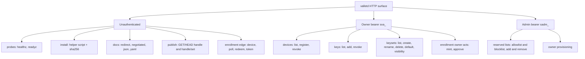
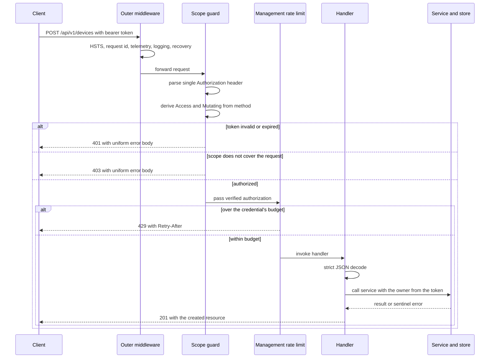

# API Reference

This is the exhaustive endpoint reference for `valletd`. It documents **35 operations** across nine groups: liveness probes, the served installer, the self-served OpenAPI contract, the unauthenticated publish path, the owner-authenticated management API (devices, public keys, key sets), the enrollment and token-issuance surface, and the administrator surface. Everything below was checked against the router (`internal/transport/http/router.go`), the handlers, and the contract-tested OpenAPI document; wherever a real captured request/response pair exists it is shown verbatim, and every other sample is marked as derived from the spec. Production examples use `https://vallet.example.com`; local development examples use `https://localhost:8443` with `curl -k`, because the dev server presents a self-signed certificate.

## Contents

- [Endpoint summary](#endpoint-summary)
- [The common envelope](#the-common-envelope)
  - [Authentication](#authentication)
  - [Scopes and the scope guard](#scopes-and-the-scope-guard)
  - [Rate-limit tiers](#rate-limit-tiers)
  - [Shared headers](#shared-headers)
  - [Error bodies](#error-bodies)
  - [Strict JSON decoding](#strict-json-decoding)
  - [No route accepts an owner identifier](#no-route-accepts-an-owner-identifier)
  - [The surface at a glance](#the-surface-at-a-glance)
  - [How an authenticated management call is processed](#how-an-authenticated-management-call-is-processed)
- [Probes](#probes)
  - [`GET /healthz`](#get-healthz)
  - [`GET /readyz`](#get-readyz)
- [Install](#install)
  - [`GET /install/vallet-helper.sh`](#get-installvallet-helpersh)
  - [`GET /install/vallet-helper.sh.sha256`](#get-installvallet-helpershsha256)
- [Docs](#docs)
  - [`GET /docs` (redirect)](#get-docs-redirect)
  - [`GET /docs/` (negotiated)](#get-docs-negotiated)
  - [`GET /docs/spec/openapi.json`](#get-docsspecopenapijson)
  - [`GET /docs/spec/openapi.yaml`](#get-docsspecopenapiyaml)
- [Publish](#publish)
  - [`GET /{handle}`](#get-handle)
  - [`HEAD /{handle}`](#head-handle)
  - [`GET /{handle}/{set}`](#get-handleset)
  - [`HEAD /{handle}/{set}`](#head-handleset)
- [Devices](#devices)
  - [`GET /api/v1/devices`](#get-apiv1devices)
  - [`POST /api/v1/devices`](#post-apiv1devices)
  - [`DELETE /api/v1/devices/{deviceID}`](#delete-apiv1devicesdeviceid)
- [Public keys](#public-keys)
  - [`GET /api/v1/keys`](#get-apiv1keys)
  - [`POST /api/v1/keys`](#post-apiv1keys)
  - [`DELETE /api/v1/keys/{keyID}`](#delete-apiv1keyskeyid)
- [Key sets](#key-sets)
  - [`GET /api/v1/keysets`](#get-apiv1keysets)
  - [`POST /api/v1/keysets`](#post-apiv1keysets)
  - [`PATCH /api/v1/keysets/{keySetID}`](#patch-apiv1keysetskeysetid)
  - [`DELETE /api/v1/keysets/{keySetID}`](#delete-apiv1keysetskeysetid)
  - [`PUT /api/v1/keysets/{keySetID}/default`](#put-apiv1keysetskeysetiddefault)
  - [`PUT /api/v1/keysets/{keySetID}/visibility`](#put-apiv1keysetskeysetidvisibility)
- [Enrollment and tokens](#enrollment-and-tokens)
  - [`POST /api/v1/enroll/device`](#post-apiv1enrolldevice)
  - [`POST /api/v1/enroll/poll`](#post-apiv1enrollpoll)
  - [`POST /api/v1/enroll/redeem`](#post-apiv1enrollredeem)
  - [`POST /api/v1/enroll/mint`](#post-apiv1enrollmint)
  - [`POST /api/v1/enroll/approve`](#post-apiv1enrollapprove)
  - [`POST /api/v1/token`](#post-apiv1token)
- [Administration](#administration)
  - [`POST /api/v1/admin/reserved/allowlist`](#post-apiv1adminreservedallowlist)
  - [`DELETE /api/v1/admin/reserved/allowlist`](#delete-apiv1adminreservedallowlist)
  - [`POST /api/v1/admin/reserved/blocklist`](#post-apiv1adminreservedblocklist)
  - [`DELETE /api/v1/admin/reserved/blocklist`](#delete-apiv1adminreservedblocklist)
  - [`POST /api/v1/admin/owners`](#post-apiv1adminowners)
- [Known documentation defects](#known-documentation-defects)
- [See also](#see-also)

---

## Endpoint summary

| # | Method and path | Auth | Rate-limit tier | Purpose |
| --- | --- | --- | --- | --- |
| 1 | `GET /healthz` | none | none | Liveness. Never touches the database. |
| 2 | `GET /readyz` | none | none | Readiness. Pings the datastore; fails closed to 503. |
| 3 | `GET /install/vallet-helper.sh` | none | none | Download the helper installer script. |
| 4 | `GET /install/vallet-helper.sh.sha256` | none | none | The installer's SHA-256 in `sha256sum -c` format. |
| 5 | `GET /docs` | none | none | 301 redirect to `/docs/`. |
| 6 | `GET /docs/` | none | none | The OpenAPI contract, negotiated on `Accept`. |
| 7 | `GET /docs/spec/openapi.json` | none | none | The contract as JSON at a fixed URL. |
| 8 | `GET /docs/spec/openapi.yaml` | none | none | The contract as YAML at a fixed URL. |
| 9 | `GET /{handle}` | none, or access key for a protected set | publish | Fetch an owner's default key set as `authorized_keys` text. |
| 10 | `HEAD /{handle}` | as above | publish | Headers only for the default key set. |
| 11 | `GET /{handle}/{set}` | as above | publish | Fetch a named key set. |
| 12 | `HEAD /{handle}/{set}` | as above | publish | Headers only for a named key set. |
| 13 | `GET /api/v1/devices` | owner bearer (`sva_`) | management | List the token owner's devices. |
| 14 | `POST /api/v1/devices` | owner bearer (`sva_`) | management | Register a device. Body field is `name`. |
| 15 | `DELETE /api/v1/devices/{deviceID}` | owner bearer (`sva_`) | management | Revoke a device. |
| 16 | `GET /api/v1/keys` | owner bearer (`sva_`) | management | List the token owner's public keys. |
| 17 | `POST /api/v1/keys` | owner bearer (`sva_`) | management | Enroll a public key on a device. Does **not** publish it. |
| 18 | `DELETE /api/v1/keys/{keyID}` | owner bearer (`sva_`) | management | Revoke a public key. |
| 19 | `GET /api/v1/keysets` | owner bearer (`sva_`) | management | List the token owner's key sets. |
| 20 | `POST /api/v1/keysets` | owner bearer (`sva_`) | management | Create a key set (always `protected`). |
| 21 | `PATCH /api/v1/keysets/{keySetID}` | owner bearer (`sva_`) | management | Rename a key set. **Returns a new `id`.** |
| 22 | `DELETE /api/v1/keysets/{keySetID}` | owner bearer (`sva_`) | management | Delete a key set. Body field `confirm` when non-empty. |
| 23 | `PUT /api/v1/keysets/{keySetID}/default` | owner bearer (`sva_`) | management | Designate the set bare `GET /{handle}` resolves to. |
| 24 | `PUT /api/v1/keysets/{keySetID}/visibility` | owner bearer (`sva_`) | management | Move a set between `public` and `protected`. |
| 25 | `POST /api/v1/enroll/device` | none | auth (IP) | Start a device-authorization grant (mode 1). |
| 26 | `POST /api/v1/enroll/poll` | none | auth (IP) | Poll a pending grant for approval. |
| 27 | `POST /api/v1/enroll/redeem` | none | auth (IP) | Redeem an approved code for the first token pair. |
| 28 | `POST /api/v1/enroll/mint` | owner bearer (`sva_`) | management | Mint an already-approved pairing (mode 2). |
| 29 | `POST /api/v1/enroll/approve` | owner bearer (`sva_`) | management + auth (owner) | Approve a pending grant with the short user code. |
| 30 | `POST /api/v1/token` | none (the refresh token is the credential) | auth (IP) | Rotate a refresh token for a fresh pair. |
| 31 | `POST /api/v1/admin/reserved/allowlist` | admin bearer (`sadm_`) | none | Exempt an identifier from the blocklist. |
| 32 | `DELETE /api/v1/admin/reserved/allowlist` | admin bearer (`sadm_`) | none | Withdraw an allowlist exemption. |
| 33 | `POST /api/v1/admin/reserved/blocklist` | admin bearer (`sadm_`) | none | Reserve an additional identifier at runtime. |
| 34 | `DELETE /api/v1/admin/reserved/blocklist` | admin bearer (`sadm_`) | none | Withdraw an administrator-added reserved term. |
| 35 | `POST /api/v1/admin/owners` | admin bearer (`sadm_`) | admin | Provision an owner and return a one-time enrollment code. |

Counting a `GET`/`HEAD` pair on the publish routes as two operations, and `POST`/`DELETE` on each reserved list as two, the router mounts **35 distinct operations over 24 path patterns**. Every one of them is documented below.

---

## The common envelope

### Authentication

Every credential is presented as `Authorization: Bearer <token>`. Exactly one `Authorization` header is accepted — two is a request-smuggling shape and is refused outright rather than resolved. The scheme is matched case-insensitively; the credential must be non-empty and at most 4096 bytes.

| Prefix | Kind | Where it comes from | Typical lifetime |
| --- | --- | --- | --- |
| `sva_` | Owner access token | `POST /api/v1/enroll/redeem` or `POST /api/v1/token` | ~15 minutes (observed) |
| `svr_` | Owner refresh token | the same two endpoints | ~90 days (observed) |
| `svd_` | Device / enrollment code | `POST /api/v1/enroll/device`, `POST /api/v1/enroll/mint`, `POST /api/v1/admin/owners` | minutes |
| `sadm_` | Administrator token | the `valletd bootstrap-admin` subcommand | 720 h (30 d) by default |

Shell variables used in every sample: `$ACCESS_TOKEN` (an `sva_` token), `$REFRESH_TOKEN` (an `svr_` token), `$ADMIN_TOKEN` (a `sadm_` token).

Owner tokens and administrator tokens are signed with **different keys**, so an owner token can never be accepted as administrator authority and vice versa. An owner token presented on an admin route is a `403`.

### Scopes and the scope guard

Every `/api/v1/*` owner route runs through one guard before the handler sees the request. The guard:

1. extracts the bearer token,
2. computes the route's declared `Access` — either *account-wide* (names no resource) or *resource-bound* (names the device or key set from the path),
3. sets `Mutating` from the HTTP method: `GET`, `HEAD`, and `OPTIONS` are reads, **everything else is a write** (an unknown verb is treated as a write, never as a read),
4. authorizes the token's scopes against that `Access`.

A token carries one or more scopes. The valid scope kinds are:

| `kind` | Meaning | `resource_id` |
| --- | --- | --- |
| `full-owner` | Everything the owner can do | absent |
| `read-only` | Reads only; every mutating route answers `403` | absent |
| `single-set` | Bound to one key set | required — the key set id |
| `single-device` | Bound to one device | required — the device id |

**The wire spelling is hyphenated.** `full-owner`, not `full_owner`. The underscore form is rejected with `400`. (The OpenAPI document's `Scope` description and two of its request examples still say `full_owner`; see [Known documentation defects](#known-documentation-defects).)

Consequences worth memorising:

- *Account-wide* routes refuse any resource-bound token. A `single-set` token cannot list or create key sets, cannot touch devices or keys, and cannot designate a default.
- *Resource-bound* routes (`DELETE /api/v1/devices/{deviceID}`, `PATCH`/`DELETE /api/v1/keysets/{keySetID}`, `PUT /api/v1/keysets/{keySetID}/visibility`) let a bound token reach **only** the resource it was issued for.
- A `read-only` token is refused on every `POST`, `PUT`, `PATCH`, and `DELETE`.
- `PUT /api/v1/keysets/{keySetID}/default` is account-wide despite naming a set in its path, because designating a default also rewrites the previous default's row and repoints bare `GET /{handle}`.

### Rate-limit tiers

| Tier | Keyed by | Mounted where | Applies to |
| --- | --- | --- | --- |
| publish | client IP | middleware around the publish handler | `GET`/`HEAD /{handle}` and `/{handle}/{set}` |
| management | the caller's **credential id** | inside the scope guard, after authentication | every `/api/v1/` owner route |
| auth (IP) | client IP, failure-counting with backoff | inside the handler, around the credential check | `enroll/device`, `enroll/poll`, `enroll/redeem`, `token` |
| auth (owner) | the verified owner id | inside the handler | `enroll/approve` |
| admin | the resolved administrator id | middleware around the handler | `POST /api/v1/admin/owners` only |
| none | — | — | probes, install, docs, and the four reserved-list admin routes |

A refusal is `429` with a `Retry-After` header holding the remaining seconds of the caller's window, and the uniform error body. The body never reports your current count, your limit, or which tier you tripped.

The management tier is keyed on the credential rather than the IP, so an owner's automation behind a shared NAT does not throttle unrelated colleagues. It also **fails closed**: during a counter-store outage the management surface refuses rather than serves unmetered.

### Shared headers

Every response carries:

```
strict-transport-security: max-age=31536000; includeSubDomains
x-content-type-options: nosniff
x-request-id: <26-character ULID>
```

Quote the `x-request-id` in any bug report — it is the correlation key in the server log, and it is the only diagnostic the server ever gives a client.

Management (`/api/v1/*`) responses add:

```
cache-control: no-store
content-type: application/json; charset=utf-8
vary: Authorization
```

`Vary: Authorization` is set by the scope guard before anything branches, so it is present on successes and refusals alike. The admin routes do not pass through that guard and therefore do not set it.

Publish responses instead carry `ETag`, `Content-Length`, `Content-Type: text/plain; charset=utf-8`, and either `cache-control: public, max-age=60` (public set) or `cache-control: private, max-age=60` plus `vary: Authorization` (protected set).

A wrong method on a known path is answered by the router itself, with an `Allow` header and a plain-text body:

```console
$ curl -sk -i -X PUT https://localhost:8443/healthz
HTTP/2 405
allow: GET, HEAD
content-type: text/plain; charset=utf-8
```

### Error bodies

There are exactly **three** error body shapes on this server, and mixing them up is the most common client bug.

| Surface | Body | Content type |
| --- | --- | --- |
| Every management, enrollment, and admin error | `{"status":"error"}` | `application/json; charset=utf-8` |
| Key-set `409` only | `{"status":"error","reason":"name_taken"}` — reason drawn from the closed set `name_taken`, `limit_reached`, `default_set`, `confirmation_required` | JSON |
| `POST /api/v1/keys` `400` only | `{"status":"error","reason":"<ingest rule>"}` | JSON |
| Publish `404` | `not found\n` — **plain text**, not JSON | `text/plain; charset=utf-8` |
| Publish `500` | `internal server error\n` — plain text | `text/plain; charset=utf-8` |

The uniform `{"status":"error"}` body is deliberate: a `404` for another owner's device is byte-identical to a `404` for a device that never existed, so the API cannot be used to enumerate what exists. Do not build client logic that branches on error text; branch on the status code, and on `reason` only for the two responses that carry one.

### Strict JSON decoding

Every JSON request body is decoded strictly:

- **Unknown fields are rejected with `400`.** They are not ignored and not silently stripped. Sending `{"name":"x","owner_id":"victim"}` to `POST /api/v1/devices` fails; it does not succeed-and-drop.
- A second JSON value after the first in the same body is rejected.
- Each endpoint has a byte ceiling (4 KiB for most bodies, 8 KiB for enrollment, 64 KiB for `POST /api/v1/keys` so a full-size key line always fits). Exceeding it is a `400`.
- Decode errors are never echoed back. The response is a bare `400` with the uniform body, because a decode error can quote the bytes that failed to parse — and on the key endpoint those bytes might be a private key somebody pasted by mistake.

### No route accepts an owner identifier

**No endpoint on this server takes an owner id, handle, or account selector in a request body, query string, header, or path** — except the publish path, where the handle is the public name being resolved, and `POST /api/v1/admin/owners`, where the handle is the name being *claimed* for a new owner. On every management route the owner comes from the verified token and from nowhere else (ADR-0004). This is enforced structurally: the request structs have no owner field, and strict decoding turns an attempt to add one into a `400`.

Practical consequence for a client: there is no "act as" or "impersonate" parameter, and no way to list another owner's devices, keys, or sets. To manage a different owner you must hold that owner's token.

### The surface at a glance



### How an authenticated management call is processed

Note the ordering, which is not the obvious one: the **rate limiter runs after authentication**, because the management tier is keyed on the caller's credential id and that value does not exist until the bearer token has been verified.



---

## Probes

### `GET /healthz`

Liveness. Reports on the process alone.

- **Auth**: none
- **Scope required**: none — not behind the guard
- **Rate-limit tier**: none (deliberately unmetered, so publish traffic can never starve an orchestrator's probe)
- **Path/query params**: none
- **Request body**: none
- **Responses**:

| Status | Meaning |
| --- | --- |
| `200` | The process is alive. This endpoint has no failure status of its own. |
| `405` | Wrong method. Router-generated, with `Allow: GET, HEAD`. |

- **Response body**:

| Field | Type | Always present | Notes |
| --- | --- | --- | --- |
| `status` | string | yes | `ok` |
| `version` | string | when known | The running server version |

- **Notable headers**: `cache-control: no-store`; a cached `200` would let a probe keep passing after the instance went unhealthy.
- **Example** (live capture):

```console
$ curl -sk -i https://localhost:8443/healthz
HTTP/2 200
cache-control: no-store
content-type: application/json; charset=utf-8
x-request-id: X6ZEYDWMXRGNNT7U6UCLZ5RJZZ

{"status":"ok","version":"0.0.0-dev"}
```

### `GET /readyz`

Readiness. Reflects datastore health and fails closed.

- **Auth**: none
- **Scope required**: none
- **Rate-limit tier**: none
- **Path/query params**: none
- **Request body**: none
- **Responses**:

| Status | Meaning |
| --- | --- |
| `200` | The datastore answered within the internal 2 s deadline. |
| `503` | A missing datastore, a ping error, or a timeout — all reported identically, with no indication of which. |

- **Response body**:

| Field | Type | Notes |
| --- | --- | --- |
| `status` | string | `ready` on 200, `unavailable` on 503 |
| `version` | string | present on 200; omitted on 503 |

- **Notable headers**: `cache-control: no-store`.
- **Example** (live capture):

```console
$ curl -sk -i https://localhost:8443/readyz
HTTP/2 200
{"status":"ready","version":"0.0.0-dev"}
```

---

## Install

Both install routes are registered unconditionally but consult the deployment's `install.enabled` setting per request. When installs are disabled they answer with the router's own `404`, byte-identical to an unregistered path, so probing a locked-down deployment reveals nothing — not even that the feature exists to be turned off.

### `GET /install/vallet-helper.sh`

Download the POSIX shell script that installs `vallet-helper` onto a managed host.

- **Auth**: none
- **Scope required**: none
- **Rate-limit tier**: none
- **Path/query params**: none. There is deliberately no `/install/{name}` route — a path segment that selects the file would turn the one endpoint whose output operators execute into a traversal surface.
- **Request headers**:

| Header | Required | Notes |
| --- | --- | --- |
| `If-None-Match` | no | A previously returned `ETag`, or `*`. Weak comparison; a `W/` prefix is ignored. |

- **Request body**: none
- **Responses**:

| Status | Meaning |
| --- | --- |
| `200` | The script bytes. |
| `304` | Your `If-None-Match` matched the current `ETag`. |
| `404` | Installs are disabled on this deployment. |

- **Response body**: the script, `text/plain; charset=utf-8`.
- **Notable headers**: `etag` (the script's own SHA-256, the same value the digest endpoint publishes), `cache-control: public, max-age=300`, `content-disposition: attachment; filename="install-vallet-helper.sh"`, `x-content-type-options: nosniff`.
- **Do not pipe this into a shell.** Download it, verify it against the digest, then run it.
- **Example** (live capture):

```console
$ curl -sk https://localhost:8443/install/vallet-helper.sh
status=200 type=text/plain; charset=utf-8 size=5621
```

### `GET /install/vallet-helper.sh.sha256`

The installer's SHA-256 in `sha256sum -c` format.

- **Auth**: none
- **Scope required**: none
- **Rate-limit tier**: none
- **Path/query params**: none
- **Request headers**: `If-None-Match` (optional), as above
- **Request body**: none
- **Responses**: `200`, `304`, `404` — identical semantics to the script endpoint.
- **Response body**: one line — hex digest, two spaces, file name — so it pipes straight into `sha256sum -c -`.
- **Notable headers**: same set as the script endpoint, with `filename="install-vallet-helper.sh.sha256"`.
- **This endpoint is not a trust anchor.** A server compromised into serving a hostile script would serve that script's digest too. Pin the digest published out-of-band in the release notes; this endpoint exists so that published value can be checked for staleness.
- **Example** (live capture):

```console
$ curl -sk https://localhost:8443/install/vallet-helper.sh.sha256
8127c663b45b72ec69b386190a080390cc427dcb3dacac4361380f230c56fb44  install-vallet-helper.sh
```

---

## Docs

All four docs routes consult the deployment's `docs.enabled` setting per request and answer the router's own `404` when documentation is disabled.

### `GET /docs` (redirect)

Redirects to the canonical documentation path.

- **Auth**: none
- **Scope required**: none
- **Rate-limit tier**: none
- **Path/query params**: none
- **Request body**: none
- **Responses**:

| Status | Meaning |
| --- | --- |
| `301` | Moved permanently to `/docs/`. |
| `404` | Docs are disabled on this deployment. |

- **Response body**: the standard redirect stub.
- **Notable headers**: `location: /docs/`. The target is a fixed constant, so this can never be driven into an open redirect.
- **Example** (live capture):

```console
$ curl -sk -i https://localhost:8443/docs
HTTP/2 301
location: /docs/
```

### `GET /docs/` (negotiated)

The OpenAPI contract in the representation you ask for.

- **Auth**: none
- **Scope required**: none
- **Rate-limit tier**: none
- **Path/query params**: none
- **Request headers**:

| Header | Required | Notes |
| --- | --- | --- |
| `Accept` | no | Drives negotiation. JSON is both the default and the fallback. |
| `If-None-Match` | no | Conditional fetch. |

Negotiation rules: JSON is the floor. YAML is returned only when the client ranks it strictly above JSON — `application/yaml`, `text/yaml`, and `application/x-yaml` are all understood. `text/html` returns a self-contained rendered UI with a hash-pinned CSP and no external assets. An absent, wildcard, unparseable, or unsatisfiable `Accept` yields JSON. Nothing here can produce a `406`.

- **Request body**: none
- **Responses**: `200` (the contract), `304` (matched `ETag`), `404` (docs disabled).
- **Response body**: the OpenAPI 3.1.1 document as JSON, YAML, or HTML.
- **Notable headers**: `vary: Accept` (a cache that ignored it would serve one client's representation to another), `etag`, `cache-control: public, max-age=300`.
- **Example** (live capture):

```console
$ curl -sk https://localhost:8443/docs/
status=200 type=application/json; charset=utf-8 size=98609

$ curl -sk -H 'Accept: application/yaml' https://localhost:8443/docs/
status=200 type=application/yaml; charset=utf-8
```

### `GET /docs/spec/openapi.json`

The contract as JSON at a deterministic URL that ignores `Accept`.

- **Auth**: none
- **Scope required**: none
- **Rate-limit tier**: none
- **Path/query params**: none. There is no `/docs/spec/{name}` route, for the same reason there is no `/install/{name}`.
- **Request headers**: `If-None-Match` (optional)
- **Request body**: none
- **Responses**: `200`, `304`, `404` (docs disabled).
- **Response body**: the OpenAPI document, converted at runtime from the one embedded YAML source, so the two representations cannot disagree.
- **Notable headers**: `etag`, `cache-control: public, max-age=300`. No `Vary`, because nothing in the request selects the representation.
- **Example** (live capture):

```console
$ curl -sk https://localhost:8443/docs/spec/openapi.json
status=200 type=application/json; charset=utf-8 size=98609
```

### `GET /docs/spec/openapi.yaml`

The contract as YAML at a deterministic URL.

- **Auth**: none
- **Scope required**: none
- **Rate-limit tier**: none
- **Path/query params**: none
- **Request headers**: `If-None-Match` (optional)
- **Request body**: none
- **Responses**: `200`, `304`, `404` (docs disabled).
- **Response body**: the bytes embedded in the binary at build time, verbatim — comments and formatting intact, never re-serialized.
- **Notable headers**: `etag`, `cache-control: public, max-age=300`, `content-type: application/yaml; charset=utf-8`.
- **Example** (live capture confirms this URL serves the YAML at a fixed path):

```console
$ curl -sk -o openapi.yaml https://vallet.example.com/docs/spec/openapi.yaml
```

---

## Publish

The publish path is the read side of the product: it serves an `authorized_keys` file over plain HTTP(S) so that `sshd`'s `AuthorizedKeysCommand` can fetch it with a bare `curl`. It is never *required* to be authenticated; a protected set simply will not resolve without the right per-set access key.

Every negative verdict — unknown handle, unknown set, another owner's set, an inactive set, a malformed name, and every refused access key (absent, malformed, revoked, or minted for a different set) — produces one byte-identical `404`. There is no observable difference a stranger could use to enumerate an owner's namespace.

> **Gap you must know about.** `POST /api/v1/keys` creates a key but does **not** add it to any key set, and there is currently **no HTTP route that adds a key to a set**. A key enrolled over the API is therefore never published: `GET /{handle}` answers `200` with an empty body. Today the only way to populate a set is the `valletd bootstrap-owner` CLI. See [`05-key-sets-and-publishing.md`](05-key-sets-and-publishing.md).

### `GET /{handle}`

Fetch an owner's default key set.

- **Auth**: none for a `public` set; an access key for the set (as `Authorization: Bearer …`) for a `protected` one. A missing or malformed header is not an error — it is simply an empty credential that no protected set accepts.
- **Scope required**: not applicable — this route does not pass through the owner scope guard. A set-bound access key reaches only its own set.
- **Rate-limit tier**: publish (keyed by client IP)
- **Path/query params**:

| Name | In | Required | Notes |
| --- | --- | --- | --- |
| `handle` | path | yes | The owner's public handle. Reserved terms are not routable as handles. |

- **Request headers**:

| Header | Required | Notes |
| --- | --- | --- |
| `Authorization` | only for a protected set | `Bearer <access key>`. Never accepted in a query parameter or cookie. |
| `If-None-Match` | no | Conditional fetch against the content-hash `ETag`. |

- **Request body**: none
- **Responses**:

| Status | Meaning |
| --- | --- |
| `200` | The set resolved. Body is the `authorized_keys` text (possibly empty). |
| `304` | Your `If-None-Match` matched. |
| `404` | Every negative verdict, uniformly. Body is plain text `not found`. |
| `429` | Publish-tier rate limit. |
| `500` | Internal fault. Body is plain text `internal server error`. |

- **Response body**: `text/plain; charset=utf-8`, one `authorized_keys` line per active key in the set, canonically reconstructed by the server.
- **Notable headers**: `etag` (SHA-256 of the body, stable across restarts and replicas); `cache-control: public, max-age=60` for a public set, `cache-control: private, max-age=60` plus `vary: Authorization` for a protected one; `content-length` set explicitly. The `404` carries `cache-control: no-store`, no `ETag`, and no `Vary`.
- **Example** (live capture — a populated set):

```console
$ curl -sk -i https://localhost:8443/bob
HTTP/2 200
cache-control: public, max-age=60
content-type: text/plain; charset=utf-8
etag: "18ada6ff3dcbc0c7f3a2eaf3e2316b0a6c4c2c8f8a7d3b6fd92abe06d3d47cae"
content-length: 94

ssh-ed25519 AAAAC3NzaC1lZDI1NTE5AAAAIFEDekQ7K0Z2UMpuepS0mnASJ7EJH8x6WUSEtgFZixT6 alice@laptop
```

- **Example** (live capture — a set with no members; note the `ETag` is the SHA-256 of the empty string):

```console
$ curl -sk -i https://localhost:8443/alice
HTTP/2 200
cache-control: public, max-age=60
content-type: text/plain; charset=utf-8
etag: "e3b0c44298fc1c149afbf4c8996fb92427ae41e4649b934ca495991b7852b855"
content-length: 0
```

- **Example** (live capture — the uniform 404):

```console
$ curl -sk -i https://localhost:8443/nope
HTTP/2 404
cache-control: no-store
content-type: text/plain; charset=utf-8
content-length: 10

not found
```

### `HEAD /{handle}`

Headers for an owner's default key set.

- **Auth**, **scope**, **rate-limit tier**, **params**, **responses**, **headers**: identical to [`GET /{handle}`](#get-handle). One handler serves both methods, so they cannot drift apart. `Content-Length` is set explicitly rather than inferred, so it is accurate on a bodiless response.
- **Request body**: none
- **Response body**: none.
- **Example** (live capture):

```console
$ curl -sk -I https://localhost:8443/alice
HTTP/2 200
cache-control: public, max-age=60
content-type: text/plain; charset=utf-8
etag: "e3b0c44298fc1c149afbf4c8996fb92427ae41e4649b934ca495991b7852b855"
content-length: 0
```

### `GET /{handle}/{set}`

Fetch a named key set.

- **Auth**: none for a `public` set; the set's access key for a `protected` one.
- **Scope required**: not applicable. An access key minted for one of the owner's *other* sets is refused with the same uniform `404`.
- **Rate-limit tier**: publish (keyed by client IP)
- **Path/query params**:

| Name | In | Required | Notes |
| --- | --- | --- | --- |
| `handle` | path | yes | The owner's public handle. |
| `set` | path | yes | The key set name, scoped to that owner. Slug: 1–64 chars of `a–z`, `0–9`, hyphen. |

- **Request headers**: `Authorization` (protected sets only), `If-None-Match` (optional)
- **Request body**: none
- **Responses**: `200`, `304`, `404`, `429`, `500` — exactly as for the bare-handle route, produced by the same code.
- **Response body**: the `authorized_keys` text for that set.
- **Notable headers**: as for the bare-handle route.
- **Example** (derived from the OpenAPI spec; not exercised live):

```console
$ curl -sk -i https://localhost:8443/bob/servers \
    -H "Authorization: Bearer $ACCESS_TOKEN"
HTTP/2 200
cache-control: private, max-age=60
vary: Authorization
content-type: text/plain; charset=utf-8
etag: "18ada6ff3dcbc0c7f3a2eaf3e2316b0a6c4c2c8f8a7d3b6fd92abe06d3d47cae"
content-length: 94

ssh-ed25519 AAAAC3NzaC1lZDI1NTE5AAAAIFEDekQ7K0Z2UMpuepS0mnASJ7EJH8x6WUSEtgFZixT6 alice@laptop
```

### `HEAD /{handle}/{set}`

Headers for a named key set.

- **Auth**, **scope**, **rate-limit tier**, **params**, **responses**, **headers**: identical to [`GET /{handle}/{set}`](#get-handleset); the same handler produces both.
- **Request body**: none
- **Response body**: none.
- **Example** (derived from the OpenAPI spec; not exercised live):

```console
$ curl -sk -I https://vallet.example.com/bob/servers \
    -H "Authorization: Bearer $ACCESS_TOKEN"
HTTP/2 200
cache-control: private, max-age=60
vary: Authorization
etag: "18ada6ff3dcbc0c7f3a2eaf3e2316b0a6c4c2c8f8a7d3b6fd92abe06d3d47cae"
content-length: 94
```

---

## Devices

A device is an owner-scoped label under which public keys are enrolled. Devices are never deleted, only revoked.

### `GET /api/v1/devices`

List the token owner's devices, including revoked ones.

- **Auth**: owner bearer (`sva_`)
- **Scope required**: account-wide; read-only tokens are accepted (this is a read); a `single-device` or `single-set` token is **refused with 403**
- **Rate-limit tier**: management
- **Path/query params**: none. There is no pagination, no filter, and no owner selector.
- **Request body**: none
- **Responses**:

| Status | Meaning |
| --- | --- |
| `200` | The list, possibly empty. |
| `401` | No, malformed, expired, or revoked token. Refresh and retry. |
| `403` | Valid token whose scope does not cover an account-wide read. |
| `429` | Management-tier rate limit. |
| `500` | Internal fault. |

- **Response body**:

| Field | Type | Always | Notes |
| --- | --- | --- | --- |
| `devices` | array | yes | Empty array, never `null`, when the owner has none |
| `devices[].id` | string | yes | Opaque, unguessable |
| `devices[].name` | string | yes | The display name |
| `devices[].status` | string | yes | `active` or `revoked` |
| `devices[].created_at` | RFC 3339 string | yes | |
| `devices[].updated_at` | RFC 3339 string | yes | |
| `devices[].revoked_at` | RFC 3339 string | only when revoked | Omitted otherwise |

- **Notable headers**: `cache-control: no-store`, `vary: Authorization`.
- **Example** (live capture):

```console
$ curl -sk https://localhost:8443/api/v1/devices \
    -H "Authorization: Bearer $ACCESS_TOKEN"
{"devices":[]}
```

### `POST /api/v1/devices`

Register a device for the token owner.

- **Auth**: owner bearer (`sva_`)
- **Scope required**: account-wide **and** mutating. A `read-only` token is refused; a resource-bound token is refused.
- **Rate-limit tier**: management
- **Path/query params**: none
- **Request body** (`application/json`, required):

| Field | Type | Required | Constraints |
| --- | --- | --- | --- |
| `name` | string | **yes** | 1–64 printable characters, no control characters, no leading or trailing whitespace. Not an identifier; need not be unique. |

> **The field is `name`, not `label`.** Sending `{"label":"…"}` is a `400` — unknown fields are rejected, never ignored. There is no `owner_id` field, and adding one is likewise a `400`.

- **Responses**:

| Status | Meaning |
| --- | --- |
| `201` | Created. Body is the new device. |
| `400` | Malformed JSON, unknown field, oversized body, or an invalid/blocked name. |
| `401` | Missing or unusable token. |
| `403` | Read-only or resource-bound token. |
| `429` | Management-tier rate limit. |
| `500` | Internal fault. |

- **Response body**: a single device object with the fields listed under [`GET /api/v1/devices`](#get-apiv1devices).
- **Notable headers**: `cache-control: no-store`, `vary: Authorization`.
- **Example** (live capture):

```console
$ curl -sk -X POST https://localhost:8443/api/v1/devices \
    -H "Authorization: Bearer $ACCESS_TOKEN" \
    -H 'Content-Type: application/json' \
    -d '{"name":"work laptop"}'
{"id":"SOE3NPUCSIRKLLQXSPNNUQQETR","name":"work laptop","status":"active","created_at":"2026-07-24T16:05:52.734103101Z","updated_at":"2026-07-24T16:05:52.734103101Z"}
```

(HTTP 201.)

### `DELETE /api/v1/devices/{deviceID}`

Revoke one of the token owner's devices.

- **Auth**: owner bearer (`sva_`)
- **Scope required**: resource-bound to **this device** — the route names the device from the path, so a `single-device` token may revoke only the device it was issued for. A `full-owner` token may revoke any of the owner's devices. Mutating, so a `read-only` token is refused.
- **Rate-limit tier**: management
- **Path/query params**:

| Name | In | Required | Notes |
| --- | --- | --- | --- |
| `deviceID` | path | yes | The opaque identifier from the register or list response. Not derived from the name. |

- **Request body**: none
- **Responses**:

| Status | Meaning |
| --- | --- |
| `204` | The device moved from `active` to `revoked`. No body. |
| `401` | Missing or unusable token. |
| `403` | Read-only token, or a bound token naming a different device. |
| `404` | Unknown id, another owner's id, **or an already-revoked device** — the three are indistinguishable. |
| `429` | Management-tier rate limit. |
| `500` | Internal fault. |

- **Response body**: none on `204`; `{"status":"error"}` otherwise.
- **Notable headers**: `vary: Authorization`.
- **Example** (live capture):

```console
$ curl -sk -o /dev/null -w '%{http_code}\n' -X DELETE \
    https://localhost:8443/api/v1/devices/SOE3NPUCSIRKLLQXSPNNUQQETR \
    -H "Authorization: Bearer $ACCESS_TOKEN"
204
```

The device stays in the list with `status: "revoked"` and a `revoked_at` timestamp; it is not deleted. Repeating the call is safe and answers `404`.

---

## Public keys

### `GET /api/v1/keys`

List the token owner's public keys, including revoked ones.

- **Auth**: owner bearer (`sva_`)
- **Scope required**: account-wide; a resource-bound token is refused. Read-only tokens are accepted.
- **Rate-limit tier**: management
- **Path/query params**: none
- **Request body**: none
- **Responses**: `200`, `401`, `403`, `429`, `500` — same meanings as the device list.
- **Response body**:

| Field | Type | Always | Notes |
| --- | --- | --- | --- |
| `keys` | array | yes | Empty array, never `null` |
| `keys[].id` | string | yes | Opaque key identifier |
| `keys[].device_id` | string | yes | The device the key belongs to |
| `keys[].algorithm` | string | yes | One of `ssh-ed25519`, `ecdsa-sha2-nistp256`, `ecdsa-sha2-nistp384`, `ecdsa-sha2-nistp521`, `ssh-rsa`, `sk-ssh-ed25519@openssh.com`, `sk-ecdsa-sha2-nistp256@openssh.com` |
| `keys[].comment` | string | yes | Normalized trailing comment; empty string when the key carried none |
| `keys[].fingerprint` | string | yes | OpenSSH `SHA256:` form |
| `keys[].bit_len` | integer | yes | Key strength in bits |
| `keys[].status` | string | yes | `active` or `revoked` |
| `keys[].created_at` | RFC 3339 string | yes | |
| `keys[].updated_at` | RFC 3339 string | yes | |
| `keys[].revoked_at` | RFC 3339 string | only when revoked | |

The **key material is never returned** by the management API. The fingerprint identifies the key; the blob is what the publish path serves.

- **Notable headers**: `cache-control: no-store`, `vary: Authorization`.
- **Example** (live capture):

```console
$ curl -sk https://localhost:8443/api/v1/keys \
    -H "Authorization: Bearer $ACCESS_TOKEN"
{"keys":[{"id":"4CWDFHTBRB2A7UGJWR5YBFHT64","device_id":"SOE3NPUCSIRKLLQXSPNNUQQETR","algorithm":"ssh-ed25519","comment":"alice@laptop","fingerprint":"SHA256:4LA2LcP4zPzowu7BJB47GKbwwOM9/+nniaEqpBq8TMU","bit_len":256,"status":"active","created_at":"2026-07-24T16:06:00.437902348Z","updated_at":"2026-07-24T16:06:00.437902348Z"}]}
```

### `POST /api/v1/keys`

Enroll one public key on one of the token owner's devices.

- **Auth**: owner bearer (`sva_`)
- **Scope required**: account-wide **and** mutating. Keys have no resource kind in the authorization model, so even addressing a single key is treated as account-wide; a resource-bound token is refused, and a read-only token is refused.
- **Rate-limit tier**: management
- **Path/query params**: none
- **Request body** (`application/json`, required, ≤ 64 KiB):

| Field | Type | Required | Constraints |
| --- | --- | --- | --- |
| `device_id` | string | **yes** | Must be an **active** device of the token's owner. Anything else is `404`. |
| `public_key` | string | **yes** | Exactly one `authorized_keys`-style line: algorithm, base64 blob, optional comment. ≤ 16384 bytes. No `authorized_keys` options of any kind. Never a private key. |

The server derives `algorithm`, `comment`, `fingerprint`, and `bit_len` from the parsed key. **You cannot assert any of them** — there are no such request fields, and sending one is a `400`, because a client-asserted fingerprint would be a client-asserted identity for the key.

> **This endpoint does not publish the key.** It creates the key and attaches it to a device. It does **not** add the key to any key set, and there is no HTTP route that does — so the key will not appear at `GET /{handle}`. See [`05-key-sets-and-publishing.md`](05-key-sets-and-publishing.md) for the current workaround (`valletd bootstrap-owner`).

- **Responses**:

| Status | Meaning |
| --- | --- |
| `201` | Enrolled. Body is the new key. |
| `400` | The ingest layer rejected the submission. **This response carries a `reason`.** Causes: private key material, `authorized_keys` options, an algorithm outside the allowlist (`ssh-dss` is refused), an RSA key below 3072 bits, more than one key, an oversized submission, malformed JSON, or an unknown field. |
| `401` | Missing or unusable token. |
| `403` | Read-only or resource-bound token. |
| `404` | `device_id` unknown, another owner's, or revoked — indistinguishable. |
| `409` | The owner already holds this key. Body is the bare `{"status":"error"}`, with no reason. |
| `429` | Management-tier rate limit. |
| `500` | Internal fault. |

- **Response body** on `201`: a single key object, fields as in [`GET /api/v1/keys`](#get-apiv1keys). On `400`: `{"status":"error","reason":"<fixed ingest-rule string>"}` — the reason never contains any part of your submission.
- **Notable headers**: `cache-control: no-store`, `vary: Authorization`.
- **Example** (live capture):

```console
$ curl -sk -X POST https://localhost:8443/api/v1/keys \
    -H "Authorization: Bearer $ACCESS_TOKEN" \
    -H 'Content-Type: application/json' \
    -d '{"device_id":"SOE3NPUCSIRKLLQXSPNNUQQETR","public_key":"ssh-ed25519 AAAAC3NzaC1lZDI1NTE5AAAAIFEDekQ7K0Z2UMpuepS0mnASJ7EJH8x6WUSEtgFZixT6 alice@laptop"}'
{"id":"4CWDFHTBRB2A7UGJWR5YBFHT64","device_id":"SOE3NPUCSIRKLLQXSPNNUQQETR","algorithm":"ssh-ed25519","comment":"alice@laptop","fingerprint":"SHA256:4LA2LcP4zPzowu7BJB47GKbwwOM9/+nniaEqpBq8TMU","bit_len":256,"status":"active","created_at":"2026-07-24T16:06:00.437902348Z","updated_at":"2026-07-24T16:06:00.437902348Z"}
```

(HTTP 201.)

### `DELETE /api/v1/keys/{keyID}`

Revoke one of the token owner's public keys.

- **Auth**: owner bearer (`sva_`)
- **Scope required**: account-wide **and** mutating — note this differs from the device route, because the authorization model has no resource kind for a key. A resource-bound token is refused even when it "should" cover the key; a read-only token is refused.
- **Rate-limit tier**: management
- **Path/query params**:

| Name | In | Required | Notes |
| --- | --- | --- | --- |
| `keyID` | path | yes | The opaque key identifier. Not derived from the fingerprint, comment, or material. |

- **Request body**: none
- **Responses**:

| Status | Meaning |
| --- | --- |
| `204` | The key moved from `active` to `revoked`. It stops being served by the publish path. |
| `401` | Missing or unusable token. |
| `403` | Read-only or resource-bound token. |
| `404` | Unknown id, another owner's id, or already revoked — indistinguishable. |
| `429` | Management-tier rate limit. |
| `500` | Internal fault. |

- **Response body**: none on `204`; `{"status":"error"}` otherwise.
- **Notable headers**: `vary: Authorization`.
- **Example** (live capture — note the second call):

```console
$ curl -sk -o /dev/null -w '%{http_code}\n' -X DELETE \
    https://localhost:8443/api/v1/keys/4CWDFHTBRB2A7UGJWR5YBFHT64 \
    -H "Authorization: Bearer $ACCESS_TOKEN"
204

$ curl -sk -o /dev/null -w '%{http_code}\n' -X DELETE \
    https://localhost:8443/api/v1/keys/4CWDFHTBRB2A7UGJWR5YBFHT64 \
    -H "Authorization: Bearer $ACCESS_TOKEN"
404
```

---

## Key sets

A key set is a named, resolvable collection of the owner's keys — the second segment of the published `/{handle}/{set}` URL. Exactly one of an owner's sets is the default, and that is the one bare `GET /{handle}` resolves to.

Renaming or deleting a set leaves a **quarantined tombstone** holding the freed name in reserve, so re-creating that name cannot silently serve different keys at a URL consumers are still polling. Tombstones never appear in the list, cannot be addressed, and still count toward the per-owner cap.

### `GET /api/v1/keysets`

List the token owner's live key sets.

- **Auth**: owner bearer (`sva_`)
- **Scope required**: account-wide — a `single-set` token must not be able to enumerate the owner's other sets, so it is refused. Read-only tokens are accepted.
- **Rate-limit tier**: management
- **Path/query params**: none
- **Request body**: none
- **Responses**: `200`, `401`, `403`, `429`, `500`.
- **Response body**:

| Field | Type | Always | Notes |
| --- | --- | --- | --- |
| `key_sets` | array | yes | Empty array, never `null`. Quarantined tombstones are excluded. |
| `key_sets[].id` | string | yes | Opaque. Not derived from the name; a rename mints a new one. |
| `key_sets[].name` | string | yes | The slug used in `/{handle}/{set}` |
| `key_sets[].visibility` | string | yes | `public` or `protected` |
| `key_sets[].is_default` | boolean | yes | Whether bare `GET /{handle}` resolves here |
| `key_sets[].created_at` | RFC 3339 string | yes | |
| `key_sets[].updated_at` | RFC 3339 string | yes | |

There is no owner field and no lifecycle-state field.

- **Notable headers**: `cache-control: no-store`, `vary: Authorization`.
- **Example** (live capture, immediately after owner provisioning):

```console
$ curl -sk https://localhost:8443/api/v1/keysets \
    -H "Authorization: Bearer $ACCESS_TOKEN"
{"key_sets":[{"id":"DEORY7CPZIXRDC7PIBBJ7UKGKW","name":"default","visibility":"public","is_default":true,"created_at":"2026-07-24T16:05:13.865007966Z","updated_at":"2026-07-24T16:05:13.865007966Z"}]}
```

The `default` set created during owner provisioning is `public`. Sets created afterwards through the API are `protected`.

### `POST /api/v1/keysets`

Create a key set for the token owner.

- **Auth**: owner bearer (`sva_`)
- **Scope required**: account-wide **and** mutating. A token scoped to one set must not be able to mint another, so a resource-bound token is refused; a read-only token is refused.
- **Rate-limit tier**: management
- **Path/query params**: none
- **Request body** (`application/json`, required):

| Field | Type | Required | Constraints |
| --- | --- | --- | --- |
| `name` | string | **yes** | 1–64 chars matching `^[a-z0-9]([a-z0-9-]*[a-z0-9])?$`. Also checked against the reserved-identifier blocklist. |

There is deliberately no `visibility` and no `is_default` field; both are separate operations with their own authorization story, and sending either is a `400`.

- **Responses**:

| Status | Meaning |
| --- | --- |
| `201` | Created — always `protected`, never the default. |
| `400` | Malformed JSON, unknown field, invalid slug, or a blocked name (the message never names which curated term fired). |
| `401` | Missing or unusable token. |
| `403` | Read-only or resource-bound token. |
| `409` | `{"status":"error","reason":"name_taken"}` — the owner already holds that name, **including as a quarantined tombstone**. Or `{"status":"error","reason":"limit_reached"}` — the per-owner cap (configurable, default 100, counting tombstones). |
| `429` | Management-tier rate limit. |
| `500` | Internal fault. |

- **Response body**: one key set object, fields as in [`GET /api/v1/keysets`](#get-apiv1keysets).
- **Notable headers**: `cache-control: no-store`, `vary: Authorization`.
- **Example** (live capture):

```console
$ curl -sk -i -X POST https://localhost:8443/api/v1/keysets \
    -H "Authorization: Bearer $ACCESS_TOKEN" \
    -H 'Content-Type: application/json' \
    -d '{"name":"servers"}'
HTTP/2 201
{"id":"IZMTEKANV4GDI7UGUB6FOBO5VB","name":"servers","visibility":"protected","is_default":false,"created_at":"2026-07-24T16:07:12.067856138Z","updated_at":"2026-07-24T16:07:12.067856138Z"}
```

### `PATCH /api/v1/keysets/{keySetID}`

Rename one of the token owner's key sets.

> ### ⚠ THIS OPERATION RETURNS A NEW `id`
>
> A key set row's name is immutable, so a rename is implemented as **a new row under the new name plus a quarantined tombstone holding the old name**. Membership moves to the new row, and the default designation moves with it if the renamed set was the default. **The old id stops working immediately** — any later call using it answers `404`, indistinguishably from a stranger's id.
>
> Clients MUST read `id` out of the rename response and replace whatever they were holding. Caching the id you passed in is a bug that surfaces later as an inexplicable `404`. The whole rename is one transaction; a partial rename is not a reachable state.

- **Auth**: owner bearer (`sva_`)
- **Scope required**: resource-bound to **this key set** — a `single-set` token bound to this set is sufficient; one bound to a different set is refused. Mutating, so a read-only token is refused.
- **Rate-limit tier**: management
- **Path/query params**:

| Name | In | Required | Notes |
| --- | --- | --- | --- |
| `keySetID` | path | yes | The current opaque id. A rename mints a new one. |

- **Request body** (`application/json`, required):

| Field | Type | Required | Constraints |
| --- | --- | --- | --- |
| `name` | string | **yes** | Same slug pattern and blocklist check as at creation — a name blocked at create is blocked at rename, or renaming would be a bypass. |

- **Responses**:

| Status | Meaning |
| --- | --- |
| `200` | Renamed. **Body carries the new `id`.** |
| `400` | Malformed JSON, unknown field, invalid slug, or a blocked name. |
| `401` | Missing or unusable token. |
| `403` | Read-only token, or a token bound to a different set. |
| `404` | Unknown id, another owner's id, or a quarantined tombstone — indistinguishable. |
| `409` | `name_taken` or `limit_reached`, as at creation. |
| `429` | Management-tier rate limit. |
| `500` | Internal fault. |

- **Response body**: one key set object with the **new** `id`.
- **Notable headers**: `cache-control: no-store`, `vary: Authorization`.
- **Example** (live capture — watch the id change):

```console
$ curl -sk -X PATCH https://localhost:8443/api/v1/keysets/IZMTEKANV4GDI7UGUB6FOBO5VB \
    -H "Authorization: Bearer $ACCESS_TOKEN" \
    -H 'Content-Type: application/json' \
    -d '{"name":"prod-servers"}'
{"id":"HPDG66LHVCCN43WPGSFCCMEIUU","name":"prod-servers","visibility":"protected","is_default":false,"created_at":"2026-07-24T16:07:12.067856138Z","updated_at":"2026-07-24T16:08:40.113220417Z"}
```

The old id is dead from that moment (live capture):

```console
$ curl -sk -o /dev/null -w '%{http_code}\n' -X PUT \
    https://localhost:8443/api/v1/keysets/IZMTEKANV4GDI7UGUB6FOBO5VB/visibility \
    -H "Authorization: Bearer $ACCESS_TOKEN" -d '{"visibility":"public"}'
404
```

### `DELETE /api/v1/keysets/{keySetID}`

Delete one of the token owner's key sets.

- **Auth**: owner bearer (`sva_`)
- **Scope required**: resource-bound to **this key set**; a token bound to a different set is refused. Mutating, so a read-only token is refused.
- **Rate-limit tier**: management
- **Path/query params**:

| Name | In | Required | Notes |
| --- | --- | --- | --- |
| `keySetID` | path | yes | The opaque set id. |

- **Request body** (`application/json`, **optional**):

| Field | Type | Required | Constraints |
| --- | --- | --- | --- |
| `confirm` | boolean | only when the set still has members | Default `false`. Explicit acknowledgement that a non-empty set may be removed. |

> **The confirmation is a request-body field, not a query parameter.** There is no `?confirm=true`. Send `{"confirm": true}` as a JSON body on the `DELETE`.
>
> It fails closed in every direction: an absent body, an absent field, and `false` all leave it unset and the delete of a non-empty set is refused with `409 confirmation_required`. A body that is *present but malformed* is a `400`, not a declined confirmation — there is no shape of malformed request that deletes more than a well-formed one would.

- **Responses**:

| Status | Meaning |
| --- | --- |
| `204` | Deleted, along with its membership rows. The underlying public keys are **not** deleted. |
| `400` | A present-but-malformed body, an unknown field, or trailing data. |
| `401` | Missing or unusable token. |
| `403` | Read-only token, or a token bound to a different set. |
| `404` | Unknown id, another owner's id, or a quarantined tombstone. |
| `409` | `{"status":"error","reason":"default_set"}` — the designated default cannot be deleted by any path; designate another default first. Or `{"status":"error","reason":"confirmation_required"}` — the set still has members. |
| `429` | Management-tier rate limit. |
| `500` | Internal fault. |

- **Response body**: none on `204`; the uniform or reasoned error body otherwise.
- **Notable headers**: `vary: Authorization`.
- **Example** (derived from the OpenAPI spec and the handler; not exercised live):

```console
$ curl -sk -o /dev/null -w '%{http_code}\n' -X DELETE \
    https://localhost:8443/api/v1/keysets/HPDG66LHVCCN43WPGSFCCMEIUU \
    -H "Authorization: Bearer $ACCESS_TOKEN" \
    -H 'Content-Type: application/json' \
    -d '{"confirm":true}'
204
```

Without the confirmation on a non-empty set (derived):

```console
$ curl -sk -X DELETE https://vallet.example.com/api/v1/keysets/HPDG66LHVCCN43WPGSFCCMEIUU \
    -H "Authorization: Bearer $ACCESS_TOKEN"
{"status":"error","reason":"confirmation_required"}
```

### `PUT /api/v1/keysets/{keySetID}/default`

Designate the set that bare `GET /{handle}` resolves to.

- **Auth**: owner bearer (`sva_`)
- **Scope required**: **account-wide** and mutating — deliberately *not* resource-bound, unlike rename and delete. Designating a default also rewrites the previous default's row and repoints account-wide state, so a `single-set` token is refused even for the set it is bound to. A read-only token is refused.
- **Rate-limit tier**: management
- **Path/query params**:

| Name | In | Required | Notes |
| --- | --- | --- | --- |
| `keySetID` | path | yes | The set to designate. |

- **Request body**: **none.** The set is named by the path and the operation has no other input; there is no field a client could send.
- **Responses**:

| Status | Meaning |
| --- | --- |
| `200` | Designated. Body is the updated set with `is_default: true`. |
| `401` | Missing or unusable token. |
| `403` | Read-only or resource-bound token. |
| `404` | Unknown id, another owner's id, or a quarantined tombstone. |
| `429` | Management-tier rate limit. |
| `500` | Internal fault. |

Exactly one set is the default at any moment: the previous designation is cleared and the new one set in a single transaction backed by a partial unique index, so "two defaults" and "zero defaults" are unreachable states rather than checked-for ones. Designating a new default is also what frees the previous one for deletion.

- **Response body**: one key set object.
- **Notable headers**: `cache-control: no-store`, `vary: Authorization`.
- **Example** (derived from the OpenAPI spec; not exercised live):

```console
$ curl -sk -X PUT https://localhost:8443/api/v1/keysets/HPDG66LHVCCN43WPGSFCCMEIUU/default \
    -H "Authorization: Bearer $ACCESS_TOKEN"
{"id":"HPDG66LHVCCN43WPGSFCCMEIUU","name":"prod-servers","visibility":"protected","is_default":true,"created_at":"2026-07-24T16:07:12.067856138Z","updated_at":"2026-07-24T16:09:02.551094318Z"}
```

### `PUT /api/v1/keysets/{keySetID}/visibility`

Move a key set between `public` and `protected`.

- **Auth**: owner bearer (`sva_`)
- **Scope required**: resource-bound to **this key set** — the update touches only the addressed row, so a `single-set` token bound to it may perform it. Mutating, so a read-only token is refused.
- **Rate-limit tier**: management
- **Path/query params**:

| Name | In | Required | Notes |
| --- | --- | --- | --- |
| `keySetID` | path | yes | The set to change. |

- **Request body** (`application/json`, **required**):

| Field | Type | Required | Constraints |
| --- | --- | --- | --- |
| `visibility` | string | **yes** | Exactly `public` or `protected`. Any other value is refused. |

The value is a required positive assertion and fails closed: an absent body, an absent field, an empty string, and any value outside the closed set are all `400`. There is no shape of malformed request that publishes a set. Re-asserting the visibility a set already has succeeds and is audited.

- **Responses**:

| Status | Meaning |
| --- | --- |
| `200` | Changed. Body is the updated set. |
| `400` | Absent/malformed body, unknown field, or a value outside `{public, protected}`. |
| `401` | Missing or unusable token. |
| `403` | Read-only token, or a token bound to a different set. |
| `404` | Unknown id, another owner's id, or a quarantined tombstone. |
| `429` | Management-tier rate limit. |
| `500` | Internal fault. |

Both directions are access-affecting and both are audited: `protected`→`public` exposes the handle-to-keys association the owner had chosen to restrict, and `public`→`protected` breaks consumers still polling the URL. Neither is the harmless direction.

- **Response body**: one key set object.
- **Notable headers**: `cache-control: no-store`, `vary: Authorization`.
- **Example** (derived from the OpenAPI spec; not exercised live):

```console
$ curl -sk -X PUT https://localhost:8443/api/v1/keysets/HPDG66LHVCCN43WPGSFCCMEIUU/visibility \
    -H "Authorization: Bearer $ACCESS_TOKEN" \
    -H 'Content-Type: application/json' \
    -d '{"visibility":"public"}'
{"id":"HPDG66LHVCCN43WPGSFCCMEIUU","name":"prod-servers","visibility":"public","is_default":false,"created_at":"2026-07-24T16:07:12.067856138Z","updated_at":"2026-07-24T16:09:31.882713004Z"}
```

---

## Enrollment and tokens

There are two enrollment modes plus a refresh path.

- **Mode 1 — device-authorization grant.** An unauthenticated client calls `POST /api/v1/enroll/device`, shows its human operator a short `user_code`, and polls. The operator transcribes that code into an already-authenticated session and calls `POST /api/v1/enroll/approve`. The client then calls `POST /api/v1/enroll/redeem`.
- **Mode 2 — mint.** An already-authenticated owner calls `POST /api/v1/enroll/mint` and pastes the returned `device_code` into the new client, which redeems it. There is no `user_code`: the mint *is* the approval.
- **Bootstrap.** `POST /api/v1/admin/owners` returns an `enrollment_code` that is redeemed at `POST /api/v1/enroll/redeem` exactly like a device code.
- **Refresh.** `POST /api/v1/token` rotates a refresh token single-use.

### `POST /api/v1/enroll/device`

Start a device-authorization grant (mode 1).

- **Auth**: none — the caller has not proven to be anybody yet, and the pairing is unusable until an owner approves it.
- **Scope required**: none (not behind the guard). The `scopes` in the body are what the pairing *asks for*.
- **Rate-limit tier**: auth, keyed on client IP (check only — a successful start is not counted as a failure, but an IP already locked out for spraying `redeem` cannot open fresh pairings here either)
- **Path/query params**: none
- **Request body** (`application/json`, required, ≤ 8 KiB):

| Field | Type | Required | Constraints |
| --- | --- | --- | --- |
| `client_label` | string | **yes** | A short, non-secret human label so an owner can recognise the pairing. |
| `scopes` | array of objects | **yes** | Must be present and non-empty. An empty array is never equivalent to `full-owner`. |
| `scopes[].kind` | string | **yes** | One of `full-owner`, `read-only`, `single-set`, `single-device`. **Hyphens, not underscores.** |
| `scopes[].resource_id` | string | required for `single-set` and `single-device`; must be absent otherwise | The bound key set id or device id. |

There is no owner field — there is no owner yet — and an unknown field is a `400`.

- **Responses**:

| Status | Meaning |
| --- | --- |
| `201` | Pairing opened. |
| `400` | Malformed body, unknown field, missing `client_label` or `scopes`, or an invalid scope (including `full_owner` with an underscore). |
| `429` | Auth-tier lockout for this IP. `Retry-After` says when to come back. |
| `500` | Internal fault. |

- **Response body**:

| Field | Type | Always | Notes |
| --- | --- | --- | --- |
| `pairing_id` | string | yes | Opaque and non-secret; on its own it authenticates nothing. |
| `device_code` | string | yes | `svd_` prefixed. The 256-bit secret this client keeps and presents to poll and redeem. Disclosed **once**. |
| `user_code` | string | yes on this endpoint | The short code the operator transcribes, e.g. `7MAL-ESTP`. |
| `expires_at` | RFC 3339 string | yes | When the pairing expires if unredeemed. |
| `poll_interval_seconds` | integer | yes | Minimum seconds between polls. |

- **Notable headers**: `cache-control: no-store`. No `Vary` — this route is not behind the scope guard.
- **Example** (live capture):

```console
$ curl -sk -X POST https://localhost:8443/api/v1/enroll/device \
    -H 'Content-Type: application/json' \
    -d '{"client_label":"tv-box","scopes":[{"kind":"full-owner"}]}'
{"pairing_id":"EPh6xavJgwlFQI5vo-hF3A","device_code":"svd_EPh6xavJgwlFQI5vo-hF3A.aDK8zpdpVm1Gsy9rf7x4blCyDSJTEzMgYtxBmHaY0uI","user_code":"7MAL-ESTP","expires_at":"2026-07-24T17:17:53.593316127+01:00","poll_interval_seconds":5}
```

(HTTP 201.)

### `POST /api/v1/enroll/poll`

Poll a pending device grant for approval.

- **Auth**: none — the device code in the body is the caller's proof.
- **Scope required**: none
- **Rate-limit tier**: auth, keyed on client IP (check only; a poll is not counted as a credential-guess failure, but the IP lockout earned on the minting endpoints applies)
- **Path/query params**: none
- **Request body** (`application/json`, required):

| Field | Type | Required | Constraints |
| --- | --- | --- | --- |
| `device_code` | string | **yes** | The `svd_` code the grant disclosed to this client. It is the whole body; a companion field is a `400`. |

- **Responses**:

| Status | Meaning |
| --- | --- |
| `200` | Approved — redeem now. Body `{"status":"approved"}`. |
| `202` | Still pending — wait `poll_interval_seconds` and try again. Body `{"status":"pending"}`. |
| `400` | Malformed body or unknown field. |
| `401` | Refused. Unknown, expired, revoked, already-redeemed, or polled too soon — all one indistinguishable answer with the uniform error body. |
| `429` | Auth-tier lockout for this IP. |
| `500` | Internal fault. |

> **Respect the 5-second poll interval or you will never see `approved`.** The minimum gap between two polls of the same device code is 5 seconds (returned as `poll_interval_seconds` on the grant). A poll inside that window is refused with the same `401` as an unknown code, **and it pushes the next permitted poll a further 5 seconds out from the moment of the refusal** — so a tight polling loop starves itself indefinitely. Verified live: `202 pending` → approve → sleep 5s → `200 {"status":"approved"}` → `redeem 200`.
>
> Once you see `approved`, the next step is **redeem**, not another poll.

- **Response body**:

| Field | Type | Notes |
| --- | --- | --- |
| `status` | string | `approved` or `pending`. A refusal is a `401` carrying `{"status":"error"}` instead. |

- **Notable headers**: `cache-control: no-store`.
- **Example** (live capture):

```console
$ curl -sk -X POST https://localhost:8443/api/v1/enroll/poll \
    -H 'Content-Type: application/json' \
    -d '{"device_code":"svd_EPh6xavJgwlFQI5vo-hF3A.aDK8zpdpVm1Gsy9rf7x4blCyDSJTEzMgYtxBmHaY0uI"}'
{"status":"pending"}
```

### `POST /api/v1/enroll/redeem`

Redeem an approved device code (or an admin-issued enrollment code) for the first credential pair.

- **Auth**: none — the code is the credential.
- **Scope required**: none. The issued token carries the scopes the pairing was created with.
- **Rate-limit tier**: auth, keyed on client IP, with the **full failure-counting pattern**: the check runs before the service call, a genuine rejection climbs the backoff curve, and a correct redemption clears the count. A malformed body is a `400` and is **not** counted — a parse failure is not a credential guess.
- **Path/query params**: none
- **Request body** (`application/json`, required):

| Field | Type | Required | Constraints |
| --- | --- | --- | --- |
| `device_code` | string | **yes** | The `svd_` device code from `enroll/device` or `enroll/mint`, **or** the `enrollment_code` from `POST /api/v1/admin/owners`. |

- **Responses**:

| Status | Meaning |
| --- | --- |
| `200` | Redeemed. The credential pair is disclosed **once**, here. |
| `400` | Malformed body or unknown field. Not rate-counted. |
| `401` | Unknown, expired, unapproved, or already-redeemed code — one indistinguishable answer. |
| `429` | Auth-tier lockout for this IP. |
| `500` | Internal fault. |

- **Response body**:

| Field | Type | Always | Notes |
| --- | --- | --- | --- |
| `refresh_token` | string | yes | `svr_` prefixed. Single-use; spend it at `POST /api/v1/token`. |
| `refresh_expires_at` | RFC 3339 string | yes | ~90 days observed. |
| `access_token` | string | yes | `sva_` prefixed. Present this as the bearer on management routes. |
| `access_expires_at` | RFC 3339 string | yes | ~15 minutes observed. |
| `owner_id` | string | yes | The owner the credential authenticates as. |
| `scopes` | array | yes | The granted scopes, each `{"kind": …, "resource_id"?: …}`. |

- **Notable headers**: `cache-control: no-store`.
- **Example** (live capture — redeeming an admin-issued enrollment code):

```console
$ curl -sk -i -X POST https://localhost:8443/api/v1/enroll/redeem \
    -H 'Content-Type: application/json' \
    -d '{"device_code":"svd_xSRuLXWoFj9xKhR6c0jAlQ.2UDzHozLNanK6tnxaXd6LqoteW46b8Fo9nLi4vosVVg"}'
HTTP/2 200

{"refresh_token":"svr_1Fy07sEjiFiIbZe-0-Dd-g.QPCOk6h_DwLJcORFkap3dzmoxil7Gsnb98v4HfF75uw","refresh_expires_at":"2026-10-22T17:05:28.026740069+01:00","access_token":"sva_eyJ2IjoxLCJqdGkiOiI3dzBmajBjVUpsYXV6U1RnTlFxVVRRIiwib3duIjoiT1VQN0NOSDJUUjJJT1FLRUtGNFJURjZaNDciLCJyZWYiOiIxRnkwN3NFamlGaUliWmUtMC1EZC1nIiwic2NwIjpbeyJrIjoiZnVsbC1vd25lciJ9XSwiaWF0IjoxNzg0OTA5MTI4LCJleHAiOjE3ODQ5MTAwMjh9.ujnpHCi2-r9KYkxOaXPTaBEGhJ7TamfJOkcmxVJClgM","access_expires_at":"2026-07-24T17:20:28.026740069+01:00","owner_id":"OUP7CNH2TR2IOQKEKF4RTF6Z47","scopes":[{"kind":"full-owner"}]}
```

Note the scope on the wire: `{"kind":"full-owner"}`.

### `POST /api/v1/enroll/mint`

Mint an already-approved pairing for the token owner (mode 2).

- **Auth**: owner bearer (`sva_`)
- **Scope required**: account-wide **and** mutating — enrollment is an account-wide act, so a resource-bound token is refused; a read-only token is refused.
- **Rate-limit tier**: management. It carries **no** auth-tier failure counter of its own: it verifies no guessable secret, because the mint *is* the approval.
- **Path/query params**: none
- **Request body** (`application/json`, required, ≤ 8 KiB): identical to [`POST /api/v1/enroll/device`](#post-apiv1enrolldevice).

| Field | Type | Required | Constraints |
| --- | --- | --- | --- |
| `client_label` | string | **yes** | Short human label. |
| `scopes` | array of objects | **yes** | Non-empty. Kinds as listed above; `full-owner` is hyphenated. |
| `scopes[].kind` | string | **yes** | `full-owner`, `read-only`, `single-set`, `single-device`. |
| `scopes[].resource_id` | string | for the bound kinds only | |

Both `client_label` and `scopes` are required; omitting either is a `400`.

- **Responses**:

| Status | Meaning |
| --- | --- |
| `201` | Minted. |
| `400` | Malformed body, unknown field, missing required field, or an invalid scope — including `{"kind":"full_owner"}` with an underscore. |
| `401` | Missing or unusable token. |
| `403` | Read-only or resource-bound token. |
| `429` | Management-tier rate limit. |
| `500` | Internal fault. |

- **Response body**: the same grant shape as `enroll/device`, **except that `user_code` is absent** — the mint is the approval, so there is nothing to transcribe.
- **Notable headers**: `cache-control: no-store`, `vary: Authorization`.
- **Example** (live capture):

```console
$ curl -sk -i -X POST https://localhost:8443/api/v1/enroll/mint \
    -H "Authorization: Bearer $ACCESS_TOKEN" \
    -H 'Content-Type: application/json' \
    -d '{"client_label":"backup host","scopes":[{"kind":"full-owner"}]}'
HTTP/2 201
{"pairing_id":"wYB0LRtw6jY4DAsMfWE6rg","device_code":"svd_wYB0LRtw6jY4DAsMfWE6rg.epQn-_9UhcfDk9He2QDjKmtbRLilKOesEV6pwMowtDo","expires_at":"2026-07-24T17:17:53.568191682+01:00","poll_interval_seconds":5}
```

The underscore form is refused (live capture):

```console
$ curl -sk -o /dev/null -w '%{http_code}\n' -X POST https://localhost:8443/api/v1/enroll/mint \
    -H "Authorization: Bearer $ACCESS_TOKEN" \
    -d '{"client_label":"backup host","scopes":[{"kind":"full_owner"}]}'
400
```

### `POST /api/v1/enroll/approve`

Approve a pending device grant on the strength of the transcribed short code (mode 1).

- **Auth**: owner bearer (`sva_`)
- **Scope required**: account-wide **and** mutating; a resource-bound or read-only token is refused.
- **Rate-limit tier**: management, **plus** the auth tier keyed on the **verified owner** (not the client IP). The user code is the ~40-bit secret this surface protects, so guessing is bounded independently of IP rotation, with exponential backoff layered over the service's own flat per-pairing attempt cap.
- **Path/query params**: none
- **Request body** (`application/json`, required):

| Field | Type | Required | Constraints |
| --- | --- | --- | --- |
| `user_code` | string | **yes** | The short code the pairing client displayed, e.g. `7MAL-ESTP`. No owner field — the owner is the verified token's. |

- **Responses**:

| Status | Meaning |
| --- | --- |
| `204` | Approved. The pairing is now bound to your owner and can be redeemed. No body. |
| `400` | Malformed body or unknown field. |
| `401` | Missing or unusable token. |
| `403` | Unknown code, expired pairing, already-approved pairing, exhausted attempt budget, **or** a read-only/resource-bound token — one indistinguishable answer, so an owner cannot confirm a hit on someone else's code. It is a `403` rather than a `401` because the bearer already authenticated; refreshing your token will not help. |
| `429` | Owner-keyed auth-tier backoff, or the management tier. |
| `500` | Internal fault. |

- **Response body**: none on `204`; `{"status":"error"}` otherwise.
- **Notable headers**: `vary: Authorization`.
- **Example** (live capture):

```console
$ curl -sk -i -X POST https://localhost:8443/api/v1/enroll/approve \
    -H "Authorization: Bearer $ACCESS_TOKEN" \
    -H 'Content-Type: application/json' \
    -d '{"user_code":"7MAL-ESTP"}'
HTTP/2 204
vary: Authorization
```

### `POST /api/v1/token`

Exchange a refresh token for a fresh credential pair.

- **Auth**: none in the header sense — the refresh token in the body **is** the credential. Do not also send an `Authorization` header.
- **Scope required**: none. The new pair carries the same scopes as the old one.
- **Rate-limit tier**: auth, keyed on client IP, with the full failure-counting pattern. It shares the IP key space with `enroll/redeem`, so a campaign that sprays one is throttled on the other. A malformed body is a `400` and is not counted.
- **Path/query params**: none
- **Request body** (`application/json`, required):

| Field | Type | Required | Constraints |
| --- | --- | --- | --- |
| `refresh_token` | string | **yes** | The current `svr_` token. Its single field is the secret; a companion field is a `400`. |

- **Responses**:

| Status | Meaning |
| --- | --- |
| `200` | Rotated. The old refresh token is now spent. |
| `400` | Malformed body or unknown field. Not rate-counted. |
| `401` | Unknown, expired, revoked, or **already-rotated** token — one indistinguishable answer. |
| `429` | Auth-tier lockout for this IP. |
| `500` | Internal fault. |

> **Rotation is single-use, and replay is theft detection.** Replaying a refresh token revokes its entire lineage inside the service — every descendant credential is invalidated. The wire response is the same `401` either way, so a replayer cannot tell a live lineage it just burned from a dead one. Practical client rule: persist the new `refresh_token` atomically before you discard the old one, and never run two refreshes concurrently on the same lineage.

- **Response body**: identical to [`POST /api/v1/enroll/redeem`](#post-apiv1enrollredeem) — `refresh_token`, `refresh_expires_at`, `access_token`, `access_expires_at`, `owner_id`, `scopes`.
- **Notable headers**: `cache-control: no-store`.
- **Example** (live capture):

```console
$ curl -sk -X POST https://localhost:8443/api/v1/token \
    -H 'Content-Type: application/json' \
    -d "{\"refresh_token\":\"$REFRESH_TOKEN\"}"
{"refresh_token":"svr_2XUzIBL5tyoIVNfXy-__fg.fLV3aH_oQK5AOCXKd2eihb1jxOpcQfK5sRZgCPZ1nCw","refresh_expires_at":"2026-10-22T16:08:05.62322684Z","access_token":"sva_…","access_expires_at":"2026-07-24T17:23:21.199348146+01:00","owner_id":"OUP7CNH2TR2IOQKEKF4RTF6Z47","scopes":[{"kind":"full-owner"}]}
```

Replaying the same token (live capture):

```console
$ curl -sk -X POST https://localhost:8443/api/v1/token \
    -d "{\"refresh_token\":\"$REFRESH_TOKEN\"}"
{"status":"error"}      # HTTP 401
```

---

## Administration

Administrator routes do **not** pass through the owner scope guard. Their authority is an administrator identity resolved from a `sadm_` bearer token, signed with a dedicated administrator key that is distinct from the owner token signing key — so an owner token can never grant administrator authority, and an owner-key compromise cannot forge one.

Verification checks the signature and validity window only; the actual authority is the `administrators` table, consulted on every request. A validly-signed token for a disabled or unknown administrator is refused with `403`, rendered identically to "no token at all" so that admin identities cannot be enumerated. There is no per-token revocation in v1 — disable the administrator row instead.

Mint the first administrator token with the CLI:

```console
$ valletd bootstrap-admin -label "docs-admin"
administrator_id=5SI4C3467CZBGMOHGKWW3WT5U2
label=docs-admin
admin_token=sadm_eyJ2IjoxLCJqdGkiOiJlQlFGSEdiQ3dEM05EMEJTdmxhelRBIiwiYWRtIjoiNVNJNEMzNDY3Q1pCR01PSEdLV1czV1Q1VTIiLCJpYXQiOjE3ODQ5MDkwOTQsImV4cCI6MTc4NzUwMTA5NH0.lHWi7djZhtjBC_aixB0ZFaQBMoaY6IDIMpFydQMep7M
```

Flags: `-config`, `-label` (required), `-ttl` (default `720h`). It runs migrations first and is idempotent on an already-migrated database. It requires `auth.admin_token_signing_key_ref` to be configured; without that key the admin routes stay fail-closed and answer `403` to everyone.

> **Ordering note that surprises people:** on the four reserved-list routes the body is decoded **before** the administrator identity is resolved. An unauthenticated caller sending a malformed body sees `400`; the same caller sending a well-formed body sees `403`.

### `POST /api/v1/admin/reserved/allowlist`

Exempt an identifier from the reserved-identifier blocklist, making it claimable.

- **Auth**: admin bearer (`sadm_`)
- **Scope required**: none — administrator authority is not scoped. Owner scopes are irrelevant here, and an owner token is a `403`.
- **Rate-limit tier**: **none** (the ADMIN tier is not yet attached to the reserved-list routes)
- **Path/query params**: none
- **Request body** (`application/json`, required, ≤ 4 KiB):

| Field | Type | Required | Constraints |
| --- | --- | --- | --- |
| `entry` | string | **yes** | 1–256 bytes, in the administrator's own spelling. Stored and audited exactly as written; the server derives the comparison skeleton itself and never accepts or returns one. |

> **The field is `entry`.** Not `term`, not `identifier`, not `name`. Anything else is a `400`.

- **Responses**:

| Status | Meaning |
| --- | --- |
| `204` | Applied. No body, and the entry is never echoed back. |
| `400` | Malformed body, unknown field, empty entry, or an entry whose skeleton is empty. |
| `403` | No administrator, an unknown one, or a disabled one — one indistinguishable answer. |
| `409` | The entry is already present. |
| `500` | Internal fault or unwired service. |

- **Response body**: none on `204`; `{"status":"error"}` otherwise.
- **Notable headers**: no `Vary` — this route is not behind the owner guard.
- This is a deliberate hole in a security control, so the audit record is written **before** the exemption takes effect.
- **Example** (live capture):

```console
$ curl -sk -o /dev/null -w '%{http_code}\n' -X POST \
    https://localhost:8443/api/v1/admin/reserved/allowlist \
    -H "Authorization: Bearer $ADMIN_TOKEN" \
    -H 'Content-Type: application/json' \
    -d '{"entry":"support"}'
204
```

### `DELETE /api/v1/admin/reserved/allowlist`

Withdraw an allowlist exemption, re-blocking the identifier for future creates and renames.

- **Auth**: admin bearer (`sadm_`)
- **Scope required**: none
- **Rate-limit tier**: none
- **Path/query params**: none
- **Request body** (`application/json`, **required** — unlike the key-set delete, this `DELETE` requires a body):

| Field | Type | Required | Constraints |
| --- | --- | --- | --- |
| `entry` | string | **yes** | 1–256 bytes. Matched on its **skeleton**, so a removal withdraws an entry added under any confusable spelling of the same word. |

- **Responses**:

| Status | Meaning |
| --- | --- |
| `204` | Removed. |
| `400` | Malformed body, unknown field, or an invalid entry. |
| `403` | No/unknown/disabled administrator. |
| `404` | No such entry is present. |
| `500` | Internal fault. |

Identifiers already claimed under the exemption are not affected: the blocklist is enforced at creation and rename only. Removal strengthens the control, so it is persisted before it is reported as done.

- **Response body**: none on `204`; `{"status":"error"}` otherwise.
- **Example** (derived from the OpenAPI spec; not exercised live):

```console
$ curl -sk -o /dev/null -w '%{http_code}\n' -X DELETE \
    https://vallet.example.com/api/v1/admin/reserved/allowlist \
    -H "Authorization: Bearer $ADMIN_TOKEN" \
    -H 'Content-Type: application/json' \
    -d '{"entry":"support"}'
204
```

### `POST /api/v1/admin/reserved/blocklist`

Reserve an additional identifier at runtime.

- **Auth**: admin bearer (`sadm_`)
- **Scope required**: none
- **Rate-limit tier**: none
- **Path/query params**: none
- **Request body** (`application/json`, required):

| Field | Type | Required | Constraints |
| --- | --- | --- | --- |
| `entry` | string | **yes** | 1–256 bytes. Whole-skeleton term; its confusable spellings are refused with it. Substring terms are not offered at runtime. |

- **Responses**:

| Status | Meaning |
| --- | --- |
| `204` | Applied. The term is refused for creates and renames from that point on. |
| `400` | Malformed body, unknown field, or an invalid entry. |
| `403` | No/unknown/disabled administrator, including an owner token presented here. |
| `409` | The term is already present. |
| `500` | Internal fault. |

- **Response body**: none on `204`; `{"status":"error"}` otherwise.
- **Example** (live capture):

```console
$ curl -sk -i -X POST https://localhost:8443/api/v1/admin/reserved/blocklist \
    -H "Authorization: Bearer $ADMIN_TOKEN" \
    -H 'Content-Type: application/json' \
    -d '{"entry":"postmaster"}'
HTTP/2 204
x-request-id: 2OF5X72Z2AVS3XELFIBQX7QQHG
```

Observed matrix (live capture):

| Call | Status |
| --- | --- |
| add `postmaster` to the blocklist | `204` |
| add `postmaster` again | `409` |
| add `support` to the allowlist | `204` |
| no `Authorization` header, well-formed body | `403` |
| owner token (not admin) on an admin route | `403` |
| provision an owner with handle `postmaster` afterwards | `400` |

### `DELETE /api/v1/admin/reserved/blocklist`

Withdraw an administrator-added reserved term.

- **Auth**: admin bearer (`sadm_`)
- **Scope required**: none
- **Rate-limit tier**: none
- **Path/query params**: none
- **Request body** (`application/json`, **required**):

| Field | Type | Required | Constraints |
| --- | --- | --- | --- |
| `entry` | string | **yes** | 1–256 bytes. Only terms added at runtime are reachable. |

Curated terms from the built-in lists **cannot** be removed here: they are reviewed data, and a runtime operation that could silently disable a shipped impersonation term would be a larger hole than the allowlist it complements. Removal weakens the control, so the audit record is written before the term stops being enforced.

- **Responses**:

| Status | Meaning |
| --- | --- |
| `204` | Removed. |
| `400` | Malformed body, unknown field, or an invalid entry. |
| `403` | No/unknown/disabled administrator. |
| `404` | No such administrator-added term is present (including when the term exists but is curated). |
| `500` | Internal fault. |

- **Response body**: none on `204`; `{"status":"error"}` otherwise.
- **Example** (derived from the OpenAPI spec; not exercised live):

```console
$ curl -sk -o /dev/null -w '%{http_code}\n' -X DELETE \
    https://vallet.example.com/api/v1/admin/reserved/blocklist \
    -H "Authorization: Bearer $ADMIN_TOKEN" \
    -H 'Content-Type: application/json' \
    -d '{"entry":"postmaster"}'
204
```

### `POST /api/v1/admin/owners`

Provision a new owner and return a one-time enrollment code.

- **Auth**: admin bearer (`sadm_`), and the administrator must be **active**; a disabled administrator's token is refused even though its signature verifies.
- **Scope required**: none
- **Rate-limit tier**: **admin**, keyed on the resolved administrator (the only admin route with the tier attached — which is why it is the only one with a documented `429`). A request that resolves to no administrator lands in one shared bucket, so an anonymous flood is throttled without touching a legitimate caller.
- **Path/query params**: none
- **Request body** (`application/json`, required, ≤ 4 KiB):

| Field | Type | Required | Constraints |
| --- | --- | --- | --- |
| `handle` | string | **yes** | The public name to claim. Passes handle syntax rules and the reserved-identifier blocklist. |
| `set_name` | string | no | Name for the owner's default key set. Omitted means `default`. Blocklist-checked too. |
| `client_label` | string | no | Non-secret label recorded on the minted enrollment credential and its audit trail. Omitted means a server default. |

There is deliberately no owner id, status, key, or device field: the server mints identifiers, the owner is always created active, and the owner adds their own keys after enrolling.

- **Responses**:

| Status | Meaning |
| --- | --- |
| `201` | Provisioned. Owner, handle, and an empty **public** default key set created in one transaction. |
| `400` | Invalid or blocklisted handle or set name — rendered identically so nothing reveals which rule fired. Also malformed JSON or an unknown field. |
| `403` | No administrator, unknown, or disabled. |
| `409` | The handle is already taken. |
| `429` | Admin-tier rate limit. |
| `500` | Internal fault. |

- **Response body**:

| Field | Type | Always | Notes |
| --- | --- | --- | --- |
| `owner_id` | string | yes | The new owner's identifier. |
| `handle` | string | yes | The claimed handle. |
| `set_name` | string | yes | The name the default key set was created with. |
| `enrollment_code` | string | yes | `svd_` prefixed, single-use. **The only secret in this response**; it appears in no log and no other response. Hand it to the owner, who redeems it at `POST /api/v1/enroll/redeem`. |
| `expires_at` | RFC 3339 string | yes | When the code expires if unredeemed. |
| `pairing_id` | string | yes | Non-secret; on its own it authenticates nothing. |

The operator never holds the owner's long-lived credential — only this short-lived one-time code.

- **Notable headers**: `cache-control: no-store`.
- **Example** (live capture):

```console
$ curl -sk -i -X POST https://localhost:8443/api/v1/admin/owners \
    -H "Authorization: Bearer $ADMIN_TOKEN" \
    -H 'Content-Type: application/json' \
    -d '{"handle":"alice"}'
HTTP/2 201
cache-control: no-store
content-type: application/json; charset=utf-8
x-request-id: X4UWYVXQG5BXRNHGUL5UJI2HNL

{"owner_id":"OUP7CNH2TR2IOQKEKF4RTF6Z47","handle":"alice","set_name":"default","enrollment_code":"svd_xSRuLXWoFj9xKhR6c0jAlQ.2UDzHozLNanK6tnxaXd6LqoteW46b8Fo9nLi4vosVVg","expires_at":"2026-07-24T17:15:13.866593461+01:00","pairing_id":"xSRuLXWoFj9xKhR6c0jAlQ"}
```

Claiming a blocklisted handle (live capture):

```console
$ curl -sk -X POST https://localhost:8443/api/v1/admin/owners \
    -H "Authorization: Bearer $ADMIN_TOKEN" \
    -d '{"handle":"postmaster"}'
{"status":"error"}      # HTTP 400
```

---

## Known documentation defects

These are places where the repository's own prose disagrees with the running server. Trust this page and the router.

| Source | Stale claim | Reality |
| --- | --- | --- |
| `README.md` | "no backend code yet, by design" | The full API is implemented and wired in the composition root. |
| `api/openapi/openapi.yaml`, `info.description` | Management endpoints are "forthcoming and deliberately absent" | All 35 operations are mounted and were exercised live. |
| `api/openapi/openapi.yaml`, `admin` tag | Admin routes "fail closed — the routes answer `403` to everyone" | They work with a real administrator token minted by `valletd bootstrap-admin`. The 403-to-everyone posture applies only when no administrator signing key is configured. |
| `api/openapi/openapi.yaml`, `Scope` schema description and the `enroll/device` / `enroll/mint` request examples | Scope kind spelled `full_owner` | **The wire value is `full-owner`, hyphenated.** The underscore form is rejected with `400`. This is the one genuine schema-level defect in an otherwise contract-tested document. |

Two behavioural notes that are not spec defects but bite clients:

1. **Poll pending is `202`** per the handler and the contract, though one captured session showed `200`. Branch on the body's `status` field.
2. **There is no HTTP route to add a key to a key set.** `POST /api/v1/keys` creates a key without publishing it. See [`05-key-sets-and-publishing.md`](05-key-sets-and-publishing.md).

Aside from the scope-kind spelling, the OpenAPI document's paths, schemas, and status codes matched the router everywhere this reference checked them — including the split of account-wide versus resource-bound access on the key-set routes and the absence of a rate-limit tier on the four reserved-list admin routes.

---

## See also

- [`01-quickstart.md`](01-quickstart.md) — get a token and make your first call.
- [`02-configuration.md`](02-configuration.md) — server settings that change what this surface does.
- [`03-users-and-onboarding.md`](03-users-and-onboarding.md) — provisioning owners and the enrollment flows end to end.
- [`04-devices-and-keys.md`](04-devices-and-keys.md) — the device and key lifecycle in narrative form.
- [`05-key-sets-and-publishing.md`](05-key-sets-and-publishing.md) — key sets, visibility, and the publish path.
- [`07-errors-security-and-limits.md`](07-errors-security-and-limits.md) — error handling, rate limits, and the security model.
- [`README.md`](README.md) — guide index.
