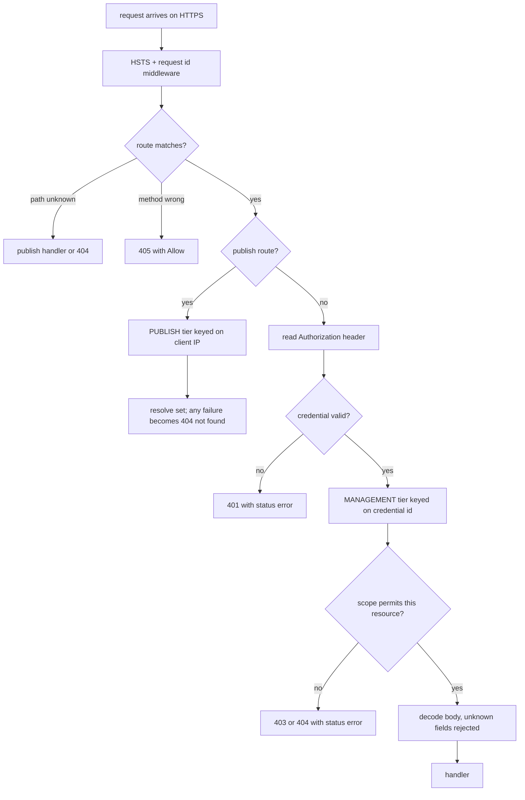

# Errors, Security, and Limits

This page is the contract your error-handling code must be written against. The short version: management errors tell you nothing beyond the HTTP status, publish errors tell you even less, and both are that way on purpose. Everything below is either a captured live response or a rule read directly out of the router and handlers; anything taken from the OpenAPI spec without a live observation is marked as such.

## Contents

- [The uniform management error body](#the-uniform-management-error-body)
  - [The one exception: key-set 409](#the-one-exception-key-set-409)
- [The uniform publish 404](#the-uniform-publish-404)
- [Status codes by surface](#status-codes-by-surface)
- [Response headers](#response-headers)
- [Rate limiting](#rate-limiting)
- [Token model](#token-model)
- [Request handling rules](#request-handling-rules)
- [Putting it together](#putting-it-together)
- [See also](#see-also)

## The uniform management error body

Every error on the `/api/v1/...` surface has exactly this body, with exactly one exception described below:

```json
{"status":"error"}
```

No code. No reason. No field name. No message. A `400` from a malformed JSON body, a `400` from an unknown JSON field, a `400` from a blocklisted handle, a `401` from a missing token, a `403` from an owner token on an admin route, a `404` from a stale key set id, a `409` from a duplicate admin list entry, a `429` from a rate limit, and a `500` from a panic are all byte-identical in the body. Captured examples:

```bash
curl -k -i https://localhost:8443/api/v1/keys
```

```
HTTP/2 401
content-type: application/json; charset=utf-8
cache-control: no-store
x-content-type-options: nosniff
www-authenticate: Bearer

{"status":"error"}
```

```bash
curl -k -X POST https://localhost:8443/api/v1/admin/owners \
  -H "Authorization: Bearer $ADMIN_TOKEN" \
  -H 'Content-Type: application/json' \
  -d '{"handle":"postmaster"}'
```

`400`, body `{"status":"error"}`.

### The one exception: key-set 409

A `409` from a key set route — and only there — adds a `reason`:

```
$ curl -sk -X POST https://localhost:8443/api/v1/keysets -H "Authorization: Bearer $ACCESS_TOKEN" -d '{"name":"dup"}'
HTTP/2 409
{"status":"error","reason":"name_taken"}
```

```
$ curl -sk -X DELETE https://localhost:8443/api/v1/keysets/$DEFAULT_SET_ID -H "Authorization: Bearer $ACCESS_TOKEN" -d '{"confirm":true}'
HTTP/2 409
{"status":"error","reason":"default_set"}
```

The reason comes from a fixed, closed set of four values:

| Reason | Meaning |
| --- | --- |
| `name_taken` | another of your sets already uses that name |
| `limit_reached` | you are at `retention.max_sets_per_owner` |
| `default_set` | you cannot delete the set that is currently your default |
| `confirmation_required` | the set has members; resend with `{"confirm": true}` |

Treat the four as an exhaustive enum, and still fall back gracefully on an unrecognised value.

**Why this is not a leak, and why nothing else gets a reason.** Every one of the four describes the *caller's own* resources. To reach a key-set `409` at all you must already hold a credential the server has verified, and the set must already be yours — a stranger's set id produces the reasonless `404` long before any of these checks run. The design rule is: a reason may be disclosed only when it tells the caller something they could have discovered by listing their own resources. No other error can satisfy that, so no other error carries one.

**Consequences for a client.** Branch on the HTTP status code, plus the `reason` on a key-set `409`. Nothing else in the body is a discriminator, and a future field you are hoping for is not coming. Write your user-facing messages from the status plus the operation you attempted ("that handle is not available" for a `400` on owner provisioning), not from the server. And surface the `x-request-id` header in your error UI: it is the only correlation handle between what the user saw and what the operator can find in the log, because the reason for the failure exists only there.

A `WWW-Authenticate: Bearer` header accompanies `401`, deliberately with no `realm` and no `error` parameter — those parameters are exactly the kind of detail the uniform body exists to withhold.

## The uniform publish 404

The publish path does not speak JSON. Its failures are fixed plain text:

```bash
curl -k -i https://localhost:8443/nope
```

```
HTTP/2 404
cache-control: no-store
content-type: text/plain; charset=utf-8
content-length: 10

not found
```

Ten bytes, `not found` plus a newline. The internal-fault response is the same shape with `internal server error` and a `500`.

**Every negative verdict produces this exact response**: an unknown handle, an unknown set name, a set that belongs to a different owner, an inactive set, a malformed name, and every refused access key — absent, malformed, revoked, or minted for one of the owner's *other* sets. Same status, same body, same headers, same length. There is not even a `Vary` header on this path, because emitting one for a protected miss and not for an absent handle would restore the distinction in a header nobody reads.

**Why there is deliberately no 401 or 403 here.** A `403` would be an existence oracle. It would tell a stranger "that handle exists, and that set exists, but you may not have it" — which is enough to enumerate an organisation's people and the names of their protected key sets from the outside. A consumer holding a token for one set is not the owner and must not be able to read the owner's other set names off a refusal. So the publish endpoint never *requires* a credential: a missing `Authorization` header is not an error, it is simply an empty token that no protected set accepts, and the refusal it earns is the same `404` an absent set earns.

The token, when you do send one, is read from the `Authorization` header **only**. Query parameters and cookies are never consulted, because proxies log them, browser history keeps them, and clients send them cross-site without intent.

## Status codes by surface

Codes marked *(spec)* come from the OpenAPI document and were not exercised in the captures; everything else was observed live.

**Probes**

| Request | Status | Notes |
| --- | --- | --- |
| `GET /healthz` | `200` | `{"status":"ok","version":"0.0.0-dev"}` |
| `GET /readyz` | `200` | `{"status":"ready","version":"0.0.0-dev"}` |
| `PUT /healthz` | `405` | `allow: GET, HEAD`, plain text body |

**Publish**

| Request | Status | Notes |
| --- | --- | --- |
| `GET /{handle}`, `GET /{handle}/{set}` | `200` | `text/plain`, strong ETag, may be a zero-length body |
| conditional `GET` with matching `If-None-Match` | `304` | validators retained (from code; not exercised live) |
| any negative verdict | `404` | `not found` |
| internal fault | `500` | `internal server error` |

**Management** (`/api/v1/...`)

| Situation | Status |
| --- | --- |
| success, resource created | `201` |
| success with a body | `200` |
| success with no body (deletes, approve) | `204` |
| malformed body, unknown JSON field, invalid value, blocklisted handle, underscore scope kind | `400` |
| missing, malformed, expired, or replayed credential | `401` |
| valid credential without the required authority (owner token on an admin route, no credential at all on an admin route) | `403` |
| unknown or no-longer-yours resource id | `404` |
| method not allowed on a mounted path | `405` with `Allow` |
| duplicate admin list entry | `409` (bare body) |
| key set name taken, set limit reached, deleting the default set, or deleting a non-empty set without `{"confirm": true}` | `409` (body carries `reason`) |
| rate limit exceeded | `429` with `Retry-After` |
| panic or internal fault | `500` |

Captured specifics worth memorising: a stale key set id (after a `PATCH` rename changed it) gives `404` on `/visibility` and `/default`; adding an already-present admin list entry gives a bare `409`; deleting an **empty** key set needs no confirmation at all and returns `204`. The confirmation for a non-empty set is a JSON **body** field, `{"confirm": true}`, not a query parameter — and a body that fails to decode leaves it false, so the route fails closed.

`POST /api/v1/enroll/poll` is the one route where a `2xx` alone does not tell you what happened: pending is `202 Accepted` with `{"status":"pending"}` and approval is `200 OK` with `{"status":"approved"}`. Branch on the body's `status` field, not on `2xx`.

Its `401` is also overloaded. An unknown code, an expired one, a revoked one, an
already-redeemed one, **and a poll issued inside the 5-second minimum interval** all answer
the same `401 {"status":"error"}`. The too-soon case additionally pushes the next permitted
poll another 5 seconds out from the refusal, so an impatient client locks itself out. Always
sleep for the `poll_interval_seconds` returned with the grant.

**Docs and install**

| Request | Status |
| --- | --- |
| `GET /docs` | `301` to `/docs/` |
| `GET /docs/` | `200` (JSON, or YAML with `Accept: application/yaml`) |
| `GET /docs/spec/openapi.json`, `GET /docs/spec/openapi.yaml` | `200` |
| `GET /install/vallet-helper.sh`, `GET /install/vallet-helper.sh.sha256` | `200` text/plain |

## Response headers

Two headers come from middleware and are therefore on **every** response the HTTPS listener produces, including ones the router generates itself:

| Header | Value |
| --- | --- |
| `strict-transport-security` | `max-age=31536000; includeSubDomains` |
| `x-request-id` | a 26-character opaque id |

HSTS deliberately omits `preload`, and is withheld on a non-secure request. In `upstream` mode an `X-Forwarded-Proto` is believed only from a trusted peer and only when it is exactly `https` — a comma-separated list is refused.

`x-request-id` reuses an inbound `X-Request-Id` only if it passes a safety check; otherwise the supplied value is discarded outright and never logged or echoed. Do not assume the id you sent comes back.

`x-content-type-options: nosniff` is different: it is set by the JSON and publish writers, not by middleware. It therefore accompanies every handler-produced response — every management JSON body and every publish response, success or failure — but not a response the router itself generates without calling a handler. The captured `405` illustrates the split: the router supplies its `allow` and `content-type`, the middleware still supplies HSTS and `x-request-id` as the response unwinds outward, and there is no `nosniff` because no handler write path ran.

Per-surface caching:

| Surface | Headers |
| --- | --- |
| management (any status) | `cache-control: no-store`; `vary: Authorization` on authenticated responses (the captured unauthenticated `401` carries no `Vary`) |
| publish, public set | `cache-control: public, max-age=60`, strong `etag`, `content-length` set explicitly |
| publish, protected set | `cache-control: private, max-age=60` plus `vary: Authorization` (from code; **not** observed live, and unreachable today — see below) |
| publish, failure | `cache-control: no-store`, no ETag, no `Vary` |

The ETag is the hex SHA-256 of the body, as a strong tag — so it is stable across restarts, replicas, and rebuilds, and any instance can validate a tag any other instance issued. An empty key set yields `"e3b0c442...7852b855"`, the hash of the empty string. The validators are set *before* the `If-None-Match` check so a `304` carries them too. `HEAD` returns identical headers with no body, including `content-length`.

Sixty seconds is the deliberate compromise between revocation latency and hammering the origin from every SSH login; conditional requests make the revalidation cheap.

**Protected sets are unreachable today.** Reading one requires an access key, and there is currently no HTTP route and no CLI subcommand that mints one — `valletd` has only `bootstrap-admin` and `bootstrap-owner`. So although a set created over the API defaults to `visibility: "protected"`, nobody can read it, and every attempt earns the standard `404`. The `private, max-age=60` and `vary: Authorization` headers above are read from the code, not from a capture. Publish `public` sets until access keys exist.

## Rate limiting

Four tiers. Budgets and windows are configurable — see [02-configuration.md](02-configuration.md).

| Tier | Default | Keyed on | Where it runs |
| --- | --- | --- | --- |
| PUBLISH | 60/min | client IP | middleware around the publish handler |
| MANAGEMENT | 120/min | the verified credential id | inside the authorization layer, after the credential is known |
| ADMIN | 60/min | `admin:` + administrator id | around `POST /api/v1/admin/owners` |
| AUTH | 5/min | client IP, **or** the verified owner | inside the credential-exchange handlers |

The AUTH tier is the subtle one. It counts *failures* with backoff rather than every request, and it uses two separate key spaces. Unauthenticated credential exchange — `POST /api/v1/enroll/device`, `/enroll/poll`, `/enroll/redeem`, and `POST /api/v1/token` — is keyed on the **client IP**, because there is no verified identity yet to key on. But `POST /api/v1/enroll/approve` is authenticated, and it is keyed on the **verified owner**: keying an authenticated approval on IP would let one owner behind a shared NAT exhaust everyone else's budget, and would let an attacker who can change source address escape their own.

The ADMIN tier is currently attached to owner provisioning only; the reserved allowlist/blocklist routes carry no tier yet. A comment in the router still claims the tier is unmounted — the code disagrees with it, and the code is what runs.

Exceeding a limit yields `429` with the standard management body `{"status":"error"}` and a `Retry-After` header in seconds. No detail about which tier fired or how much budget remains is disclosed. When rate limiting is disabled by configuration the publish, management, and admin limiters simply are not installed; the AUTH tier has no disabled state and falls back to in-process counters. If the shared counter store is unreachable, the management, admin, and auth tiers **fail closed** — you get `429`, not a free pass.

Client IP resolution matters for the two IP-keyed tiers. `X-Forwarded-For` is read only when the immediate peer is a configured trusted proxy; the chain is then walked right to left, skipping trusted entries, with a 16-hop budget, and a malformed entry ends the walk at the peer address. With no trusted proxies configured, the peer address is always used. If the peer address cannot be parsed at all, the resolver yields nothing and callers refuse the request with `429` rather than exempting it.

## Token model

| Prefix | Token | Observed lifetime |
| --- | --- | --- |
| `sva_` | owner access token | about 15 minutes |
| `svr_` | owner refresh token | about 90 days |
| `svd_` | device / enrollment code | short, returned as `expires_at` |
| `sadm_` | administrator token | 30 days by default (`bootstrap-admin -ttl`, default `720h`) |

Refresh and device credentials have the shape `prefix_<id>.<secret>` — the part before the dot identifies the record, the part after is the secret. Never log the whole string; never split it and log the second half either.

All of these are sent the same way: `Authorization: Bearer <token>`. Exactly one `Authorization` header must be present, the scheme is matched case-insensitively, and the credential must be non-empty and within a length bound.

**Refresh tokens are single use.** `POST /api/v1/token` returns a *new* refresh token alongside the new access token, and the presented one is spent. Replaying it fails:

```bash
curl -k -X POST https://localhost:8443/api/v1/token \
  -H 'Content-Type: application/json' \
  -d "{\"refresh_token\":\"$REFRESH_TOKEN\"}"
```

```
HTTP/2 200
{"refresh_token":"svr_2XUzIBL5tyoIVNfXy-__fg.fLV3aH_oQK5AOCXKd2eihb1jxOpcQfK5sRZgCPZ1nCw", ...}
```

Immediately replaying the same request with the same original token:

```
HTTP/2 401
{"status":"error"}
```

A replay is treated as evidence of theft, not as a retry: reuse detection revokes the whole lineage descended from that token. This was verified end to end — after one token was replayed, every later use of that lineage's *rotated* token also returned `401`, and the owner had to be enrolled again from scratch. It is the designed response to suspected theft, not a bug.

The client-correctness consequence is severe enough to design around explicitly:

- Refresh in exactly **one** place, under a mutex or a single-flight guard. Two tabs, two goroutines, or a retry racing the original request will each present the same refresh token, and the second one destroys the session.
- **Persist the rotated token before** you act on the new access token. A crash between receiving the rotation and storing it leaves you holding a spent token and no way back.
- Treat a `401` from `POST /api/v1/token` as "the session is gone, start enrollment again". Never retry it, and never fall back to the previous token.

There is no per-token revocation for administrator tokens; a leaked one is handled by disabling the administrator row.

## Request handling rules

**Method handling.** Routes are registered with explicit methods, so a wrong method on a mounted path is a `405` carrying the allowed set, produced by the router before any handler runs:

```bash
curl -k -i -X PUT https://localhost:8443/healthz
```

```
HTTP/2 405
allow: GET, HEAD
content-type: text/plain; charset=utf-8
```

(The capture above lists the router's own headers; the middleware-supplied `strict-transport-security` and `x-request-id` are present too.)

A `GET` route also serves `HEAD` — that is why `Allow` reads `GET, HEAD` for a route registered only as `GET`.

**Strict JSON decoding.** Every JSON body is read through a size-bounded reader with unknown-field rejection enabled. An unrecognised field is a `400`; it is not ignored. This is why `{"label":"work laptop"}` fails on device creation where `{"name":"work laptop"}` succeeds, and why an admin list entry must be `{"entry":"..."}` rather than `{"term":...}` or `{"identifier":...}`.

That strictness is also a security control, not just tidiness: **no route accepts an owner identifier in its body.** The owner is derived from the token and nowhere else, so there is no field a caller could add to act as someone else — and because unknown fields are rejected rather than dropped, no such field can be smuggled in against a future version of the server that might start reading it.

**Ordering of body validation and authorization.** On the admin reserved-list routes, a malformed body is rejected with `400` *before* authorization is evaluated. Captured: an unauthenticated request with a bad body sees `400`, and the same unauthenticated request with a good body sees `403`. Do not infer anything about your credentials from a `400`.

**Logging.** The access log records method, matched route pattern, sanitized path, status, bytes, duration, and request id. Query strings, headers, cookies, and bodies are never recorded, so a token in a query string would not be logged — but it would still be wrong, and the server would not read it anyway.

## Putting it together



## See also

- [README.md](README.md) — guide index
- [01-quickstart.md](01-quickstart.md) — from zero to a published key
- [02-configuration.md](02-configuration.md) — configuration reference
- [03-users-and-onboarding.md](03-users-and-onboarding.md) — owners, enrollment, tokens
- [04-devices-and-keys.md](04-devices-and-keys.md) — devices and public keys
- [05-key-sets-and-publishing.md](05-key-sets-and-publishing.md) — key sets and the publish endpoint
- [06-api-reference.md](06-api-reference.md) — full endpoint reference
