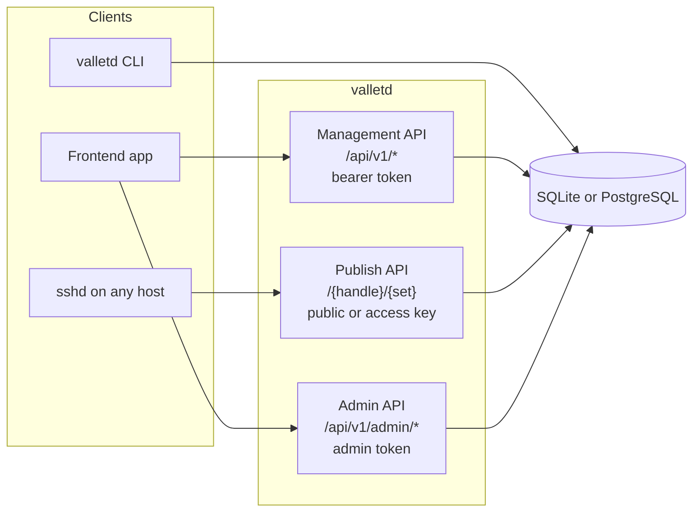
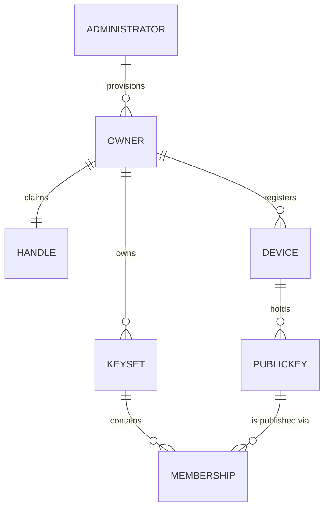

# sshpilot-vallet — Frontend & API Guide

Everything a frontend developer (or an AI agent) needs to build a client against
`valletd`, without reading a line of Go. Every request and response shown in this
guide was captured from a real running server; anything derived from the OpenAPI
document rather than observed is marked as such at the point of use.

**vallet in one sentence:** an owner registers SSH **public** keys from their devices,
groups them into named **key sets**, and each set is published at
`GET /{handle}/{set}` as a native `authorized_keys` document that any host can consume
with plain `curl` — no client, no agent, no private key on the backend.

---

## Contents

### Start here
| Guide | What it covers |
| --- | --- |
| **[1. Quick start](01-quickstart.md)** | Boot a server and go from nothing to a published key in one sitting. Docker or from source, the golden-path curl sequence, and what you just built. |
| **[2. Configuration](02-configuration.md)** | Every `VALLET_*` environment variable and YAML key, the secret-reference convention, TLS modes, datastores, rate-limit tiers, and telemetry. |

### Building a client
| Guide | What it covers |
| --- | --- |
| **[3. Users & onboarding](03-users-and-onboarding.md)** | The identity model, bootstrapping the first administrator, creating owners, and **how a client actually obtains a bearer token** — all three enrollment modes, plus refresh rotation. |
| **[4. Devices & keys](04-devices-and-keys.md)** | Registering devices, enrolling public keys, what the ingest layer refuses and why, listing, and revocation. |
| **[5. Key sets & publishing](05-key-sets-and-publishing.md)** | Creating and managing key sets, public vs protected visibility, the publish read path, and consuming keys from an SSH server. |

### Reference
| Guide | What it covers |
| --- | --- |
| **[6. API reference](06-api-reference.md)** | Every endpoint: auth, scope, rate-limit tier, parameters, request and response schemas, status codes, and a working curl example. |
| **[7. Errors, security & limits](07-errors-security-and-limits.md)** | The uniform error bodies, the enumeration-resistance design, status-code tables, security headers, rate limiting, and the token model. |

### Role runbooks
Task-oriented, start-to-finish walkthroughs for a specific person. They reuse the
reference chapters above rather than repeating them.

| Guide | For whom | What it covers |
| --- | --- | --- |
| **[Administrator — provisioning users](admin-provisioning-guide.md)** | System administrators | Become an administrator, provision an owner with `POST /api/v1/admin/owners`, hand them an enrollment code that grants `full-owner` self-management, and — where a key must actually be published today — seed it with `bootstrap-owner`. |
| **[End-user guide](end-user-guide.md)** | Owners managing their own keys | Authenticate and keep a token fresh, list your devices/keys/key sets, add and edit keys and sets, and get your keys onto another machine — including the honest gap where the API cannot yet publish a key on its own. |

---

## The shape of the system

## The domain model

An owner claims one **handle** (their public name). Public keys belong to a **device**,
and a **key set** publishes a selected group of those keys. One set is the owner's
**default**, served at `GET /{handle}`; the rest are served at `GET /{handle}/{set}`.

---

## Read this before you build

Three things routinely surprise people writing a first client. Each is covered in
depth in the linked guide.

1. **A key added over the API is not published yet.** `POST /api/v1/keys` creates a
   key but does not make it a member of any key set, and there is currently no HTTP
   route that adds one. Only the `valletd bootstrap-owner` CLI seeds a key into a set.
   → [Key sets & publishing](05-key-sets-and-publishing.md)

2. **Renaming a key set changes its ID.** `PATCH /api/v1/keysets/{id}` returns a row
   with a *new* `id`; the old one stops resolving. Always use the id from the response.
   → [API reference](06-api-reference.md)

3. **Errors tell you nothing.** Every management error is the same body,
   `{"status":"error"}`, with no code and no reason. Branch on the HTTP status, never
   on the body, and surface the `x-request-id` header for support.
   → [Errors, security & limits](07-errors-security-and-limits.md)

## Conventions used throughout

- Production base URL is written `https://vallet.example.com`. A local development
  server is `https://localhost:8443`, and because it uses a self-signed certificate
  every local sample passes `curl -k`.
- Credentials appear as `$ADMIN_TOKEN`, `$ACCESS_TOKEN`, and `$REFRESH_TOKEN`.
- Token prefixes identify the kind at a glance: `sva_` access, `svr_` refresh,
  `svd_` device/enrollment code, `sadm_` administrator.
- **The server is HTTPS-only and fail-closed.** There is no plaintext port on any
  deployment, by design.

## Beyond this guide

| You want… | Read |
| --- | --- |
| The machine-readable contract | `api/openapi/openapi.yaml`, or `GET /docs/` on a running server |
| The decision log, with rationale | [../architecture/adr/README.md](../architecture/adr/README.md) |
| The threat model | [../security/threat-model.md](../security/threat-model.md) |
| Scope and requirements | [../requirements/phase-1.md](../requirements/phase-1.md) |
| Installing the `AuthorizedKeysCommand` helper | [../install-helper.md](../install-helper.md) |
| DNS-01 provider credentials for ACME | [../dns01-provider-credentials.md](../dns01-provider-credentials.md) |
