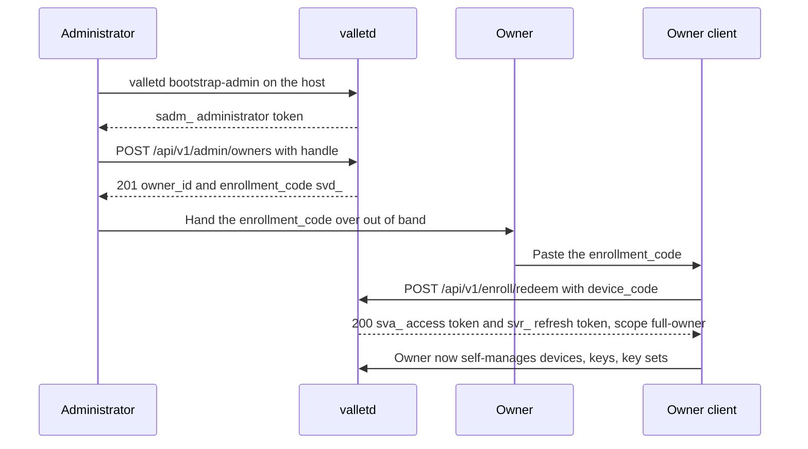
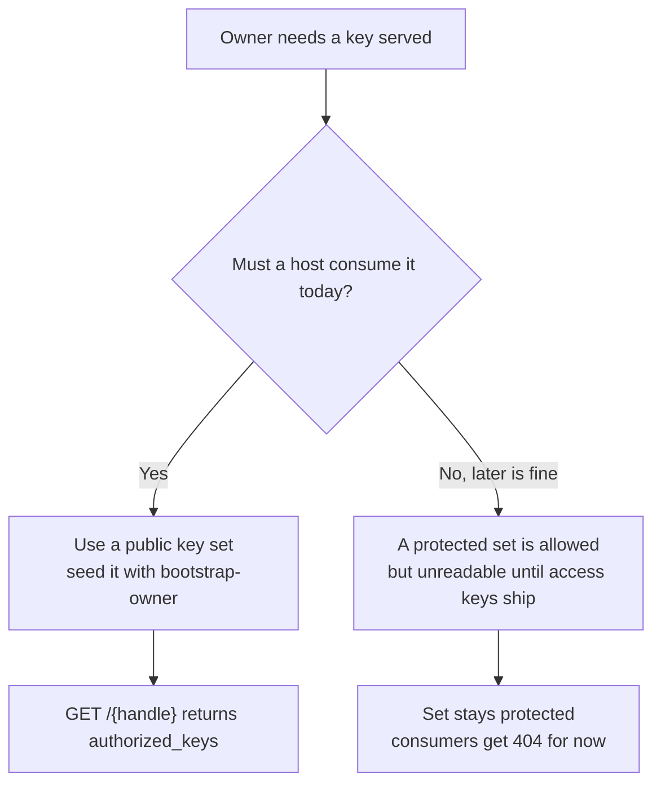

# Administrator Provisioning Guide

This is a task-oriented runbook for a **system administrator** who operates a
`valletd` instance and needs to answer one question: *how do I create a user (an
**owner**) and give them the ability to define and manage their own keys and key
sets?* It walks the full path — becoming an administrator, provisioning an owner,
and handing that owner a way to obtain their own bearer token — after which the
owner self-manages devices, public keys, and key sets without any further admin
involvement. Every request and response below was captured from a real running
server; anything not observed is marked **(spec-derived)** at the point of use. It
is a companion to [03-users-and-onboarding.md](03-users-and-onboarding.md), which
explains the identity model and enrollment modes in depth; this page is the
operator's runbook and cross-links rather than repeating that material.

## Contents

- [Prerequisites](#prerequisites)
- [Becoming an administrator](#becoming-an-administrator)
- [The provisioning flow at a glance](#the-provisioning-flow-at-a-glance)
- [Step 1 — provision an owner](#step-1--provision-an-owner)
- [Step 2 — hand the owner their access](#step-2--hand-the-owner-their-access)
- [What the owner can do next](#what-the-owner-can-do-next)
- [Publishing a key today with bootstrap-owner](#publishing-a-key-today-with-bootstrap-owner)
- [Limitations you must plan around](#limitations-you-must-plan-around)
- [Security and limits for administrators](#security-and-limits-for-administrators)
- [Troubleshooting](#troubleshooting)
- [See also](#see-also)

Base URL in every sample: `https://vallet.example.com` for production, or
`https://localhost:8443` with `curl -k` for a local dev server using a self-signed
certificate. Shell variables used: `$ADMIN_TOKEN` (a `sadm_` administrator token).

## Prerequisites

Before you can provision anyone, three things must be true of the deployment.

1. **A running `valletd` instance.** Confirm it is live and its datastore is
   reachable:

   ```bash
   curl -sk -i https://localhost:8443/readyz
   ```

   ```
   HTTP/2 200
   {"status":"ready","version":"0.0.0-dev"}
   ```

   A `503` here means the datastore is unreachable — fix that before going further,
   because owner provisioning writes to it.

2. **HTTPS only.** There is no plaintext listener on any deployment, by design. The
   dev server presents a self-signed certificate, which is why every local example
   passes `curl -k`; in production you talk to `https://vallet.example.com` with a
   real certificate and no `-k`.

3. **The administrator signing key is configured.** Administrator tokens are signed
   with a key entirely separate from owner tokens, so an owner token can never carry
   admin authority. The config must supply `auth.admin_token_signing_key_ref`
   (a secret reference — see [02-configuration.md](02-configuration.md)). If it is
   missing, the `bootstrap-admin` subcommand refuses to run rather than mint an
   unverifiable token, with this exact message:

   ```
   valletd: bootstrap-admin: auth.admin_token_signing_key_ref must be set to mint an administrator token
   ```

   Seeing that line means the key reference is unset or unresolvable — fix the
   configuration and re-run.

## Becoming an administrator

There is **no HTTP route** that creates an administrator. The first one, and every
later one, comes from a CLI subcommand run on the server host. `valletd` has exactly
two subcommands: `bootstrap-admin` and `bootstrap-owner`.

`bootstrap-admin` mints an administrator identity and prints its token once:

```
$ valletd bootstrap-admin -label "docs-admin"
administrator_id=5SI4C3467CZBGMOHGKWW3WT5U2
label=docs-admin
admin_token=sadm_eyJ2IjoxLCJqdGkiOiJlQlFGSEdiQ3dEM05EMEJTdmxhelRBIiwiYWRtIjoiNVNJNEMzNDY3Q1pCR01PSEdLV1czV1Q1VTIiLCJpYXQiOjE3ODQ5MDkwOTQsImV4cCI6MTc4NzUwMTA5NH0.lHWi7djZhtjBC_aixB0ZFaQBMoaY6IDIMpFydQMep7M
```

| Flag | Meaning |
| --- | --- |
| `-config` | Path to the configuration file (env and defaults are used when empty) |
| `-label` | **Required.** Human-readable label for the administrator row |
| `-ttl` | Token lifetime; default `720h` (30 days) |

Operational facts that matter:

- **It runs migrations first**, and is idempotent on an already-migrated database.
  So on a brand-new deployment this one command both brings the schema up and mints
  your first admin — you do not run a separate migration step.
- **The token is printed once.** Capture it into `$ADMIN_TOKEN`; it is never
  recoverable afterwards.
- The token prefix is **`sadm_`**. You present it on every admin route as
  `Authorization: Bearer $ADMIN_TOKEN`.
- **There is no per-token revocation.** An admin token is valid until it expires. To
  cut off a leaked token you disable the administrator *row* — the service re-checks
  `status == active` on every admin request, so a validly signed token for a disabled
  administrator is refused.

## The provisioning flow at a glance

The end-to-end path from a running server to an owner holding their own token. Note
that the enrollment code changes hands **out of band** — valletd never delivers it
to the owner for you.



## Step 1 — provision an owner

Creating a user is an administrator action: `POST /api/v1/admin/owners`. The request
body carries **only a handle** — the owner's globally unique public name, the thing
that appears in the publish URL `GET /{handle}`. There is no scope field, no email,
no name.

```bash
curl -sk -i -X POST https://localhost:8443/api/v1/admin/owners \
    -H "Authorization: Bearer $ADMIN_TOKEN" \
    -H 'Content-Type: application/json' \
    -d '{"handle":"alice"}'
```

```
HTTP/2 201
cache-control: no-store
content-type: application/json; charset=utf-8
x-request-id: X4UWYVXQG5BXRNHGUL5UJI2HNL

{"owner_id":"OUP7CNH2TR2IOQKEKF4RTF6Z47","handle":"alice","set_name":"default","enrollment_code":"svd_xSRuLXWoFj9xKhR6c0jAlQ.2UDzHozLNanK6tnxaXd6LqoteW46b8Fo9nLi4vosVVg","expires_at":"2026-07-24T17:15:13.866593461+01:00","pairing_id":"xSRuLXWoFj9xKhR6c0jAlQ"}
```

One transaction created all of it: an active owner, its handle name-claim, a
**public** key set named `default`, an `owner.created` audit record, and a
pre-approved pairing whose device code is returned as `enrollment_code`. It all
commits or rolls back together, so you can never end up with a claimed handle and no
way to enroll.

| Response field | What it is |
| --- | --- |
| `owner_id` | The stable, opaque identifier for the user |
| `handle` | The public name; the publish URL is `/{handle}` |
| `set_name` | Always `default` for a freshly provisioned owner, and that set is `public` |
| `enrollment_code` | **One-time secret** — the crux of Step 2. It is the `device_code` for `POST /api/v1/enroll/redeem` |
| `expires_at` | Roughly 10 minutes after issue — the code is short-lived by design |
| `pairing_id` | A lookup handle for the pairing; **not** a secret on its own |

**About the handle.** It is unique on a normalized, look-alike-folded form and is
checked against the reserved-identifier blocklist before the owner is created. A
handle the blocklist refuses is a `400` with the uniform error body:

```bash
curl -sk -X POST https://localhost:8443/api/v1/admin/owners \
    -H "Authorization: Bearer $ADMIN_TOKEN" \
    -H 'Content-Type: application/json' \
    -d '{"handle":"postmaster"}'
```

```
[400] {"status":"error"}
```

You can reserve additional terms at runtime with the admin blocklist routes
(`POST /api/v1/admin/reserved/blocklist`, body field `entry`) — see the
[API reference](06-api-reference.md#administration).

**Rate-limit tier.** `POST /api/v1/admin/owners` is the one admin route behind the
**ADMIN** tier (default 60/min), keyed on the resolved administrator id. The four
reserved-list routes carry no tier. A refusal is `429` with a `Retry-After` header.

## Step 2 — hand the owner their access

This is the crux of "give the owner the ability to define and manage its own keys
and key sets." The `enrollment_code` from Step 1 **is** the credential the owner
redeems for their first bearer token. Delivery is entirely up to you and must happen
**out of band** — valletd does not email or message it to the owner. Send it over a
channel you trust (a secure message, a password manager share), because whoever
redeems it becomes the owner.

The owner (or their client) redeems it, unauthenticated, at
`POST /api/v1/enroll/redeem`, passing the code as `device_code`:

```bash
curl -sk -i -X POST https://localhost:8443/api/v1/enroll/redeem \
    -H 'Content-Type: application/json' \
    -d '{"device_code":"svd_xSRuLXWoFj9xKhR6c0jAlQ.2UDz…"}'
```

```
HTTP/2 200

{"refresh_token":"svr_1Fy07sEjiFiIbZe-0-Dd-g.QPCOk6h_DwLJcORFkap3dzmoxil7Gsnb98v4HfF75uw","refresh_expires_at":"2026-10-22T17:05:28.026740069+01:00","access_token":"sva_eyJ2IjoxLCJqdGkiOiI3dzBmajBjVUpsYXV6U1RnTlFxVVRRIiwib3duIjoiT1VQN0NOSDJUUjJJT1FLRUtGNFJURjZaNDciLCJyZWYiOiIxRnkwN3NFamlGaUliWmUtMC1EZC1nIiwic2NwIjpbeyJrIjoiZnVsbC1vd25lciJ9XSwiaWF0IjoxNzg0OTA5MTI4LCJleHAiOjE3ODQ5MTAwMjh9.ujnpHCi2-r9KYkxOaXPTaBEGhJ7TamfJOkcmxVJClgM","access_expires_at":"2026-07-24T17:20:28.026740069+01:00","owner_id":"OUP7CNH2TR2IOQKEKF4RTF6Z47","scopes":[{"kind":"full-owner"}]}
```

Look at the tail of that response: `"scopes":[{"kind":"full-owner"}]`. **The pairing
minted by owner provisioning carries the `full-owner` scope automatically** — you do
not, and cannot, pass a scope to `POST /api/v1/admin/owners`. `full-owner` is exactly
what grants full self-management: everything on the owner axis (devices, keys, key
sets, and minting further client pairings). The owner now holds a short-lived `sva_`
access token and a ~90-day `svr_` refresh token and needs nothing more from you.

> **The scope kind is hyphenated: `full-owner`, not `full_owner`.** You will not type
> it yourself during provisioning, but the owner *will* type it later when they mint
> additional client pairings via `POST /api/v1/enroll/mint` or
> `POST /api/v1/enroll/device`, where `scopes` is required. The server **rejects the
> underscore form `{"kind":"full_owner"}` with `400`** and both accepts and returns
> `full-owner`. The OpenAPI `Scope` description still shows `full_owner` — that text
> is stale. The full scope vocabulary (`full-owner`, `read-only`, `single-set`,
> `single-device`) and the three enrollment modes are covered in
> [03-users-and-onboarding.md](03-users-and-onboarding.md#scopes).

Two honesty points to pass along to the owner:

- **The enrollment code is one-time and short-lived (~10 min).** Redemption failures
  — unknown, expired, already-redeemed — are one indistinguishable `401`. If a poll
  or redeem returns `401`, re-run enrollment; do not try to tell the cases apart.
- **There is no route to re-issue an enrollment code for an owner who already
  exists.** That is deliberate: such a route would let an administrator mint a
  full-owner credential for any account by handle — the admin→owner escalation the
  two-axis design forbids. If the owner loses the code before redeeming it, the
  practical recovery is to re-provision under a fresh handle, or to seed the account
  with `valletd bootstrap-owner` on the host (see below).

## What the owner can do next

Once the owner holds a `full-owner` access token, they are fully self-sufficient and
manage their own resources over the owner-authenticated API:

- **Devices** — register and revoke machines (`POST`/`GET`/`DELETE /api/v1/devices`).
- **Public keys** — enroll and revoke SSH public keys on a device
  (`POST`/`GET`/`DELETE /api/v1/keys`).
- **Key sets** — create, rename, delete, set default, and change visibility
  (`/api/v1/keysets`).
- **More clients** — enroll a second laptop or a CI runner via the mint and
  device-grant flows.

None of this requires the administrator. The owner side is documented in the
end-user guide ([end-user-guide.md](end-user-guide.md)), and the endpoint-level
detail is in [04-devices-and-keys.md](04-devices-and-keys.md),
[05-key-sets-and-publishing.md](05-key-sets-and-publishing.md), and the
[API reference](06-api-reference.md).

## Publishing a key today with bootstrap-owner

There is one gap that changes what you should do if your goal includes getting a key
**actually published today**, not merely enrolled.

> **There is currently no HTTP route that adds a public key to a key set.**
> `POST /api/v1/keys` creates a key and attaches it to a device, but it does **not**
> make that key a member of any set. A key added over the API is therefore never
> served: `GET /{handle}` answers `200` with an empty body. The only thing that
> seeds a *published* membership today is the `valletd bootstrap-owner` CLI.

So there are two provisioning routes, and they are **alternatives**, not steps you
chain on the same handle:

| Route | What it gives you | Nothing published yet? |
| --- | --- | --- |
| `POST /api/v1/admin/owners` (Steps 1–2) | An owner who self-manages via a `full-owner` token | Yes — until an HTTP add-to-set route exists |
| `valletd bootstrap-owner` (CLI, on the host) | An owner **and** a published key in one shot | No — the key is live immediately |

`bootstrap-owner` creates a **brand-new** owner: it claims the handle, mints a fresh
`owner_id`, creates the public `default` set, registers a device, and seeds the key
as a member — all in one transaction. Because it claims the handle itself, you cannot
point it at a handle you already provisioned through the API; that would collide on
the handle claim. Pick one route per owner.

```bash
valletd bootstrap-owner -handle bob -key-file ./id_ed25519.pub -device "bob-laptop"
```

```
owner_id=QI4IBYFNLCCKVESZ57LPZTCQSA
handle=bob
set=default
key_fingerprint=SHA256:4LA2LcP4zPzowu7BJB47GKbwwOM9/+nniaEqpBq8TMU
```

| Flag | Meaning |
| --- | --- |
| `-config` | Path to the configuration file |
| `-handle` | **Required.** The public handle to claim |
| `-key-file` | Path to a file holding one SSH public-key line, or `-` for stdin |
| `-device` | Label for the device holding the seeded key (default `bootstrap`) |
| `-set` | Name of the default key set (empty uses `default`) |

Like `bootstrap-admin`, it runs migrations first and is idempotent on that step. Now
the publish endpoint serves the key:

```bash
curl -sk -i https://localhost:8443/bob
```

```
HTTP/2 200
cache-control: public, max-age=60
content-type: text/plain; charset=utf-8
etag: "18ada6ff3dcbc0c7f3a2eaf3e2316b0a6c4c2c8f8a7d3b6fd92abe06d3d47cae"
content-length: 94

ssh-ed25519 AAAAC3NzaC1lZDI1NTE5AAAAIFEDekQ7K0Z2UMpuepS0mnASJ7EJH8x6WUSEtgFZixT6 alice@laptop
```

Contrast with an owner provisioned only through the API, whose default set is empty —
note the `content-length: 0` and the ETag of the empty string:

```bash
curl -sk -i https://localhost:8443/alice
```

```
HTTP/2 200
cache-control: public, max-age=60
content-type: text/plain; charset=utf-8
etag: "e3b0c44298fc1c149afbf4c8996fb92427ae41e4649b934ca495991b7852b855"
content-length: 0
```

## Limitations you must plan around

Two more honesty callouts belong in every admin's mental model, alongside the
no-add-to-set gap above.

**Access keys cannot be minted — so keep sets consumable-public today.** Reading a
`protected` key set on the publish path requires a per-set access key, and there is
currently **no HTTP route and no CLI subcommand** that mints one (`valletd` has only
`bootstrap-admin` and `bootstrap-owner`). New key sets created over the API default
to `visibility: "protected"`, which means **nobody can read them yet** — every
attempt earns the uniform `404`. If a set must be consumable today, keep it
**public**. The `default` set created during owner provisioning is already public.



**Management errors are uniform and enumeration-resistant.** Every error on the
`/api/v1/*` surface is byte-identical: `{"status":"error"}`, with no code, no reason,
no message. A `400` for a blocklisted handle, a `401` for a missing token, a `403`
for an owner token on an admin route, and a `429` for a rate limit all share that
body. The **one exception** is a key-set `409`, which adds a `reason` from the closed
set `name_taken`, `limit_reached`, `default_set`, `confirmation_required` — and only
because all four describe the caller's *own* resources. Do not branch on error text.
Branch on the HTTP status, and on `reason` only for that one response. Surface the
`x-request-id` response header in any report: it is the only correlation key between
what a caller saw and what you can find in the server log.

## Security and limits for administrators

- **The admin token is powerful — protect the signing key.** `auth.admin_token_signing_key_ref`
  is a secret *reference*, never an inline secret; keep the key material in a file or
  environment secret resolved by the provider, so it never lands in the config file
  or a log. Resolved secrets render `[REDACTED]` through every log and format path.
- **No per-token revocation.** A leaked `sadm_` token is valid until it expires
  (30 days by default). The remedy is to disable the administrator *row*; the service
  re-checks `status == active` on every request, so the signed-but-disabled token is
  refused immediately.
- **Fail-closed everywhere.** A missing signing key refuses to mint (Step 0). The
  admin routes answer `403` to a request with no token or an owner token. The ADMIN
  and management rate-limit tiers fail *closed* during a counter-store outage — a
  refusal, never an unmetered free pass. On the admin reserved-list routes a
  malformed body is rejected with `400` **before** authorization is evaluated, so do
  not infer anything about your credentials from a `400`.
- **Two authority axes never mix.** Administrator tokens and owner tokens are signed
  with different keys. An admin cannot act as an owner, and there is no route that
  lets an admin mint an owner credential for an existing account — provisioning is
  the only admin→owner touchpoint, and it only ever creates.
- **The audit log is append-only.** `owner.created` and peers are inserted, never
  read, rewritten, or deleted through the API; the emitter mints the id, stamps the
  time, validates against an allowlisted key set, and appends.

## Troubleshooting

| Symptom | Status / output | Cause and fix |
| --- | --- | --- |
| `bootstrap-admin` refuses to run | `valletd: bootstrap-admin: auth.admin_token_signing_key_ref must be set to mint an administrator token` | The admin signing-key reference is unset or unresolvable. Configure `auth.admin_token_signing_key_ref` and re-run. |
| Provisioning a blocklisted handle | `400` `{"status":"error"}` | The handle is a reserved/curated term (e.g. `postmaster`). Choose another handle. |
| Provisioning a handle already taken | `400` **(spec-derived)** — not in the captures; whatever the code, the body is the bare `{"status":"error"}` (the `reason` field is key-set-only) | The handle is claimed (including a look-alike fold). Choose a different handle; handles are permanent once claimed. |
| Owner token on an admin route | `403` `{"status":"error"}` | You used an `sva_` token on `/api/v1/admin/*`. Use the `sadm_` admin token. |
| No `Authorization` header on an admin route | `403` `{"status":"error"}` | Missing token. Note: a malformed body is evaluated first and yields `400` even unauthenticated — do not infer credential validity from a `400`. |
| Owner sends `{"kind":"full_owner"}` when minting a client pairing | `400` `{"status":"error"}` | Underscore scope form. Use the hyphenated `full-owner`. |
| Redeem / poll of the enrollment code fails | `401` `{"status":"error"}` | Unknown, expired (~10 min), or already-redeemed code — indistinguishable. Re-provision the owner or seed via `bootstrap-owner`. |
| Admin route returns `429` | `429` with `Retry-After` | ADMIN tier (default 60/min) on `POST /api/v1/admin/owners`. Wait the advertised seconds. |
| `GET /{handle}` returns `200` with an empty body | `content-length: 0` | The owner has no *published* key — the API cannot add a key to a set yet. Seed with `valletd bootstrap-owner`. |
| A newly created key set is unreachable | publish `404` | The set is `protected` and access keys cannot be minted. Set its visibility to `public`, or keep it protected and wait for access-key support. |

## See also

- [README.md](README.md) — guide index
- [01-quickstart.md](01-quickstart.md) — boot a server and publish a key end to end
- [02-configuration.md](02-configuration.md) — server configuration, secrets, and signing keys
- [03-users-and-onboarding.md](03-users-and-onboarding.md) — identity model, enrollment modes, scopes, refresh rotation
- [end-user-guide.md](end-user-guide.md) — the owner's side: managing devices, keys, and key sets
- [06-api-reference.md](06-api-reference.md) — every route, request, and response
- [07-errors-security-and-limits.md](07-errors-security-and-limits.md) — error bodies, enumeration policy, rate limits, token model
