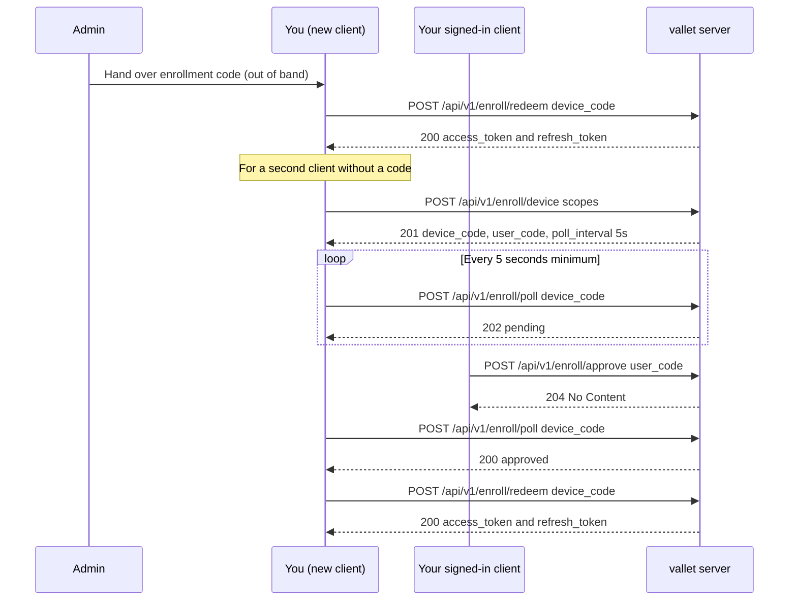
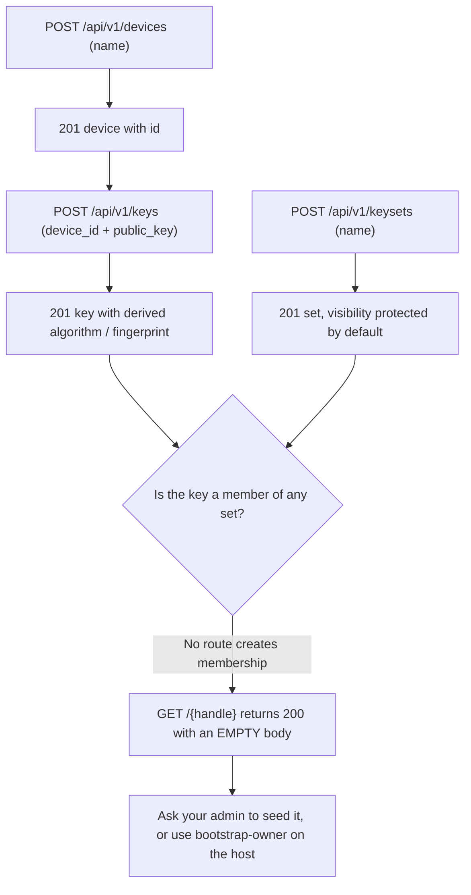
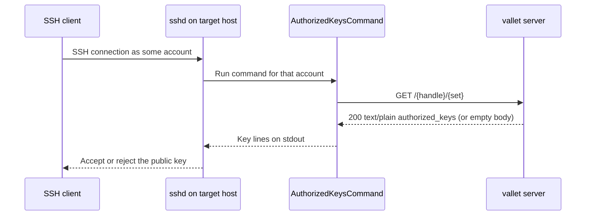

# End-User Guide — Managing Your Own SSH Keys

This is the task-oriented runbook for an **owner**: someone an administrator has already
provisioned on a `valletd` instance and who now wants to manage their own SSH **public**
keys. It answers, in order, how to authenticate and stay authenticated, how to see the
devices, keys and key sets you already have, how to add a public key and a key set, how to
edit them, and how to get your published keys onto another machine. You can follow it by
hand with `curl`, or drive it from a script or an agent — no access to the server source is
required. Every request and response below was captured from a running server unless it is
explicitly marked **(spec-derived)**.

## Contents

- [Before you begin](#before-you-begin)
- [Conventions used here](#conventions-used-here)
- [Step 1 — authenticate and get a bearer token](#step-1--authenticate-and-get-a-bearer-token)
  - [Redeem your enrollment code](#redeem-your-enrollment-code)
  - [Enroll a second client without an enrollment code](#enroll-a-second-client-without-an-enrollment-code)
  - [Keep your token fresh — refresh rotation](#keep-your-token-fresh--refresh-rotation)
- [Step 2 — see my devices, keys and key sets](#step-2--see-my-devices-keys-and-key-sets)
  - [List devices](#list-devices)
  - [List public keys](#list-public-keys)
  - [List key sets](#list-key-sets)
- [Step 3 — add a public key and a key set](#step-3--add-a-public-key-and-a-key-set)
  - [Register a device](#register-a-device)
  - [Add a public key](#add-a-public-key)
  - [What the key ingest refuses](#what-the-key-ingest-refuses)
  - [Create a key set](#create-a-key-set)
  - [Why your new key is not published yet](#why-your-new-key-is-not-published-yet)
- [Step 4 — edit devices, keys and key sets](#step-4--edit-devices-keys-and-key-sets)
  - [Rename a key set (the id changes)](#rename-a-key-set-the-id-changes)
  - [Change a key set's visibility](#change-a-key-sets-visibility)
  - [Change which set is the default](#change-which-set-is-the-default)
  - [Delete a key set](#delete-a-key-set)
  - [Revoke a key or a device](#revoke-a-key-or-a-device)
- [Step 5 — get my keys onto another machine](#step-5--get-my-keys-onto-another-machine)
  - [The honest gap: the API cannot publish a key yet](#the-honest-gap-the-api-cannot-publish-a-key-yet)
  - [Consume a published set with curl](#consume-a-published-set-with-curl)
  - [Wire it into sshd with AuthorizedKeysCommand](#wire-it-into-sshd-with-authorizedkeyscommand)
  - [Use vallet-helper for a managed block](#use-vallet-helper-for-a-managed-block)
- [See also](#see-also)

## Before you begin

You need three things from your administrator, out of band:

- Your **handle** — your public name. Your keys are published at `GET /{handle}`.
- A one-time **enrollment code** (prefix `svd_`), valid for roughly ten minutes.
- The instance **base URL** (for example `https://vallet.example.com`).

The enrollment code is short-lived and single-use. If it expires before you redeem it, there
is no self-service re-issue route — ask your administrator to re-provision you, or to seed
your account on the host. The admin side of that is covered in
[admin-provisioning-guide.md](admin-provisioning-guide.md).

## Conventions used here

- Base URL: `https://vallet.example.com` in production, or `https://localhost:8443` with
  `curl -k` against a local dev server that presents a self-signed certificate.
- Shell variables: `$ACCESS_TOKEN` (prefix `sva_`, lives ~15 minutes) and `$REFRESH_TOKEN`
  (prefix `svr_`, lives ~90 days).
- Every `/api/v1/...` management route needs `Authorization: Bearer $ACCESS_TOKEN`. The
  publish routes (`GET /{handle}`, `GET /{handle}/{set}`) need no credential for a public
  set.
- Every management error has the uniform body `{"status":"error"}` with no detail; branch on
  the HTTP **status**, never on the body. The one exception is a key-set `409`, which adds a
  `reason` — see [Delete a key set](#delete-a-key-set).

## Step 1 — authenticate and get a bearer token

Everything in the management API is behind a bearer token. You obtain one by **redeeming**
the enrollment code your administrator gave you; redemption returns a pair — a short-lived
**access token** and a long-lived **refresh token**.



### Redeem your enrollment code

Redemption is **unauthenticated** — the code itself is the credential. Send it as
`device_code`:

```
$ curl -sk -i -X POST https://localhost:8443/api/v1/enroll/redeem \
    -H 'Content-Type: application/json' \
    -d '{"device_code":"svd_xSRuLXWoFj9xKhR6c0jAlQ.2UDz…"}'
HTTP/2 200

{"refresh_token":"svr_1Fy07sEjiFiIbZe-0-Dd-g.QPCOk6h_DwLJcORFkap3dzmoxil7Gsnb98v4HfF75uw","refresh_expires_at":"2026-10-22T17:05:28.026740069+01:00","access_token":"sva_eyJ2IjoxLCJqdGki…","access_expires_at":"2026-07-24T17:20:28.026740069+01:00","owner_id":"OUP7CNH2TR2IOQKEKF4RTF6Z47","scopes":[{"kind":"full-owner"}]}
```

Capture both tokens:

```
$ export ACCESS_TOKEN=sva_…
$ export REFRESH_TOKEN=svr_…
```

Redemption is **single-use**. Redeeming the same code again — like an unknown, expired, or
unapproved code — is a uniform `401 {"status":"error"}`. There is nothing to distinguish;
if it fails, restart enrollment. Full detail on the identity model lives in
[03-users-and-onboarding.md](03-users-and-onboarding.md).

### Enroll a second client without an enrollment code

Once you already hold a token on one client, you can bring a second one online (a second
laptop, a CI runner, a headless box) without asking your administrator for a new code. Two
modes exist; both are captured in [03-users-and-onboarding.md](03-users-and-onboarding.md).
The short version:

- **Mint (authenticated paste):** on a client that already holds a token, mint a pre-approved
  pairing and paste its `device_code` into the new client, which redeems it directly.

  ```
  $ curl -sk -X POST https://localhost:8443/api/v1/enroll/mint \
      -H "Authorization: Bearer $ACCESS_TOKEN" \
      -H 'Content-Type: application/json' \
      -d '{"client_label":"backup host","scopes":[{"kind":"full-owner"}]}'
  HTTP/2 201
  {"pairing_id":"wYB0LRtw6jY4DAsMfWE6rg","device_code":"svd_wYB0LRtw6jY4DAsMfWE6rg.epQn-_9UhcfDk9He2QDjKmtbRLilKOesEV6pwMowtDo","expires_at":"2026-07-24T17:17:53.568191682+01:00","poll_interval_seconds":5}
  ```

- **Device grant (poll and approve):** the new client starts the grant unauthenticated,
  shows a short `user_code`, and polls; you approve from an already-signed-in client. This is
  the flow drawn in the diagram above.

Two rules matter and are easy to get wrong:

- `scopes` is **required**, and the kind is **`full-owner`** with a hyphen. The underscore
  form `{"kind":"full_owner"}` is rejected `400`.
- The device-grant **poll has a 5-second minimum interval**. Poll before it elapses and you
  get `401` — the *same* body as an unknown code — **and** the next permitted poll is pushed
  a further five seconds into the future. A tight polling loop starves itself and never sees
  `approved`. Sleep at least `poll_interval_seconds` between polls. Pending is
  `202 {"status":"pending"}`, approved is `200 {"status":"approved"}`; once you see
  `approved`, stop polling and redeem.

### Keep your token fresh — refresh rotation

Your access token expires in about fifteen minutes. Exchange your refresh token at
`POST /api/v1/token` for a fresh pair:

```
$ curl -sk -X POST https://localhost:8443/api/v1/token \
    -H 'Content-Type: application/json' \
    -d '{"refresh_token":"svr_N598WIMaMa3pXuQkqIQRmQ.…"}'
[200] {"refresh_token":"svr_2XUzIBL5tyoIVNfXy-__fg.fLV3aH_oQK5AOCXKd2eihb1jxOpcQfK5sRZgCPZ1nCw","refresh_expires_at":"2026-10-22T16:08:05.62322684Z","access_token":"sva_…","access_expires_at":"2026-07-24T17:23:21.199348146+01:00","owner_id":"OUP7CNH2TR2IOQKEKF4RTF6Z47","scopes":[{"kind":"full-owner"}]}
```

The response carries a **new** refresh token; the one you sent is now spent.

> **Warning — replaying a refresh token bricks your whole session.** Refresh tokens are
> single-use. If you send a refresh token that was already exchanged, the server treats it as
> a stolen-token replay and **revokes the entire lineage** — including the newer token you
> legitimately hold. You are then fully logged out and must enroll again from scratch. The
> replay of an already-spent token returns:
>
> ```
> [401] {"status":"error"}
> ```
>
> To stay safe: **persist the new refresh token durably before you use the new access
> token**, never retry a refresh with the old token after a crash, and never run two refresh
> exchanges concurrently (two browser tabs or two workers racing the same token produce
> exactly this revocation). Serialize refreshes behind a single coordinator. On a `401` from
> the exchange itself, do not retry — re-enroll.

## Step 2 — see my devices, keys and key sets

All three listing routes are read-only `GET`s that return only *your* resources. Each returns
an object wrapping an array, never a bare array.

### List devices

```
$ curl -sk https://localhost:8443/api/v1/devices \
    -H "Authorization: Bearer $ACCESS_TOKEN"
{"devices":[]}
```

Status `200`. The array is empty until you register a device. Revoked devices remain listed
with `"status":"revoked"`.

### List public keys

```
$ curl -sk https://localhost:8443/api/v1/keys \
    -H "Authorization: Bearer $ACCESS_TOKEN"
{"keys":[{ …same shape as the create response… }]}
```

Status `200`. **Revoked keys are included**, carrying `"status":"revoked"`. That is
intentional: this is your own inventory, and hiding revoked keys would make "I revoked this"
indistinguishable from "this was never enrolled".

### List key sets

Right after provisioning you already have one set — a `public` set named `default`:

```
$ curl -sk https://localhost:8443/api/v1/keysets \
    -H "Authorization: Bearer $ACCESS_TOKEN"
{"key_sets":[{"id":"DEORY7CPZIXRDC7PIBBJ7UKGKW","name":"default","visibility":"public","is_default":true,"created_at":"2026-07-24T16:05:13.865007966Z","updated_at":"2026-07-24T16:05:13.865007966Z"}]}
```

Status `200`. Full key-set behaviour is in
[05-key-sets-and-publishing.md](05-key-sets-and-publishing.md).

## Step 3 — add a public key and a key set

A public key is never a free-floating object: it always belongs to a **device**. So the order
is register a device, then add a key onto it. Creating a key set is independent.



### Register a device

```
$ curl -sk -X POST https://localhost:8443/api/v1/devices \
    -H "Authorization: Bearer $ACCESS_TOKEN" \
    -H 'Content-Type: application/json' \
    -d '{"name":"work laptop"}'
{"id":"SOE3NPUCSIRKLLQXSPNNUQQETR","name":"work laptop","status":"active","created_at":"2026-07-24T16:05:52.734103101Z","updated_at":"2026-07-24T16:05:52.734103101Z"}
```

Status `201 Created`.

> **The field is `name`, not `label`.** Sending `{"label":"work laptop"}` is a `400`. Every
> management endpoint decodes strictly: an unknown field, a second JSON value, or an oversized
> body is refused rather than ignored. There is no `owner_id` field on any request — your
> owner always comes from the token.

### Add a public key

Submit exactly two fields, `device_id` and the `authorized_keys`-style `public_key` line:

```
$ curl -sk -X POST https://localhost:8443/api/v1/keys \
    -H "Authorization: Bearer $ACCESS_TOKEN" \
    -H 'Content-Type: application/json' \
    -d '{"device_id":"SOE3NPUCSIRKLLQXSPNNUQQETR","public_key":"ssh-ed25519 AAAAC3NzaC1lZDI1NTE5AAAAIFEDekQ7K0Z2UMpuepS0mnASJ7EJH8x6WUSEtgFZixT6 alice@laptop"}'
{"id":"4CWDFHTBRB2A7UGJWR5YBFHT64","device_id":"SOE3NPUCSIRKLLQXSPNNUQQETR","algorithm":"ssh-ed25519","comment":"alice@laptop","fingerprint":"SHA256:4LA2LcP4zPzowu7BJB47GKbwwOM9/+nniaEqpBq8TMU","bit_len":256,"status":"active","created_at":"2026-07-24T16:06:00.437902348Z","updated_at":"2026-07-24T16:06:00.437902348Z"}
```

Status `201 Created`. The server derives `algorithm`, `comment`, `fingerprint` and `bit_len`
from the submitted line — you cannot assert any of them (doing so is an unknown-field `400`).
Always submit your `.pub` file, never a private key.

### What the key ingest refuses

Every refusal returns the uniform error body and never echoes the rejected bytes, so validate
locally if you want to show the user a helpful message. This matrix was verified live:

| Submission | Status |
| --- | --- |
| A well-formed allowlisted key on an active device of yours | `201` |
| RSA below **3072** bits (e.g. RSA 2048) | `400` |
| A key carrying `authorized_keys` options (`no-pty`, `command=`, `from=`, …) | `400` |
| Private key material | `400` |
| An unknown JSON field (e.g. `owner_id`) | `400` |
| More than one key line in one submission | `400` |
| A duplicate of a key you already hold (same fingerprint) | `409` |
| An unknown `device_id`, another owner's device, or a revoked device | `404` |

The accepted algorithms are exactly seven: `ssh-ed25519`, `ecdsa-sha2-nistp256`,
`ecdsa-sha2-nistp384`, `ecdsa-sha2-nistp521`, `ssh-rsa` (minimum 3072 bits),
`sk-ssh-ed25519@openssh.com`, and `sk-ecdsa-sha2-nistp256@openssh.com`. DSA (`ssh-dss`) is
intentionally absent and always refused. See
[04-devices-and-keys.md](04-devices-and-keys.md) for the full ingest flow.

### Create a key set

```
$ curl -sk -i -X POST https://localhost:8443/api/v1/keysets \
    -H "Authorization: Bearer $ACCESS_TOKEN" \
    -H 'Content-Type: application/json' \
    -d '{"name":"servers"}'
HTTP/2 201
{"id":"IZMTEKANV4GDI7UGUB6FOBO5VB","name":"servers","visibility":"protected","is_default":false,"created_at":"2026-07-24T16:07:12.067856138Z","updated_at":"2026-07-24T16:07:12.067856138Z"}
```

Status `201 Created`.

> **A set you create is `protected` by default** — not publicly readable until you change its
> visibility. Only the `default` set created when your account was provisioned is `public`. If
> you hand someone the URL of a freshly created set, it answers the uniform `404` to everyone
> until you make it public. See [Change a key set's visibility](#change-a-key-sets-visibility).

A duplicate name is `409 {"status":"error","reason":"name_taken"}`; exceeding the per-owner
set cap is `409 {"status":"error","reason":"limit_reached"}`; a name the reserved-identifier
guard refuses is a `400`.

### Why your new key is not published yet

> **This is the single most important thing to understand as an owner today.** Adding a key
> with `POST /api/v1/keys` attaches it to a device — it does **not** put the key into any key
> set, and **there is currently no HTTP route that adds a key to a key set.** A key added
> purely over the API is therefore never published: `GET /{handle}` (and any named set with no
> members) answers `200` with an **empty body**.

Enrolled over the API, then fetched — note `content-length: 0`:

```
$ curl -sk -i https://localhost:8443/alice
HTTP/2 200
cache-control: public, max-age=60
content-type: text/plain; charset=utf-8
etag: "e3b0c44298fc1c149afbf4c8996fb92427ae41e4649b934ca495991b7852b855"
content-length: 0
```

That etag is the SHA-256 of the empty string — a handy sentinel for "there are no published
keys here yet". The only way to actually place a key into a set today is the
`valletd bootstrap-owner` CLI, which runs on the server host and is an administrator/operator
action — it seeds owner, device, key, and the membership in one shot. So if you want your key
served, **ask your administrator to seed it** (see
[admin-provisioning-guide.md](admin-provisioning-guide.md)). Do not expect the API to publish
it on its own, and do not build a retry loop hoping it will appear.

## Step 4 — edit devices, keys and key sets

### Rename a key set (the id changes)

> **Renaming a key set returns a row with a NEW `id`.** The membership moves to the new row;
> the old id stops resolving and answers `404` on every subsequent call. Always use the `id`
> from the rename response and discard the one you were holding.

```
$ curl -sk -X PATCH https://localhost:8443/api/v1/keysets/IZMTEKANV4GDI7UGUB6FOBO5VB \
    -H "Authorization: Bearer $ACCESS_TOKEN" \
    -H 'Content-Type: application/json' \
    -d '{"name":"prod-servers"}'
HTTP/2 200
{"id":"HPDG66LHVCCN43WPGSFCCMEIUU","name":"prod-servers","visibility":"protected","is_default":false,…}
```

Reusing the **old** id afterwards is a `404`:

```
PUT /api/v1/keysets/IZMTEKANV4GDI7UGUB6FOBO5VB/visibility  -> 404 {"status":"error"}
```

Never persist a set id in a URL, saved config, or job definition without a re-read path.
Re-list and match on `name` if you need durability. A freed name is also **quarantined** for
about 30 days (it answers `409 name_taken` if you try to reuse it, and the old
`/{handle}/{set}` URL `404`s rather than redirecting) — full detail in
[05-key-sets-and-publishing.md](05-key-sets-and-publishing.md).

### Change a key set's visibility

```
$ curl -sk -i -X PUT \
    https://localhost:8443/api/v1/keysets/HPDG66LHVCCN43WPGSFCCMEIUU/visibility \
    -H "Authorization: Bearer $ACCESS_TOKEN" \
    -H 'Content-Type: application/json' \
    -d '{"visibility":"public"}'
HTTP/2 200
```

Body is `{"visibility":"public"}` or `{"visibility":"protected"}`; anything else is `400`.
Because access keys cannot be minted today (see
[Step 5](#the-honest-gap-the-api-cannot-publish-a-key-yet)), a set you want to be readable by
any client must be **public**.

### Change which set is the default

```
$ curl -sk -i -X PUT \
    https://localhost:8443/api/v1/keysets/HPDG66LHVCCN43WPGSFCCMEIUU/default \
    -H "Authorization: Bearer $ACCESS_TOKEN"
HTTP/2 200
```

No request body. This clears `is_default` on the previous default in the same transaction and
repoints what bare `GET /{handle}` serves, so re-list afterwards if your UI shows the default
flag — two rows changed, not one.

### Delete a key set

```
$ curl -sk -i -X DELETE \
    https://localhost:8443/api/v1/keysets/HPDG66LHVCCN43WPGSFCCMEIUU \
    -H "Authorization: Bearer $ACCESS_TOKEN"
HTTP/2 204
```

Deleting removes the set and its membership rows; the underlying public keys are never
deleted. An empty set deletes with no confirmation. Two `409` refusals can occur, and the
`reason` field is the one exception to the uniform error body:

| `reason` | Meaning | Fix |
| --- | --- | --- |
| `default_set` | The default set cannot be deleted | Designate another default first |
| `confirmation_required` | The set still has members | Re-send with `{"confirm": true}` |

> **The delete confirmation is a JSON body field, not a query parameter.** Send
> `{"confirm": true}` in the `DELETE` body:
>
> ```
> $ curl -sk -i -X DELETE \
>     https://localhost:8443/api/v1/keysets/HPDG66LHVCCN43WPGSFCCMEIUU \
>     -H "Authorization: Bearer $ACCESS_TOKEN" \
>     -H 'Content-Type: application/json' \
>     -d '{"confirm":true}'
> HTTP/2 204
> ```
>
> Confirmation fails closed: an absent body, an absent field, or `false` all leave it unset
> and refuse with `409 confirmation_required`.

### Revoke a key or a device

Revoking a device is how you handle "my laptop was stolen" — it is one call, and it takes down
the keys that hang off it. Revoking is not deletion; the row transitions to `revoked` and stays
visible in your own listings.

```
$ curl -sk -i -X DELETE \
    https://localhost:8443/api/v1/keys/4CWDFHTBRB2A7UGJWR5YBFHT64 \
    -H "Authorization: Bearer $ACCESS_TOKEN"
HTTP/2 204

$ curl -sk -i -X DELETE \
    https://localhost:8443/api/v1/devices/SOE3NPUCSIRKLLQXSPNNUQQETR \
    -H "Authorization: Bearer $ACCESS_TOKEN"
HTTP/2 204
```

Both answer `204 No Content`. Repeating a revoke — or naming an unknown id or another owner's
id — is a uniform `404`; the second call is safe but will not answer `204` again. Treat a
`404` on revoke as "it is not active", never as "it never existed".

## Step 5 — get my keys onto another machine

The whole point of vallet is that any host can pull your published keys with no client
software — a single `curl` is a complete integration. But read the honesty note first,
because a key added purely via the API will not appear until it is placed into a set.



### The honest gap: the API cannot publish a key yet

The consume mechanics below work fully. What does **not** work today is publishing a key
through the API alone:

- There is **no HTTP route** that adds a key to a key set, so a key you added with
  `POST /api/v1/keys` has no membership and is served by nothing. `GET /{handle}` returns
  `200` with an empty body.
- There is **no way to mint an access key** (`vak_`) over HTTP or CLI, so a **protected** set
  is currently unreachable by any client. If you want a set to be consumable today, its
  visibility must be **public**.
- The only way to get a key into a set is the `valletd bootstrap-owner` CLI on the server
  host — an administrator/operator action. Ask your administrator (see
  [admin-provisioning-guide.md](admin-provisioning-guide.md)).

So the realistic path to "my keys on another machine" right now is: your administrator seeds
your key into a **public** set with `bootstrap-owner`, and then the consume steps below just
work.

### Consume a published set with curl

Once a public set has members, fetch it from anywhere — no credential:

```
$ curl -sk -i https://localhost:8443/bob
HTTP/2 200
cache-control: public, max-age=60
content-type: text/plain; charset=utf-8
etag: "18ada6ff3dcbc0c7f3a2eaf3e2316b0a6c4c2c8f8a7d3b6fd92abe06d3d47cae"
content-length: 94

ssh-ed25519 AAAAC3NzaC1lZDI1NTE5AAAAIFEDekQ7K0Z2UMpuepS0mnASJ7EJH8x6WUSEtgFZixT6 alice@laptop
```

The body is a native `authorized_keys` file: `text/plain`, one canonical key per line, no
options, directly usable by sshd. `GET /{handle}` serves your **default** set;
`GET /{handle}/{set}` serves a named one. The `etag` is a strong validator (send
`If-None-Match` for a `304`), and public responses cache for 60 seconds. Anything negative —
unknown handle, unknown set, someone else's set, an inactive set, a refused credential — is
one byte-identical plain-text `404` with the body `not found` (note: **not** the management
JSON error body).

### Wire it into sshd with AuthorizedKeysCommand

A host needs no client software: point `sshd` at a script that curls your set.

```sh
#!/bin/sh
# /usr/local/sbin/vallet-authorized-keys
exec curl --silent --show-error --fail \
  --max-time 5 \
  "https://vallet.example.com/alice/servers"
```

```
# /etc/ssh/sshd_config
AuthorizedKeysCommand /usr/local/sbin/vallet-authorized-keys
AuthorizedKeysCommandUser nobody
```

### Use vallet-helper for a managed block

For anything beyond a bare fetch — caching, failure behaviour when the server is unreachable,
and syncing your keys into a **managed block** of an existing `~/.ssh/authorized_keys` rather
than replacing the file — use **`vallet-helper`**. The server ships it at
`GET /install/vallet-helper.sh` with its digest at `GET /install/vallet-helper.sh.sha256`
(in `sha256sum -c` format). It verifies TLS (verification cannot be disabled), fetches the
published set over HTTPS, and updates only the block it owns, leaving the rest of your
`authorized_keys` untouched. The installation and verification procedure is in
[../install-helper.md](../install-helper.md).

## See also

- [README.md](README.md) — guide index
- [01-quickstart.md](01-quickstart.md) — end-to-end first run
- [03-users-and-onboarding.md](03-users-and-onboarding.md) — identity model, enrollment, and tokens
- [04-devices-and-keys.md](04-devices-and-keys.md) — registering devices and enrolling public keys
- [05-key-sets-and-publishing.md](05-key-sets-and-publishing.md) — key sets, visibility, and the publish read path
- [06-api-reference.md](06-api-reference.md) — every route, request, and response
- [07-errors-security-and-limits.md](07-errors-security-and-limits.md) — error bodies, enumeration policy, rate limits
- [admin-provisioning-guide.md](admin-provisioning-guide.md) — the administrator side: provisioning owners and seeding keys
- [../install-helper.md](../install-helper.md) — installing and verifying `vallet-helper`
